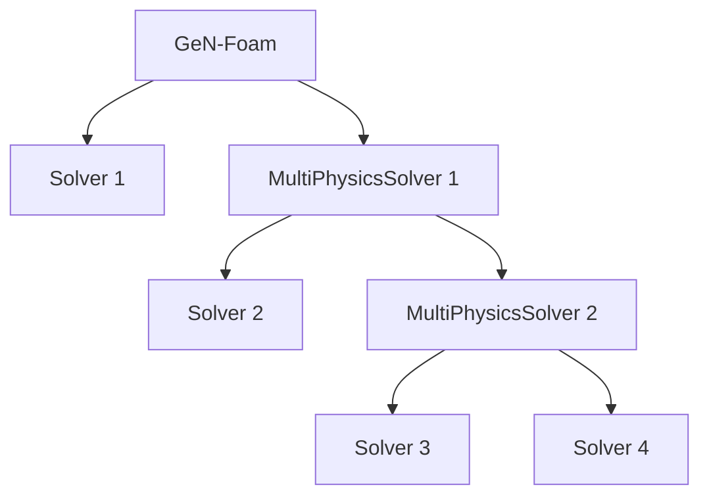
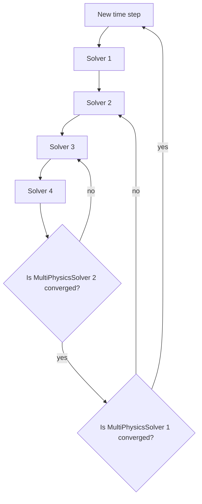

# Coupling and time stepping {#COUPLING}

**Work in progress!!**

## Introduction

GeN-Foam has been developed for the steady-state and transient analysis of reactors featuring pin-type, plate-type, or liquid fuel (viz., Molten Salt Reactors). It includes sub-solvers for neutronics, single- and two-phase thermal-hydraulics, thermal-mechanics and fuel-behaviour, via the newly imp;orted libraries of the fuel behaviour code OFFBEAT. An abitrary number of *regions* can be created, each associated to a different mesh and physics. The selection of the physics to solve is done in *system/controlDict*, in the *regionSolvers* entry.

<b>The *controlDict* dictionary</b>

The *controlDict* is an extended version of the one that is normally used in other OpenFOAM solvers. Compared to a standard OpenFOAM controlDict, it includes several keywords that allow one to select:
<UL>
<LI> Which physics to solve via the *regionSolvers subDict*. In this dictionary, the names of the regions to create is specified, and to each a physics-solver is associated, i.e. *onePhase*, *diffusionNeutronics* etc. Additionally, a *multiPhysicsSolver* can be selected. Its specifics are detailed in the following section.
<LI> The type of reactor via the keyword *liquidFuel*
<LI> The options for time stepping via the keywords *adjustTimeStep*, *maxDeltaT*, *maxCo* and *maxPowerVariation*, as well as *maxCoTwoPhase* and *marginToPhaseChange* for two-phase flow simulations.
<LI> An option for mesh manipulation called *removeBaffles*. This allows to select the physics that require the creation of a ghost mesh without baffles. This ghost mesh allows for better mesh-to-mesh projections between different physics. WARNING: parallel execution not tested.
</UL>
Fairly complete examples of *controlDict* for single-phase flow can be found in [2D_FFTF](https://gitlab.com/foam-for-nuclear/GeN-Foam/-/blob/master/Tutorials/2D_FFTF/rootCase/system/controlDict) and [3D_SmallESFR](https://gitlab.com/foam-for-nuclear/GeN-Foam/-/blob/master/Tutorials/3D_SmallESFR/rootCase/system/controlDict), while an explanation of the two-phase flow options can be found in [1D_boiling](https://gitlab.com/foam-for-nuclear/GeN-Foam/-/blob/master/Tutorials/1D_boiling/system/controlDict).

## Coupling logic

The coupling between physics is achieved by projecting coupling variables from the mesh they are calculated, to the mesh they need to be used. The details of the coupling can be specified in *constant/multiRegionCouplingDict*. In the *subDict* *mappings*, for each region one can select the fields to map *onto* it. This is done by creating a *subDic* named after the region *from* which the fields are mapped. For instance, if a field needs to mapped into the fluid Region from the neutroRegion, the specifics pf the mapping are found under *multiRegionDict/mappings/fluidRegion/neutroRegion*. In this *subDict*, one can specify the name of the field of the original mesh in the *sourceFields* entry (e.g., *powerDensity* in the neutroRegion) and the name of the field onto which the original field is mapped in the *targetFields* entry (e.g. *powerDensityNeutronics* in the fluidRegion). For now this routine is not templated, hence the user needs to specify also the field type (i.e. scalar or vector). A detailed usage of this new coupling routine can be found in any multi-physics tutorial, such as [3D_SmallESFR](https://gitlab.com/foam-for-nuclear/GeN-Foam/-/blob/master/Tutorials/3D_SmallESFR/rootCase/system/controlDict).

The standard routine eto solve for multi-physics problems is here described. Given an input volumetric power density \f$Q\f$, the thermal-hydraulics sub-solver is tasked with predicting the resulting fluid temperature \f$T\f$, density \f$\rho\f$ and velocity \f$u\f$ fields, as well as relevant structure temperature fields \f$T_s\f$. For a two-phase treatment, the fields \f$\rho\f$, \f$T\f$, \f$u\f$ consist of mass-weighed mixture values. The velocity field \f$u\f$ is used for coupling only when simulating MSRs to advect the precursors. The field \f$Q\f$ is the volumetric fuel power density and it can pertain either to a sub-scale structure (typically, the fuel rods) or the fluid itself (i.e.\ the liquid fuel in MSRs), depending on the system under investigation. The symbol \f$T_s\f$ collectively denotes the temperature fields of the structures, which can range from the fuel and cladding of a nuclear fuel pin to control rod drivelines, wrappers, the diagrid, etc. This entirely depends on what the structure thermal models are supposed to represent in the cell zones where they have been defined.

The neutronics sub-solver is tasked with predicting the volumetric fuel power density \f$Q\f$ for varying coupling fields. Not all of these fields are always used, depending on the selected type of neutronics treatment. In general terms, the diffusion, \f$S_N\f$, \f$SP_3\f$ treatments are capable of modeling reactivity feedbacks from: coolant temperature \f$T\f$ and density \f$\rho\f$, average fuel and cladding temperatures collectively denoted with \f$T_s\f$, fuel axial displacement and core radial displacement collectively denoted as \f$d\f$, as well as the temperature predicted by the thermal-mechanics sub-solver (this is useful for heterogeneous or mixed treatments, see below). As long as a parametrization of the macroscopic cross-sections against these quantities is provided, these feedbacks can be resolved. The feedback reactivities of the point-kinetics solver are described by standard feedback coefficients.

The thermal-mechanics sub-solver is tasked with predicting temperatures in solid regions and an overall displacement field that can be used to deform the neutronics mesh.  The displacement field is decomposed into fuel axial displacement and core radial displacement fields collectively denoted as \f$d\f$, which are passed to the neutronics to model expansion-related feedbacks. With regards to temperature, it is forced to the temperature of the sub-scale structures of the thermal-hydraulics domain whenever there is an area of overlap between thermal-mechanics and thermal-hydraulics mesh. If there is no overlap, the temperature is calculated based on a simple heat diffusion equation with parameters specified in the *thermoMechanicalProperties* dictionary. If the area is overlapped with neutronics, it will take from there a volumetric power source.

Based on the above, one may guess that GeN-Foam can operate in two different modes, depending on how the temperature of structures is calculated and as shown in the figure below:
- Homogeneous / domain overlap: the thermal-hydraulics solver is responsible for calculating temperatures throughout the physical domain. This is the most typical case, where structures are assumed to be treated as sub-scale structures in a porous-medium treatment.
- Heterogeneous: the thermal-hydraulics solver and the thermal-mechanics solver are responsible for calculating temperatures in different parts of the domain. This could be used for instance when simulating a core with a porous-medium approach, and a large solid reflector using the thermo-mechanics solver. Or it could be used to simulate a fuel pin in a heterogeneous manner.

Of course, it is also possible to have hybrid approaches, where the temperature in one structure is calculated in part based on the temperatures predicted in the sub-scale structure by the thermal-hydraulics sub-solver, and partly by the thermo-mechanical solver itself (where there is not overlap with the thermo-hydraulics domain).

Tutorial *2D_fullCoupling* has been created to allow users to play around with the couplings and understand their logic.

\image html HetHom.png width=500px

While this is the standard coupling approach, the new structure of GeN-Foam can be used to map *any* scalar or vectorial field to *any* scalar of vectorial fields on a different mesh. Although this renders the input structure more complex, it enables the simulation of any arbitrarily coupled multi-physics simulation that leverages the currently existing libraries.

N.B.: There is no need for the thermal-hydraulics, thermal-mechanics, and neutronics domains to be the same. GeN-Foam will project fields in a clever way whenever there is no overlap between 2 domains.

N.B.2: It is possible not to solve for displacements in the thermo-mechanics sub-solver setting to *false* the keyword *solveDisplacement* in *thermoMechanicalProperties* .

## *multiPhysicsSolver*

Many multi-physics simulations might require large flexibility on the time-loops. For instance, while some physics might be tightly coupled, others are only loosely coupled. This is, for instance, often the case for multi-scale simulations, where physics are tightly coupled within a scale and loosely across scales. In order to create this additional flexibilty, a new solver type was introduced, named the *multiPhysicsSolver*. The *multiPhysicsSolver* consists of a list of tightly coupled physics. During run-time, when the physics are corrected, if they are part of a *multiPhysicsSolver*, the physics will be corrected iteratively, until a user-input convergence criterion is met. *multiPhysicsSolvers* are also defined in *constant/multiRegionCouplingDict* in the *multiPhysicsSolvers* sub-dictionary. Each entry of the subDict corresponds to a different *multiPhysicsSolver*, characterized by a list of subSolvers (i.e. the solvers that are tightly coupled), a minmum residual to reach before the Picard iterations are interrupted and a maximum number of iterations. Note that *multiPhysicsSolvers* can be nested within one other, possibly leading to tree-like structure like shown below.

Note that all the physics that are specified in the *regionSolvers* dict are loosely coupled, whereas only those specified within a *multiPhysicsSolver* are tightly coupled.

The previous example would correspond to a time loop like that shown below.

