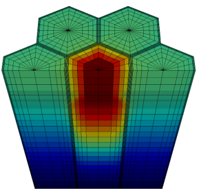
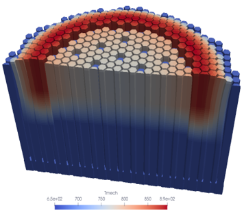
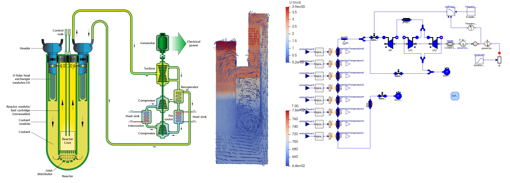
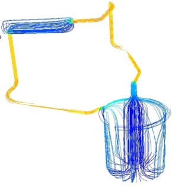
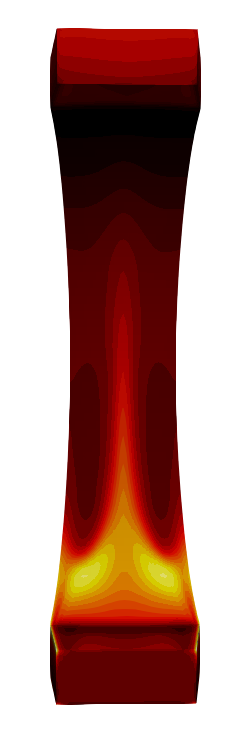
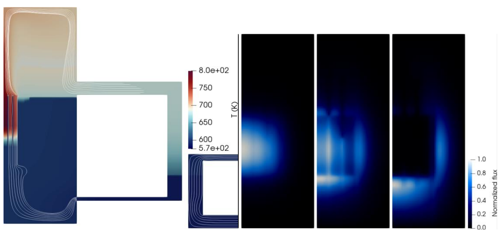

# GeN-Foam README file {#README}

GeN-Foam is a multi-physics solver for reactor analysis. It can solve (coupled or alternatively) for:

- neutronics, with models for point kinetics, diffusion (transient and eigenvalue), adjoint diffusion (only eigenvalue), SP3 (transient and eigenvalue), discrete ordinates (only eigenvalue);
- one-phase thermal-hydraulics, according to both RANS-CFD and porous-medium coarse-mesh approaches (the two approaches can be combined in the same mesh);
- two-phase porous-medium thermal-hydraulics, according to an Euler-Euler model, with models and correlations available for sodium and water;
- temperatures in sub-scale solid structures in porous-medium regions, based on user-selectable models including 1-D fuel, fixed temperature, fixed power, fuel pebbles, heated rods, as well as a generic lumped-parameters model based on the concept of electric equivalence;
- thermal-mechanics based on linear thermo-elasticity, which can be used to evaluate deformations and temperatures in solid structures. Deformations can be used to modify the meshes for thermal-hydraulics and neutronics.

It should be mentioned that GeN-Foam was mainly designed for coarse-mesh analyses of a reactor core (with porous medium approach and sub-scale representation of fuel). However, pin-by-pin and other heterogeneous models can be obtained by connecting the thermal-mechanics and thermal-hydraulics regions using coupled boundary conditions. 

N.B.: GeN-Foam is a flexible tool that allows the modeling of irregular geometries and particularly complex phenomena. However, it requires a good familiarity with Linux and OpenFOAM, as well as a solid background in multi-physics nuclear applications. Familiarity with CFD methods is strongly recommended. In addition, a good familiarity with C++ and the OpenFOAM API will be important to unlock the full potential of the code. The OpenFOAM API and the class-based structure of GeN-Foam allow an experienced user to quickly and safely add solvers, models, and equations, thus tailoring the code to their needs.

## OpenFOAM version

The current version of GeN-Foam is based on OpenFOAM, ESI/OpenCFD distribution, currently v2312, available at [www.openfoam.com](https://www.openfoam.com).

Please notice that a new version of OpenFOAM is released by ESI/OpenCFD twice a year. It may take a few weeks for the developers to update GeN-Foam to a new OpenFOAM release.

## Documentation

GeN-Foam is a complex OpenFOAM solver. For this reason, some resources have been prepared to support users and developers:

- [Online Doxygen-generated documentation](https://foam-for-nuclear.gitlab.io/GeN-Foam/index.html)
- The **slides** of introductory lectures to both OpenFOAM and GeN-Foam are provided in the folder *Documentation/someUsefulDocumentsAndPResentations*. These lectures are taken from an IAEA e-learning course available at https://elearning.iaea.org/m2/course/view.php?id=1286. The course requires registration and a NUCLEUS account, but it should be available to all IAEA member states. 
- Several commented **Tutorials** have been prepared to showcase the use and capabilities of the solver. 
- An **EMPTY case** is also provided that can be used for step-by-step building one’s case. One can start from the EMPTY case to build each new case, as it already includes a consistent minimum set of (dummy) files that must be present independent of the physics that are solved for. 

Users are also encouraged to make use of the typical OpenFOAM learning strategies:
- the high-level C++-based object-oriented language of OpenFOAM, which normally allows understanding the logic of a solver easily;
- the comments that are typically available in the source code and, in particular, in the header files of each class;
- the support of the community.

## Forum

A forum to get support from the developers and the community is available at the following link: [Forum](https://foam-for-nuclear.org/phpBB/)

## Copyright

© Contributions are individually acknowledged in the header files

## Gallery

*Modeling of the European Sodium Fast Reactor: Boiling in a windowed assembly and core flowering*

  
  

   

*Full plant modeling of the ALFRED Lead Fast Reactor using the FMI interface and Modelica*

  

   

*Modeling of Molten Salt Reactors: the MSRE and the MSFR*

  
  
  

   

*Modeling of FFTF: 2-D primary circuit thermal-hydraulics and core fluxes*

  

   

