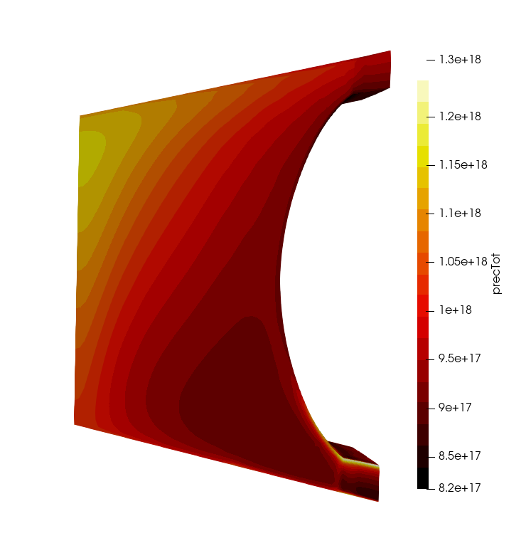

# foamForNuclear (FFN)

**foamForNuclear (FFN)** is a **general-purpose, OpenFOAM®-based multi-physics platform** for the analysis and design of nuclear systems. It originates from the **merging and extension** of two OpenFOAM-based nuclear projects: **GeN-Foam**, dedicated to multi-physics reactor simulation, and **OFFBEAT**, focused on advanced nuclear fuel performance modeling.

FFN provides a **modular and extensible framework** for simulating a wide range of physics, from core neutronics and thermal-hydraulics to advanced thermomechanics and fuel behavior. Each physics capability is implemented as an independent **module**, solving a specific set of equations that can run standalone or be coupled with others in a multi-physics environment.

## Physics Modules

FFN integrates several physics modules developed through extensive research in nuclear system modeling:

- **Neutronics:** point kinetics, diffusion, adjoint diffusion, $\text{SP}_3$, and discrete ordinates ($\text S_N$) (steady or transient);
- **Thermal-hydraulics:** one-phase RANS-CFD and porous-medium models, and a two-phase porous-medium Euler–Euler model for sodium and water;
- **Solid temperature models:** for sub-scale structures, including 1-D fuel, fixed temperature/power, heated rods, fuel pebbles, and lumped-parameter models;
- **Thermomechanics:** linear/nonlinear elasticity, plasticity, creep, and temperature-dependent material properties;
- **Fuel behavior:** densification, swelling, fission gas release, creep, irradiation growth, non-conformal gap heat transfer, and burnup-dependent material properties.

The **modular structure** of FFN allows users familiar with the OpenFOAM® API to easily add new solvers to the list of available physics. As an example, a **Volume of Fluid** solver from OpenFOAM® is already integrated into FFN, enabling free-surface flow simulations.

## Applications within FFN

The FFN platform currently includes two main applications that make use of the physics modules:

### GeN-Foam

GeN-Foam is a **multi-physics application** enabling the coupling of multiple modules within a single simulation. GeN-Foam provides the infrastructure for:

- Defining **independent physics regions** (e.g., neutronics, thermal-hydraulics, thermomechanics, fuel behavior);
- Choosing **arbitrary coupling types** (volume, surface or interpolation-based for any field);
- Customizing **time-loops**, allowing both loosely and tightly coupling.

This architecture supports multi-scale analyses combining coarse and detailed models in a unified simulation.

### OFFBEAT

While the fuel behavior module can be integrated into GeN-Foam, **OFFBEAT** remains a **standalone application** within FFN, dedicated to **single-mesh fuel performance** simulations. It provides high-fidelity thermo-mechanical and material evolution modeling for individual fuel pins, rods, or pebbles.

## OpenFOAM Version

FFN is based on the **OpenFOAM® (ESI/OpenCFD)** distribution, currently **v2506**, available at [www.openfoam.com](https://www.openfoam.com). The platform is regularly updated to maintain compatibility with new releases.

## Documentation

Resources for users and developers include:

- **User Guide and Theory Manual** *(link to be added)*
- **Online Doxygen API** *(link to be added)*
- **Introductory Lectures** ([`documentation/usefulDocumentsAndPresentations/`](./documentation/usefulDocumentsAndPresentations/))
- **Tutorial Cases** for each physics module and coupling type ([`tutorials`](./tutorials/))

Users are also encouraged to make use of the typical OpenFOAM learning strategies:

- the high-level C++-based object-oriented language of OpenFOAM, which normally allows understanding the logic of a solver easily;
- the comments that are typically available in the source code and, in particular, in the header files of each class;
- the support of the community.

## Copyright

© Contributions are individually acknowledged in the header files.

## Gallery

*Modeling of the European Sodium Fast Reactor: Boiling in a windowed assembly and core flowering*

  
  

*Full-plant modeling of the ALFRED Lead Fast Reactor using the FMI interface and Modelica*

  

*Modeling of Molten Salt Reactors: MSRE and MSFR*

  
  
  

*Modeling of FFTF: 2-D primary circuit thermal-hydraulics and core fluxes*

  

