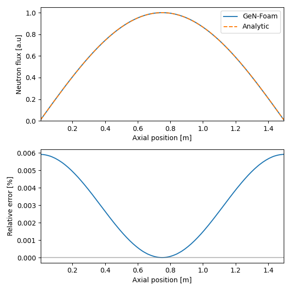
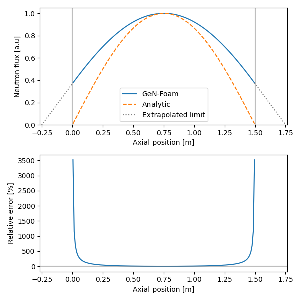

# Neutronics Diffusion: Slab Reactor

## Description

The tutorial is a simple demonstration of GeN-Foam neutronic solvers. We propose to solve the classical slab reactor problem using one energy group and no reflectors.

The one group neutronics diffusion equation can be expressed as:

$$
\underbrace{D \nabla^2 \phi}_\text{diffusion} + \underbrace{\nu \Sigma_f \phi}_\text{fission} \underbrace{- \Sigma_a \phi}_\text{absorption} = 0
$$

For a slab reactor of size $L$, the diffusion equation can be simplified:

$$
D \frac{\partial^2 \phi}{\partial z^2} + \nu \Sigma_f \phi - \Sigma_a \phi = 0
$$

Then, we introduce the $B_m^2$ parameter in the diffusion equation:

$$
\frac{\partial^2 \phi}{\partial z^2} + B_m^2 \phi = 0
$$

with:

$$
B_m^2 = \frac{k_\infty -1}{M^2}
\quad \quad
k_\infty = \frac{\nu \Sigma_f}{\Sigma_a}
\quad \quad
M = \sqrt \frac{D}{\Sigma_a}
$$

The solution of this differential equation is of the form:

$$
\phi(z) = A \sin \left( B_g z \right)
$$

The boundary conditions imposed by the slab reactor are a flux that tends to zero. Thus $B_g$ must be equal to $\frac{\pi}{L}$ if we only consider the fundamental.

$$
\phi(z) = A \sin \left( \frac{\pi z}{L} \right)
$$

The critical equation closes the system, which implies:

$$
B_m^2 = B_g^2
\rightarrow
\frac{k_\infty -1}{M^2} = \left( \frac{\pi}{L} \right)^2
$$

If we assume the following values for:
- $\nu \Sigma_f$ = 5.5675
- $\Sigma_a$ = 5.0082
- $D$ = 0.1275

The resulting $k_\infty$ is $\approx$ 1.11168 and the reactor should reach criticality for a length $L$ of:

$$
L = \pi \sqrt \frac{M^2}{k_\infty -1} = \pi \sqrt \frac{D}{\nu \Sigma_f - \Sigma_a} = 1.5 \text{m}
$$


## Simulation

The case has been prepared to verify the above results. One can change the geometry in the [`system/neutroRegion/blockMeshDict`](./system/neutroRegion/blockMeshDict) file with the `dz` parameter. The nuclear data are set in the [`constant/neutroRegion/nuclearData`](./constant/neutroRegion/nuclearData) file.

Before running the case, make sure to clean it using the following command:
```bash
./Allclean
```

Then run the case by running this command:
```bash
./Allrun
# or
./Alltest
```

The case should take no more than a few seconds. The results are stored in the `1` folder. The `1/uniform/reactorState` file stores the integral parameters of the simulation (e.g $k_\text{eff}$ and the power). The flux distribution is stored in the `1/neutroRegion/flux0` file.


## Analysis

To compare the results of GeN-Foam with the analytic solution, run the following command:

```bash
python3 Allplot.py 1 flux0
```

The script should output the shape of the flux and compare it to the analytic formula.



*Fig 1. Neutron flux comparison between GeN-Foam and an analytical solution.*


## Possible exercises

- How the keff is affected when increasing/decreasing the fuel length?
- How the keff is affected when increasing/decreasing `nuSigmaEff`, `sigmaRemoval` or `D` in [`constant/neutroRegion/nuclearData`](./constant/neutroRegion/nuclearData)
- Does the normalization power `pTarget` in [`0.orig/uniform/reactorState`](./0.orig/uniform/reactorState) affects the keff?
- Does the neutron flux vanishes at the top and bottom boundaries?
    - To check this, it is possible to change the neutron flux boundary conditions from `fixedValue` to an albedo boundary condition `albedoSP3`. You can uncomment the albedo boundary condition and comment the `fixedValue` boundary condition in [`0.orig/neutroRegion/defaultFlux`](./0.orig/neutroRegion/defaultFlux).
    - Then clean and run the simulation.
    - The flux should not anymore tends to zero at the boundary. One can change the `isAddExtrapolationDistance` flag in the [`Allplot.py`](./Allplot.py) script to see the extrapolation limit and see the following results.



*Fig 2. Neutron flux axial distribution using albedo boundary conditions. Comparison with analytical solution with zero flux at the boundaries.*
