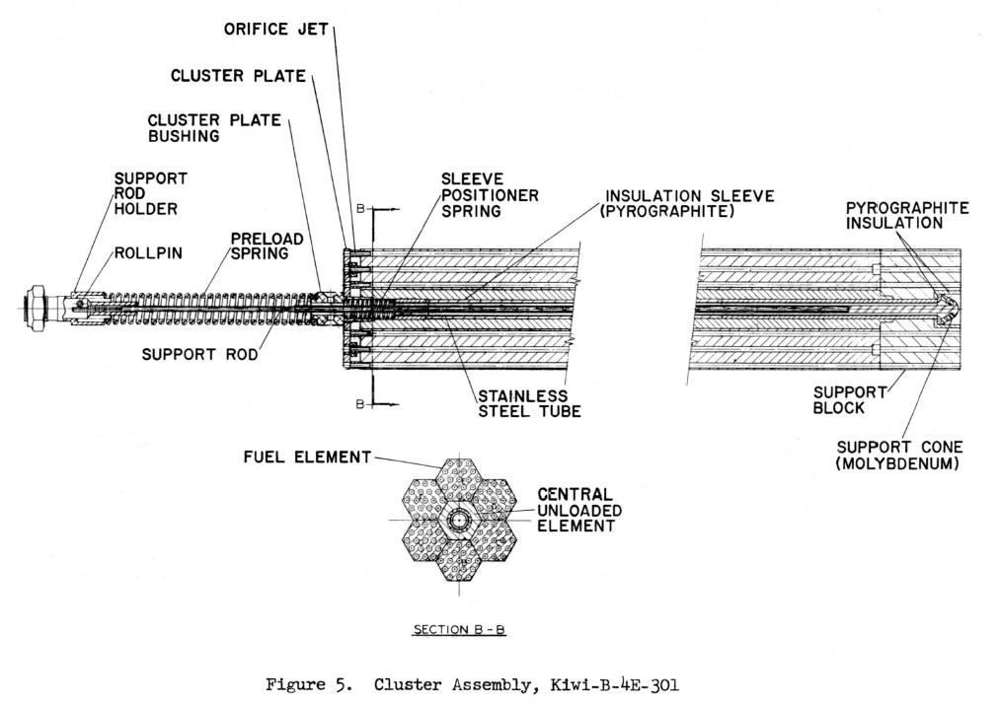
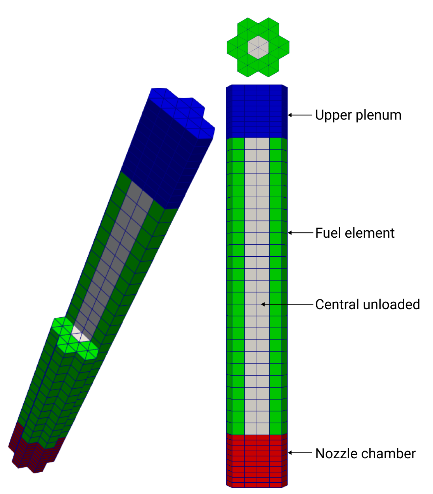
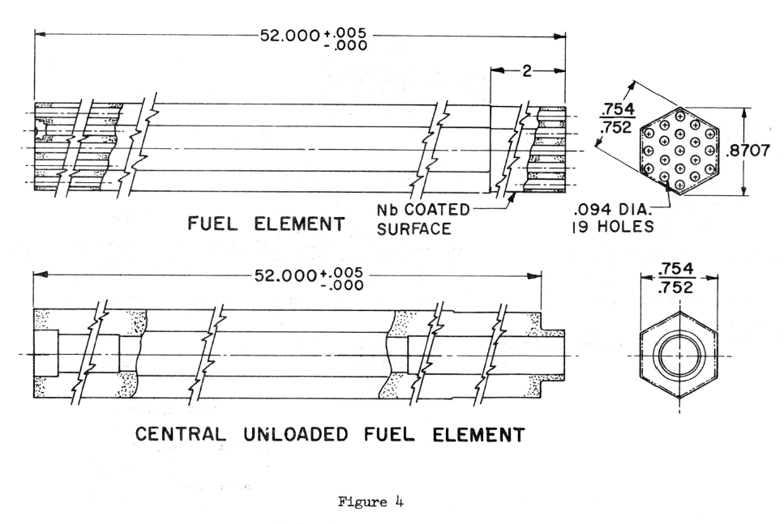
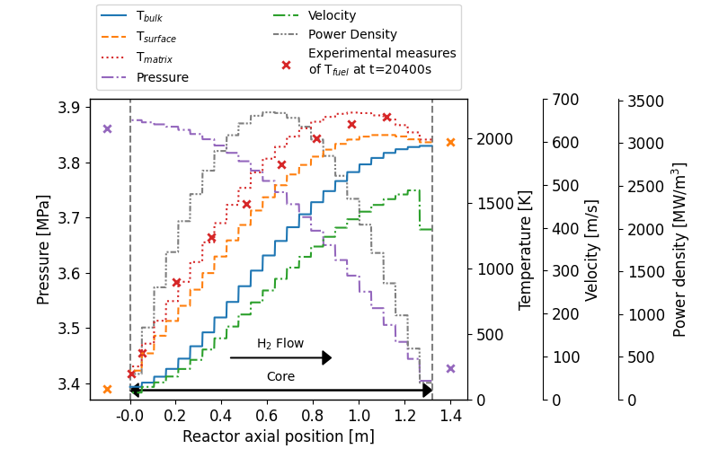
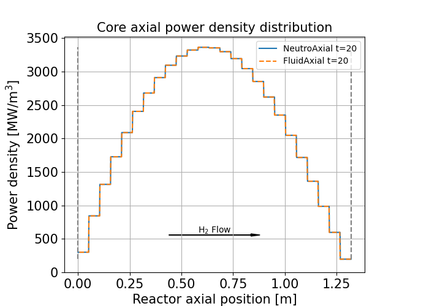
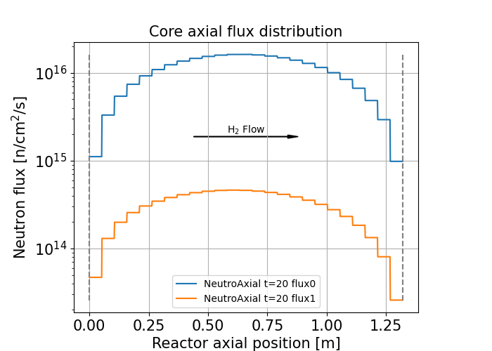
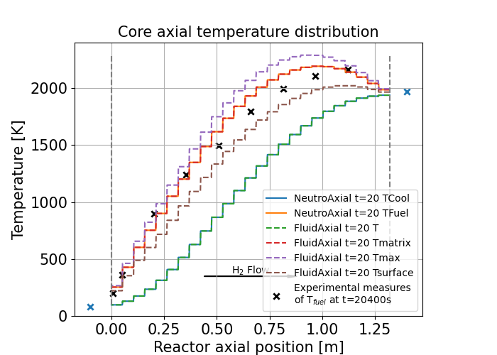
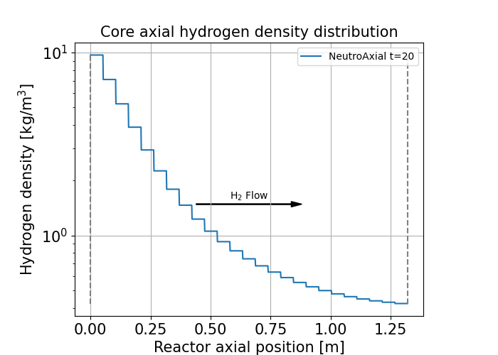
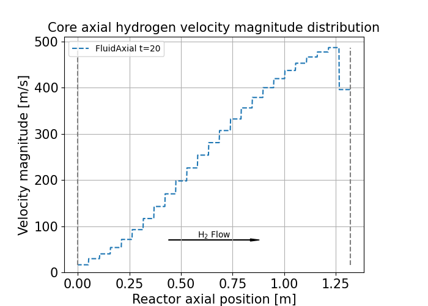
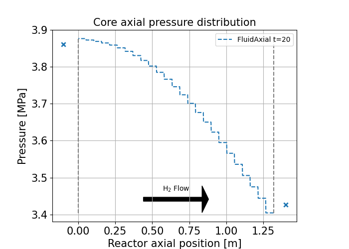

# NTP KIWI-B-4E Fuel Assembly

Author: Thomas Guilbaud

This tutorial simulates the coupled neutronics and thermal-hydraulics of a hydrogen-cooled fuel assembly of the KIWI-B-4E NTP reactor. 


## Introduction

A Nuclear Thermal Propulsion (NTP) reactor is a space propulsion engine that uses the energy of a nuclear reactor to heat and expand a lightweight propellant gas. During the 1960s, the USA dedicated an extensive research program called NERVA (Nuclear Engine for Rocket Vehicle Application) to develop NTPs for interplanetary missions following the Apollo program. Several prototypes have been ground-tested such as the KIWI-B-4E reactor. It was the first prototype to succeed in a restart at full power in 1964 (<a href="#ref2">Finseth, 1991</a>).


*Fig 1: KIWI-B-4E reactor scheme from Ref. (<a href="#ref1">Zeigner, 1965</a>). Dimensions are in inches.*


In rocketry, it is important to maximize the thrust and the efficiency of the engine to move a payload per mass of propellant that can be quantified by the specific impulse $I_{sp}$. The thrust $F$ and $I_{sp}$ are related to the exhaust velocity of the nozzle $v_2$, which is dependent on the nozzle chamber temperature and molar mass of the propellant (<a href="#ref4">Sutton et al., 2010</a>).

$$
    v_2 \approx \sqrt{
        \frac{2 \gamma}{\gamma-1} \frac{RT}{M_{mol}} 
    }
$$

$$ F = \dot{m} v_2 $$

$$ I_{sp} = \frac{v_2}{g} $$

Thus, the higher the temperature and lower the molar mass, the higher the thrust and the engine efficiency. Hydrogen, which is the lightest gas, was used as propellant and coolant for the core.

In comparison, the [RS-25 rocket engine](https://en.wikipedia.org/wiki/RS-25) of the space shuttle in a vacuum, which burns liquid oxygen and hydrogen, has the following performances: 

| Parameters                | KIWI-B-4E | RS-25    |
|:--------------------------|:---------:|:--------:|
| Exhaust velocity $v_2$    | 7549 m/s  | 4436 m/s |
| Thrust $F$                |  234 kN   | 2279 kN  |
| Specific impulse $I_{sp}$ |  770 s    |  452 s   |


## Model

### Geometry description

A KIWI-B-4E fuel assembly is composed of a central hexagonal unloaded fuel element surrounded by 6 hexagonal fuel elements (see Fig. 2).

<div style="text-align: justify;">
      
    
</div>

*Fig 2: Fuel assembly scheme from 1965 design survey of KIWI-B-4E (<a href="#ref1">Zeigner, 1965</a>) and mesh used in GeN-Foam.*

Each fuel element has 19 propellant channels (see Fig. 3). The fuel is composed of highly enriched uranium $UC_2$ in a graphite matrix (<a href="#ref1">Zeigner, 1965</a>, <a href="#ref2">Finseth, 1991</a>).



*Fig 3: Fuel assembly scheme from 1965 design survey of KIWI-B-4E (<a href="#ref1">Zeigner, 1965</a>).*

In the present model, a thermal baffle separates the central unloaded element from the fuel elements. All the elements are modeled using a porous medium.

The fuel assembly power is assumed to be 1/250 of the total full power of the KIWI-B-4E. This factor 250 is the number of fuel elements (1500) divided by the number of fuel elements per fuel assembly (6) (<a href="#ref2">Finseth, 1991</a>).


### Numerical models

This model uses the coupled neutronics **diffusion** sub-solver and the thermal-hydraulics **porous k-epsilon** sub-solver.

The thermophysical properties model of $H_2$, implemented in OpenFOAM format, is used to model the coolant. During operation, the hydrogen is in a supercritical state. It is also possible to use the `PengRobinsonGas` or the `PerfectGas` equation of states from OpenFOAM, which gives comparable results.

The multi-group XSs (MGXS) were generated using a core model of KIWI-B-4E in OpenMC (<a href="#ref5">Romano, 2015</a>). An average XS set was calculated on the entire core for the `fuelElement` zone, with a filter for the XS set of `centralUnloadedFuelElement`. Perturbed MGXS are provided for fuel temperature and coolant density.

### Correlations

The friction factor and heat transfer coefficient for the fuel element are computed using the following equations:

- From Ref. (<a href="#ref6">Taler, 2016</a>), $Re \in [3e3; 1e7]$: 
    $f = (1.2776 log(Re)-0.406)^{-2.246}$

- From Ref. (<a href="#ref3">Walton, 1992</a>), N°10 Wolf-McCarthy II, $T_w/T_b \in [1.5; 2.8]$, $Re \in [7800; 1.55e6]$: 
    $Nu = 0.023 Re^{0.8} Pr^{0.4} (T_w/T_b)^{-0.3}$


## How to run

If no `polyMesh` folders are provided, compute the mesh from the `.unv` files using:
```bash
# If mesh/*.unv are available
./Allmesh
```

Then clean and run:

```bash
./Allclean
./Allrun
# or
./Allrun_parallel # Currently 2 cores
# or
./Alltest
```

The results can be extracted using the following script:

```bash
./Allpostprocess steadyState 20
```

To plot the results:

```bash
python3 AllplotAxialDistribution.py steadyState/postProcessing/sampleNeutroDict/neutroRegion/20/NeutroAxial_TCool_TFuel_flux0_flux1_oneGroupFlux_powerDensity_rhoCool.xy

python3 AllplotAxialDistribution.py steadyState/postProcessing/sampleFluidDict/neutroRegion/20/FluidAxial_T_Tmatrix.lumpedNuclearStructure_Tmax.lumpedNuclearStructure_Tsurface.lumpedNuclearStructure_magU_p_powerDensityNeutronics.xy
```

To print the main parameters of the system:

```bash
python3 analysis.py steadyState/log.GeN-Foam
```


## Results

### Main parameters in steady-state

This table has been generated using the [`analysis.py`](./analysis.py) script. The reference values are taken from Refs. (<a href="#ref0">Elder, 1964</a>), (<a href="#ref1">Zeigner, 1965</a>), and (<a href="#ref2">Finseth, 1991</a>).

|                             | Unit | Ref.  | GeN-Foam | Error [%] |
|:----------------------------|:----:|:-----:|:--------:|:---------:|
| Core power                  | MW   |   937 |      937 |      0.00 |
| Core inlet mass flowrate    | kg/s |    31 |     30.6 |      1.14 |
| Core plenum  inlet pressure | MPa  | 3.861 |    3.877 |      0.42 |
| Core plenum outlet pressure | MPa  | 3.427 |    3.427 |      0.00 |
| Core plenum  inlet temperat | K    |  83.3 |     83.3 |      0.00 |
| Core plenum outlet temperat | K    |  1972 |   1925.0 |      2.38 |
| Exhaust velocity            | m/s  |  7549 |     7458 |      1.20 |
| Thrust                      | kN   | 234.0 |    228.6 |      2.32 |
| Isp  (outlet plenum)        | s    |   770 |    761.0 |      1.16 |


### Axial distributions in steady-state

The following graphs have been generated using the [`AllplotAxialDistribution.py`](./AllplotAxialDistribution.py) script.




*Fig 4: Axial distribution summary in a KIWI-B-4E fuel element, including temperatures, velocity, pressure, power density, and experimental data from Ref. (<a href="#ref0">Elder, 1964</a>) at t=20400s.*




*Fig 5: Axial distribution of the power density in a KIWI-B-4E fuel element.*




*Fig 6: Axial distribution of the neutron fluxes in a KIWI-B-4E fuel element.*




*Fig 7: Axial distribution of the temperatures in a KIWI-B-4E fuel element.*




*Fig 8: Axial distribution of the Hydrogen density in a KIWI-B-4E fuel element.*




*Fig 9: Axial distribution of the Hydrogen velocity in a KIWI-B-4E fuel element.*




*Fig 10: Axial distribution of the pressure in a KIWI-B-4E fuel element.*


### Observations

- The model is sensitive to the equation of state, the friction and the heat transfer models
- The Isp and the thrust are in the range of standard NTP performances of the NERVA program (~ 800 s, ~230 kN (<a href="#ref2">Finseth, 1991</a>))
- The core power density peaks below the core mid-plane, close to the upper core inlet plenum
- When increasing the Courant number above 1, the outlet mass flowrate is significantly different from the outlet


## References

<ol>
    <li id="ref0">
        M. Elder. "Preliminary Report KIWI-B-4E-301," Los Alamos Scientific Laboratory report LA-3185-MS, October 1964.
    </li>
    <li id="ref1">
        V. L. Zeigner. "Survey Description of the Design and Testing of KIWI-B-4E-301 Propulsion Reactor," Los Alamos Scientific Laboratory report LA-3311-MS, May 1965.
    </li>
    <li id="ref2">
        J. L. Finseth. "Overview of ROVER engine tests final report," National Aeronautics and Space Administration, NASA-CR-184270, February 1991.
    </li>
    <li id="ref3">
        James T. Walton. "Program ELM: A Tool for Rapid Thermal-Hydraulic Analysis of Solid-Core Nuclear Rocket Fuel Elements," Lewis Research Center, NASA-TM-105867, November 1992.
    </li>
    <li id="ref4">
        G. Sutton, O. Biblarz. "Rocket Propulsion Elements," Eighth Edition. Hoboken, New Jersey: John Wiley & Sons, Inc, 2010. isbn: 978-0-470-08024-5.
    </li>
    <li id="ref5">
        Paul K. Romano et al. "OpenMC: A State-of-the-Art Monte Carlo Code for Research and Development". In: Ann. Nucl. Energy 82 (2015), pp. 90–97.
    </li>
    <li id="ref6">
        Dawid Taler. "Determining velocity and friction factor for turbulent flow in smooth tubes," International Journal of Sciences, 105, (2016), pp. 109-122.
    </li>
</ol>
