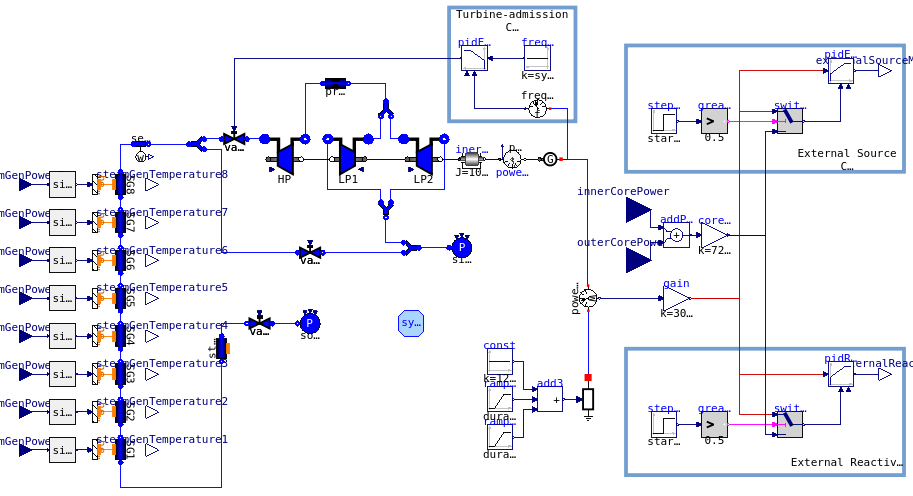
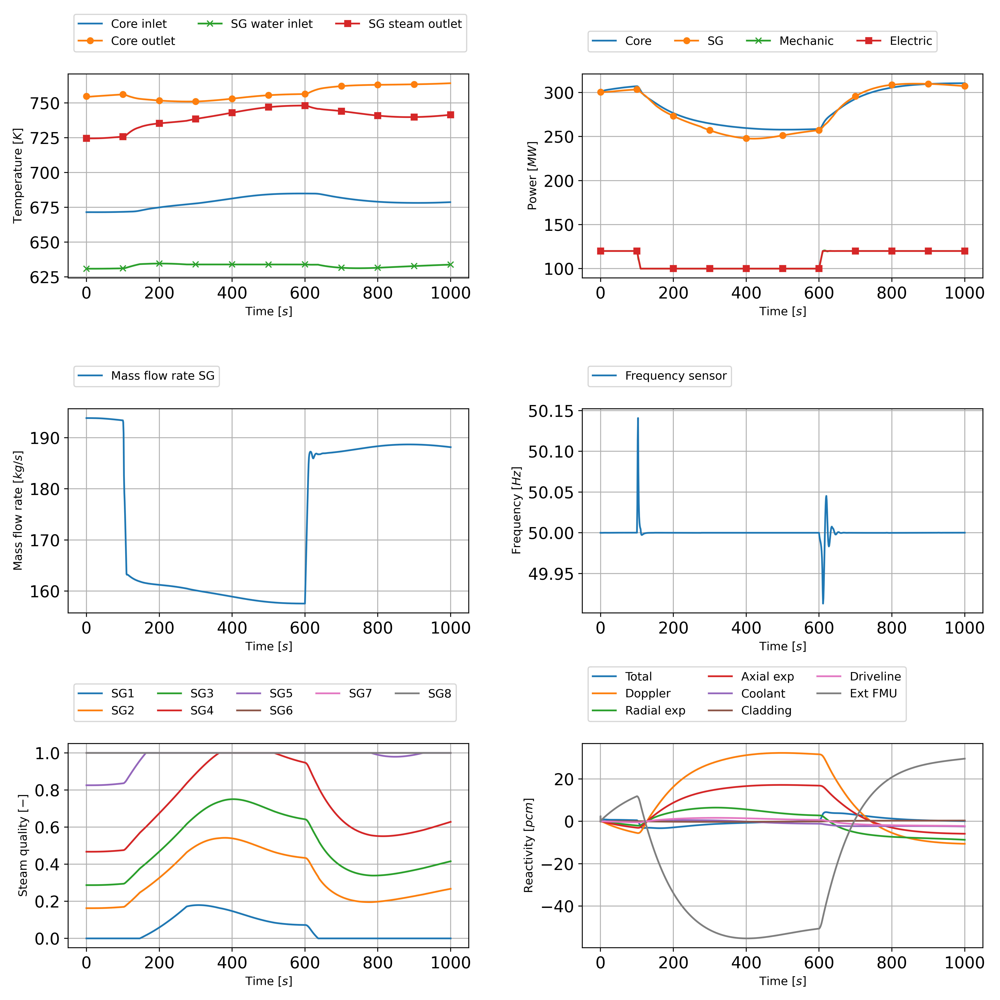

# 2D-wedge ALFRED model with FMU balance of plant

Author: Thomas Guilbaud, EPFL/Transmutex SA, 26/01/2023  

---

The purpose of this case is to simulate coupled GeN-Foam/FMU of an entire power-plant from the core to the turbine. The reactor is the Lead Fast Reactor (LFR) ALFRED of 300 MWth.


*Fig 1. Full plant modeling of the ALFRED Lead Fast Reactor using the FMI interface and Modelica.*


## GeN-Foam

Each cases needs the FMU representing the balance of plant modeled using Modelica. A first steady-state simulation is performed before each transient. The transient simulation relies on the point-kinetics sub-solver.

Before the simulation, make sure that your system has the following requirements:
- OpenFOAM-v2406
- GeN-Foam/develop build with FMU4FOAM (`./Allwmake --fmi`)
- OpenModelica 1.21.0 (`omc --Version`)
- Python3.8 with PyFMI (2.10.0), Pandas (1.4.3), Numpy (1.23.1)


### FMU generation and coupling architecture

Recommendation: Save the provided FMUs if the `omc` command doesn't work.

Prerequires:
- Need to install OpenModelica and the ThermoPower package

Several architectures have been tested with this model:
- GeN-Foam coupled with OpenModelica exported in an FMU
- GeN-Foam coupled with OpenModelica and Simulink both exported in FMUs.

Generate the FMU using the OpenModelica compiler:
```bash
omc FMUGenSecCir.mos # generate all FMUs
# or
omc FMUGenSecCirWithCtrl.mos # generate SecondaryCircuitWithControl.fmu from SecondaryCircuitWithControl.mo
# or 
omc FMUGenSecCirWithoutCtrl.mos # generate SecondaryCircuitWithoutControl.fmu from SecondaryCircuitWithoutControl.mo
```

It is possible to change the architecture in the [rootCase/system/controlDict](rootCase/system/controlDict) by changing the variable `pyFileName`:
- `pyFileName secondaryCircuitModelica;` for GeN-Foam + OpenModelica
- `pyFileName secondaryCircuit2FMUs;` for GeN-Foam + OpenModelica + Simulink


### Load follow transient

The system relies on 2 PID controllers, one on the grid frequency that controls the turbine valve admission to balance the mechanical and the electrical power. The second PID controls the reactivity insertion or the beam modulation to improve the core power response.



*Fig 2: Balance of plant model using Modelica used by GeN-Foam.*


### Run a simulation

Two scenarios are proposed in this tutorial: one with a load follow with external reactivity and one with an external source. For both simulation, a first GeN-Foam standalone simulation is performed to converge the neutronic and thermal-hydraulics meshes. This improves the stability of the following coupled GeN-Foam/Modelica simulation (see [`./Allrun_GeN-FoamStandalone`](./Allrun_GeN-FoamStandalone)).
Then, each perform a GeN-Foam/Modelica coupled steady-state simulation without feedback from the external reactivity or the external neutron source.
Once both codes are converged in steady-state, a final transient simulation is performed with a variation of electric power demand (load).

Run the load follow transient:
```bash
./Allclean

# Optional, run in Allrun_loadFollowReactivity and Allrun_loadFollowSource
# ./Allrun_GeN-FoamStandalone

# In critical mode
./Allrun_loadFollowReactivity
# or in ADS mode
./Allrun_loadFollowSource
```

Analyse the data (example of use):
```bash
python3 Allplot_loadFollowReactivity.py transientLoadFollowReactivity/secondaryCircuit.csv
# or
python3 Allplot_loadFollowSource.py transientLoadFollowSource/secondaryCircuit.csv
# or
python3 Allplot_loadFollowReactivity.py transientLoadFollowSource/secondaryCircuit.csv transientLoadFollowReactivity/secondaryCircuit.csv
# or
python3 Allplot_FMU.py transientULOF/secondaryCircuit.csv
# or
python3 Allplot_FMUanimate.py transientULOF/secondaryCircuit.csv
# or
python3 Allplot_loadFollowReactivity.py transientBeamTrip/secondaryCircuit.csv
```

The user is invited to play with the different architectures by changing the `pyFileName`.


### Results



*Fig 3: Evolution of power plant parameters during a load follow transient in critical configuration.*


## All FMUs !

Two special cases have been created in `GeN-FoamAs2FMU` and `GeN-FoamAs3FMU` where GeN-Foam is embedded in a FMU. The architecture is more homogeneous. 

Go in [GeN-FoamAs2FMU](GeN-FoamAs2FMU) or [GeN-FoamAs3FMU](GeN-FoamAs3FMU) and execute:
```bash
./Allrun
```

The results can be extracted as followed:
```bash
python3 Allplot.py
```

In the end, the results are the same compared to GeN-Foam + OpenModelica (FMU) and GeN-Foam + OpenModelica (FMU) + Simulink (FMU).
