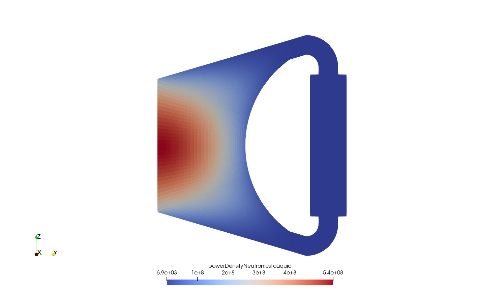
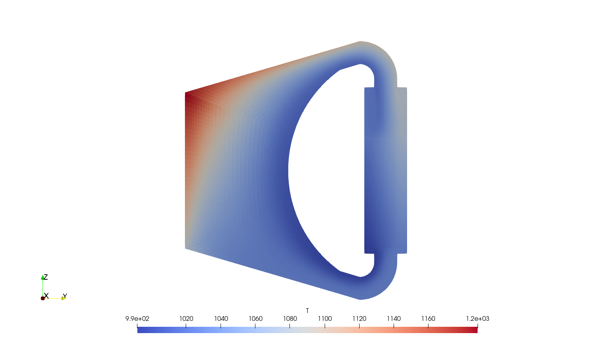
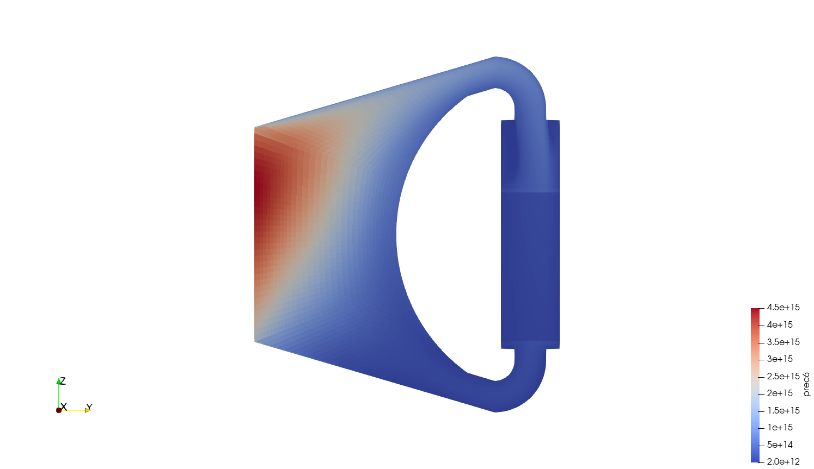

# 2D Molten Salt Fast Reactor

2D_MSFR is a 2-D r-z model of a Molten Salt Fast Reactor. It solves for neutronics and thermal-hydraulics.

The `Allrun` bash script can be used to run the tutorial. The `Allclean` bash script can be used to clean it up. The script will first run a steady-state case with fluid-dynamics only. Starting from the results of the simulation, a second steady-state is launched solving for neutronics and energy equations. Finally, a simple transient calculation is run. No reactivity is inserted in the transient and the power will simply stay constant for 10 seconds.

Any modification to the initial conditions of the transient case will instead trigger an actual transient. For example, modifying the keff in the [`reactorState`](./rootCase/0/uniform/reactorState) dictionary will trigger a reactivity-initiated transient. A more realistic transient can be initiated by modifying the heat transfer in the heat exchanger in the `phaseProperties` dict. The case is similar to the one presented in Ref. [1]. Please note that, to reduce computing time, the fluid-dynamics equations are not solved in the second steady-state and in the transient simulation. Note also that an upwind scheme is employed for the divergence term in the diffusion equations (in [`system/neutroRegion/fvSchemes`](./rootCase/system/neutroRegion/fvSchemes)), which is necessary to achieve convergence.

Lastly, a considerably finer mesh is provided under `constant/*/polyMeshFiner` directories.


## Run

```bash
./Allclean

./Allrun
```


## Gallery



*Fig 1. Power density distribution.*




*Fig 2. Fluid temperature distribution.*




*Fig 3. 6th precursor group distribution.*