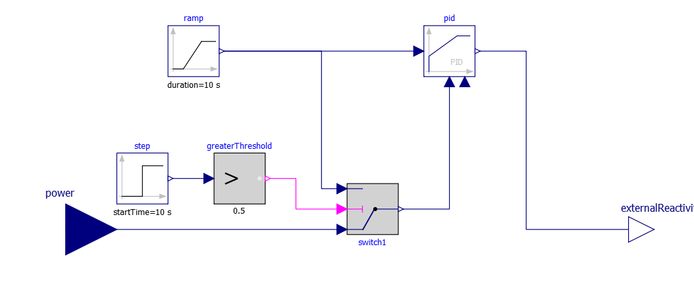
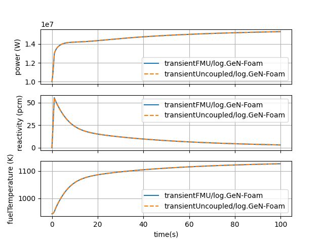
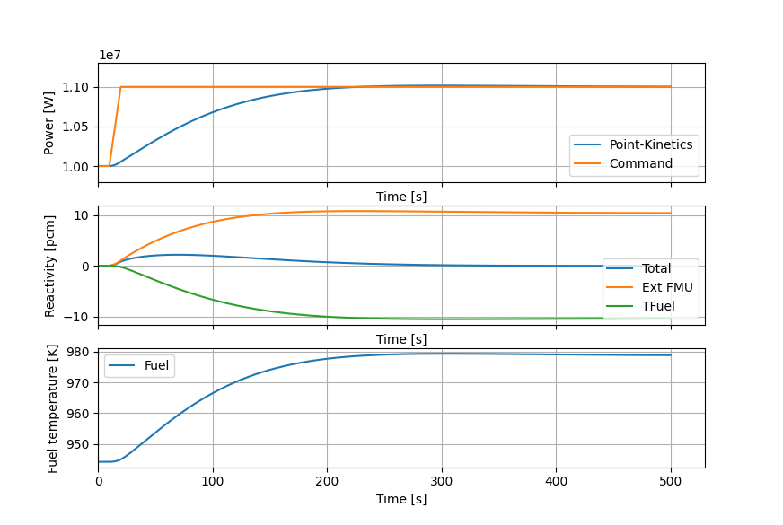

# 2D Point-Kinetics coupling with FMU

## Description

This case has been derived from `2D_onePhaseAndPointKineticsCoupling`. It 
reuses the same mesh and physical parameters.

This case is an example of use of the external reactivity control by an FMU.
It uses the point-kinetics sub-solver with an additional reactivity 
contribution comming from an FMU.

To link an FMU with a reactivity control, it is required to add the 
following line in [nuclearData](PIDcontrol/rootCase/constant/neutroRegion/nuclearData).

```
externalReactivityNameFromFMU   gfExtReact;
```

The current PID controller measures the power over the core. A command is 
provided to target a specific power. The FMU has been built using OpenModelica.



*Fig 1: Power/reactivity PID controller viewed from OpenModelica.*


## How to run

### With and without FMU comparison

In the [comparisonFMU](comparisonFMU) folder, first clean the folder:
```bash
./Allclean
```

Then run the following to simulate the case with and without the FMU:
```bash
./Allrun
```

Use the following script to compare the results:
```bash
python3 plot.py transientFMU/log.GeN-Foam transientUncoupled/log.GeN-Foam
```

The results should look like below:



*Fig 2: Plot of core parameters to a ramp insertion of 57.67131 pcm during 1 s.*


### PID controller

In the [PIDcontrol](PIDcontrol) folder, first clean the folder:
```bash
./Allclean
```

Then run the following to simulate the case with FMU PID controller:
```bash
./Allrun
```

Use the following script to compare the results:
```bash
python3 plot.py transient/log.GeN-Foam
```

The results should look like below:



*Fig 3: Plot of core parameters with controlled PID responses to a 10% power increase request.*
