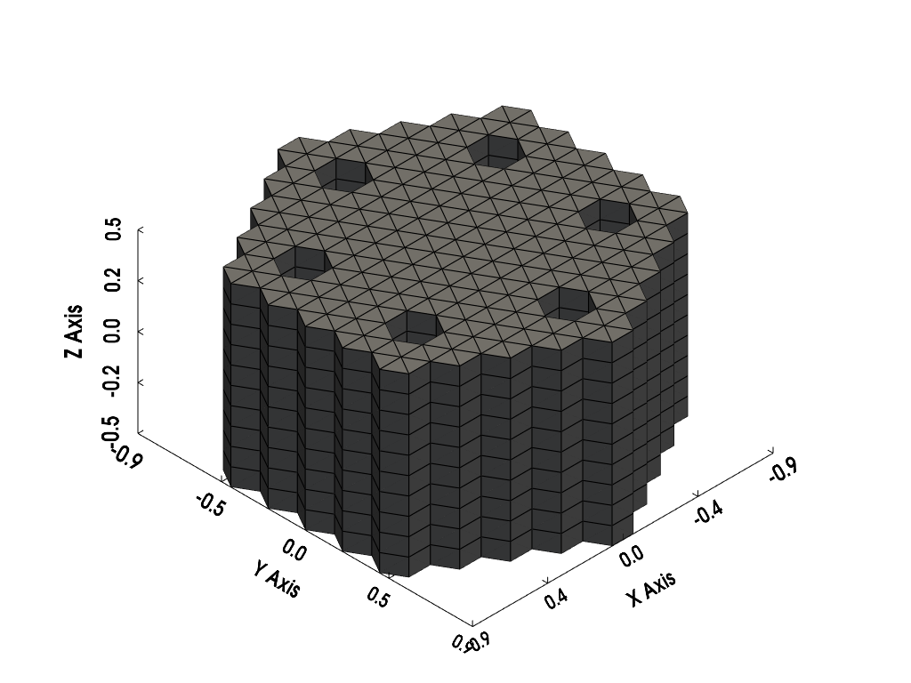
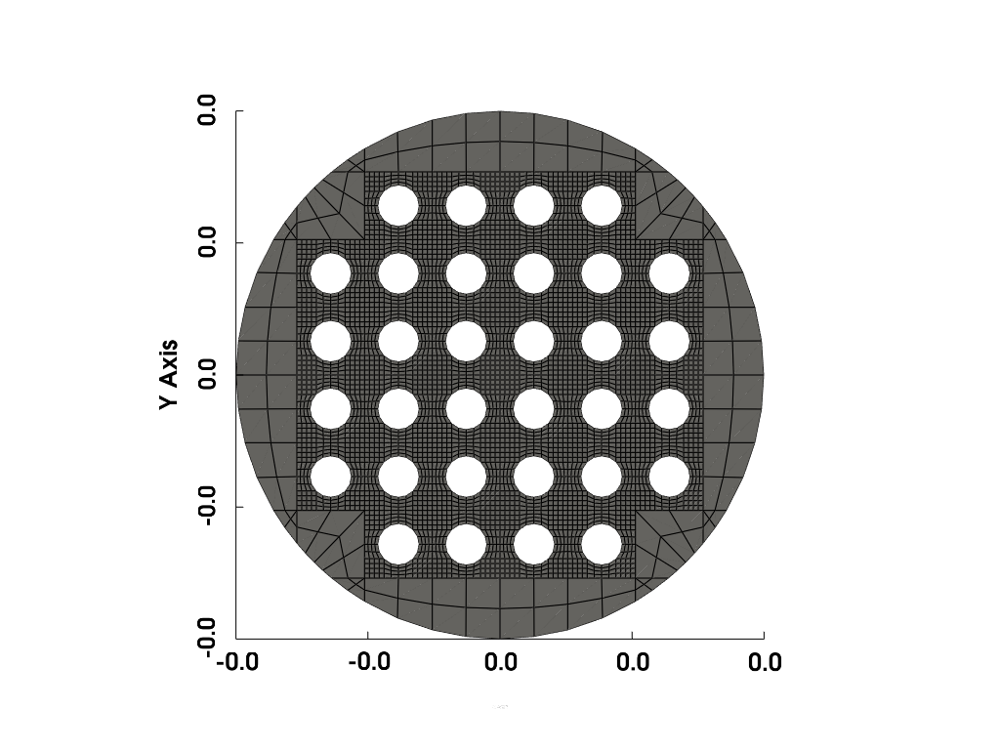
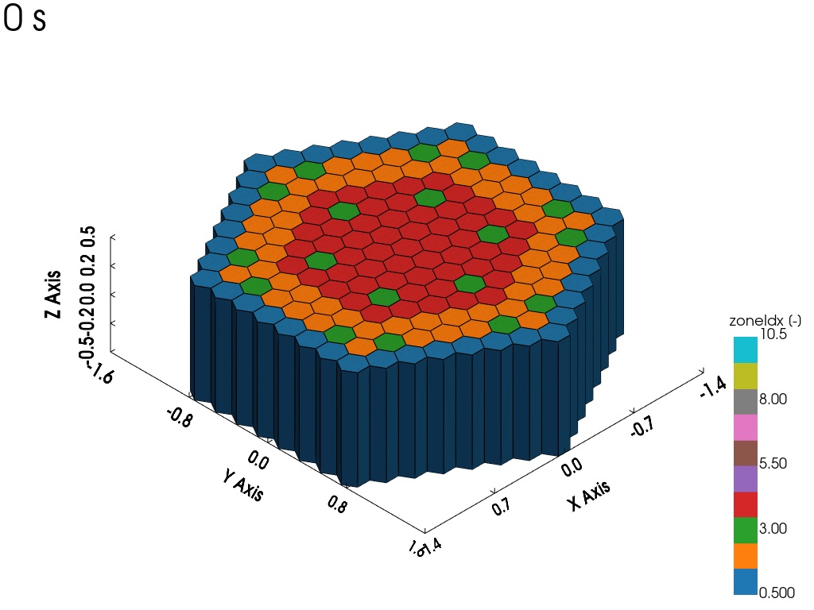
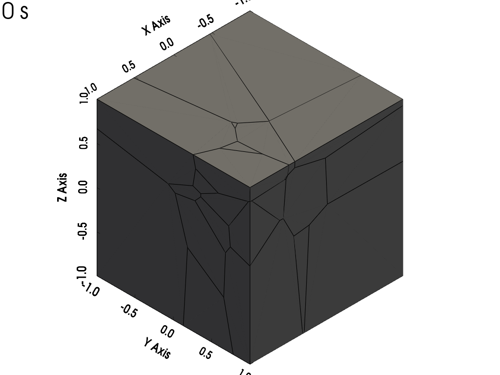

.. _pythonapi_mesh:

.. module:: foamForNuclear.mesh

---------------------------------------------
:mod:`foamForNuclear.mesh` -- Meshing Routine
---------------------------------------------

.. contents:: Table of Contents
    :local:

Meshes
------

.. autosummary::
    :toctree: generated
    :nosignatures:
    :template: myclassinherit.rst

    Mesh
    BlockMesh
    PolyMesh
    UnvMesh

Suggested packages
------------------

Here is a list of potential open-source tool that can be used to generate meshes
for OpenFOAM cases.

.. list-table:: Suggested packages for mesh generation in Python
    :widths: 50 50
    :header-rows: 1

    * - Package
      - Link

    * - Gmsh
      - https://pypi.org/project/gmsh-api/

    * - Salome
      - https://docs.salome-platform.org/latest/gui/SMESH/smeshpy_interface.html

    * - Classy-blocks
      - https://damogranlabs.com/2020/02/classy-blocks-for-blockmesh/

Elementary Meshes
-----------------

This section summaries all the elementary blocks that can be used to start
meshes.

.. list-table:: Elementary mesh types
    :widths: 50 50
    :header-rows: 1

    * - Code
      - Render

    * - Cube:

        :class:`BlockMesh.create_cube`

        .. code :: python

            mesh.create_cube(
                name='block',
                lowX=0, highX=1,
                lowY=0, highY=1,
                lowZ=0, highZ=1,
                nx=2, ny=3, nz=4
            )
      - .. image:: ../images/meshes/fig_mesh_cube_0.png
            :width: 500
            :alt: Cube

    * - Cylinder along Z:

        :class:`BlockMesh.create_cylinder_along_z`

        .. code :: python

            mesh.create_cylinder_along_z(
                name='block',
                radius=0.5,
                lowZ=0, highZ=1,
                nx=3, ny=3, nz=4,
                x=1, y=-1
            )
      - .. image:: ../images/meshes/fig_mesh_cylz_0.png
            :width: 500
            :alt: Cylinder

    * - Quarter Cylinder along Z:

        :class:`BlockMesh.create_quarter_cylinder_along_z`

        .. code :: python

            mesh.create_quarter_cylinder_along_z(
                name='block',
                radius=1,
                lowZ=0, highZ=1,
                nx=3, ny=5, nz=3,
                angleStart=0,
                isAddAllBC=True
            )
      - .. image:: ../images/meshes/fig_mesh_quarter_cylinder_0.png
            :width: 500
            :alt: Quarter Cylinder

    * - Hexagonal prism along Z:

        :class:`BlockMesh.create_hexagon_prism_along_z`

        .. code :: python

            mesh.create_hexagon_prism_along_z(
                "block",
                zmin=0, zmax=0.5,
                pitch=0.4,
                nr=2, nt=1, nz=3,
                isAddAllBC=True
            )
      - .. image:: ../images/meshes/fig_mesh_hexagon_0.png
            :width: 500
            :alt: Hexagonal prism

    * - Wedge along Z:

        :class:`BlockMesh.create_wedge`

        .. code :: python

            mesh.create_wedge(
                name='block',
                innerRadius=0,
                outerRadius=0.5,
                lowZ=0, highZ=1,
                wedgeAngle=15,
                nr=4,
                nz=5
            )
      - .. image:: ../images/meshes/fig_mesh_wedge_0.png
            :width: 500
            :alt: Wedge

    * - Sphere:

        :class:`BlockMesh.create_sphere`

        .. code :: python

            mesh.create_sphere(
                name="sphere",
                radius=1,
                nCenter=10,
                nBorder=2,
                isAddAllBC=True
            )
      - .. image:: ../images/meshes/fig_mesh_sphere_0.png
            :width: 500
            :alt: Sphere

    * - Half Sphere:

        :class:`BlockMesh.create_half_sphere`

        .. code :: python

            mesh.create_half_sphere(
                name="halfSphere",
                radius=1,
                z=-1,
                nCenter=10,
                nBorder=10,
                isAddAllBC=True
            )
      - .. image:: ../images/meshes/fig_mesh_half_sphere_0.png
            :width: 500
            :alt: Half Sphere

    * - Hollow Half Sphere:

        :class:`BlockMesh.create_hollow_half_sphere`

        .. code :: python

            mesh.create_hollow_half_sphere(
                name="sph1",
                innerRadius=0.5, outerRadius=0.8,
                nr=3,
                nt=10,
                isAddAllBC=True
            )
      - .. image:: ../images/meshes/hollow_half_sphere.png
            :width: 500
            :alt: Hollow Half Sphere

    * - Sphere 1D:

        :class:`BlockMesh.create_sphere_1D`

        .. code :: python

            mesh.create_sphere_1D(
                name='sph1',
                innerRadius=0, outerRadius=1,
                opening=5,
                nr=10,
                isAddAllBC=True
            )
      - .. image:: ../images/meshes/fig_mesh_sphere_1D_0.png
            :width: 500
            :alt: Sphere 1D

    * - Triangular Channel:

        :class:`BlockMesh.create_triangular_channel`

        .. code :: python

            mesh.create_triangular_channel(
                name='block',
                lowZ=0, highZ=1,
                pitch=1,
                radius=0.3,
                nx=3, ny=3, nz=4
            )
      - .. image:: ../images/meshes/fig_mesh_hexagon_channel_0.png
            :width: 500
            :alt: Triangular Channel

    * - Ring along Z:

        :class:`BlockMesh.create_ring_along_z`

        .. code :: python

            mesh.create_ring_along_z(
                name='block',
                innerRadius=0.2, outerRadius=0.5,
                lowZ=0, highZ=1,
                nr=3, nt=10, nz=4,
                x=1, y=-1
            )
      - .. image:: ../images/meshes/fig_mesh_ring_0.png
            :width: 500
            :alt: Ring

    * - Ring sector along Z:

        :class:`BlockMesh.create_ring_sector_along_z`

        .. code :: python

            mesh.create_ring_sector_along_z(
                name='block',
                innerRadius=0.2, outerRadius=0.5,
                angleStart=0, angleArc=60,
                lowZ=0, highZ=1,
                nr=3, nt=5, nz=4,
                x=1, y=-1
            )
      - .. image:: ../images/meshes/fig_mesh_ring_sector_0.png
            :width: 500
            :alt: Ring sector

    * - Cube with corner hole:

        :class:`BlockMesh.create_cube_with_corner_hole_along_z`

        .. code :: python

            mesh.create_cube_with_corner_hole_along_z(
                name="block",
                lowX=0, highX=1,
                lowY=0, highY=1,
                lowZ=0, highZ=1,
                radius=0.25,
                nx=3, ny=3, nz=4, nt=3,
                isHoleCylinder=True,
                isAddAllBC=True
            )
      - .. image:: ../images/meshes/fig_mesh_cube_corner_hole_0.png
            :width: 500
            :alt: Cube with corner hole

    * - Cube with square hole:

        :class:`BlockMesh.create_cube_with_hole_along_z`

        .. code :: python

            mesh.create_cube_with_hole_along_z(
                "block",
                lowX=0, highX=0.01,
                lowY=0, highY=0.01,
                lowZ=0, highZ=0.01,
                radius=0.003,
                nx=4, ny=4, nz=2, nt=4,
                isHoleCylinder=False,
                isAddAllBC=True
            )
      - .. image:: ../images/meshes/fig_mesh_square_hole_sqr_0.png
            :width: 500
            :alt: Cube with square hole

    * - Cube with cylindrical hole:

        :class:`BlockMesh.create_cube_with_hole_along_z`

        .. code :: python

            mesh.create_cube_with_hole_along_z(
                "block",
                lowX=0, highX=0.01,
                lowY=0, highY=0.01,
                lowZ=0, highZ=0.01,
                radius=0.003,
                nx=4, ny=4, nz=2, nt=4,
                isAddAllBC=True
            )
      - .. image:: ../images/meshes/fig_mesh_square_hole_cylz_0.png
            :width: 500
            :alt: Cube with cylindrical hole

    * - Hexagonal prism with hexagonal hole:

        :class:`BlockMesh.create_hexagon_prism_with_hole_along_z`

        .. code :: python

            mesh.create_hexagon_prism_with_hole_along_z(
                "hexHole",
                zmin=0, zmax=0.01,
                pitch=pitch,
                radius=0.003,
                nr=4, nt=4, nz=2,
                isHoleCylinder=False,
                isAddAllBC=True
            )
      - .. image:: ../images/meshes/fig_mesh_hexagon_hole_hex_0.png
            :width: 500
            :alt: Hexagonal prism with cylindrical hole

    * - Hexagonal prism with cylindrical hole:

        :class:`BlockMesh.create_hexagon_prism_with_hole_along_z`

        .. code :: python

            mesh.create_hexagon_prism_with_hole_along_z(
                "hexHole",
                zmin=0, zmax=0.01,
                pitch=pitch,
                radius=0.003,
                nr=4, nt=4, nz=2,
                isAddAllBC=True
            )
      - .. image:: ../images/meshes/fig_mesh_hexagon_hole_cylz_0.png
            :width: 500
            :alt: Hexagonal prism with cylindrical hole

Lattices
--------

Here is an example of use of the lattice placement using :class:`BlockMesh`.
The lattice map can be a regular MCNP/Serpent format. We recommend to use the
`Honeycomb lattice tool <https://foam-for-nuclear.gitlab.io/honeycomb/>`_  to
translate from OpenMC or CASMO.

.. code-block:: python

    lattice = """
    0 0 0 0 0 0 0 R R R R R R R R
     0 0 0 0 0 0 R O C O O O C O R
      0 0 0 0 0 R C O O O O O O C R
       0 0 0 0 R O O I I I I I O O R
        0 0 0 R O O I C I I C I O O R
         0 0 R O O I I I I I I I O O R
          0 R C O I I I I I I I I O C R
           R O O I C I I I I I C I O O R
            R C O I I I I I I I I O C R 0
             R O O I I I I I I I O O R 0 0
              R O O I C I I C I O O R 0 0 0
               R O O I I I I I O O R 0 0 0 0
                R C O O O O O O C R 0 0 0 0 0
                 R O C O O O C O R 0 0 0 0 0 0
                  R R R R R R R R 0 0 0 0 0 0 0"""

    latticeNXY = len([line for line in lattice.split("\n") if line != ""])
    pitch = 0.2108079
    coreHeight = 1
    coreNodes = 10

    nMesh = mesh.BlockMesh(region='neutroRegion')

    nMesh.lattice_placement(
        funcElementGenerator=lambda name, x, y: nMesh.create_hexagon_prism_along_z(
            name="innerCore",
            zmin=-coreHeight/2,
            zmax=coreHeight/2,
            pitch=pitch,
            x=x, y=y,
            nr=1,
            nt=1,
            nz=coreNodes,
            isAddAllBC=True
        ),
        lattice=lattice,
        latticeType="hexagon",
        nx=latticeNXY, ny=latticeNXY,
        pitch=pitch,
        elementsToPlace=['I']
    )

Which generate the following mesh.

One can also create a square lattice that fits in a cylindrical shape using the
:class:`BlockMesh.fill_lattice_ring_gap` function.

.. code-block:: python

    lattice = """
    0 F F F F 0
    F F F F F F
    F F F F F F
    F F F F F F
    F F F F F F
    0 F F F F 0
    """

    pitch = 0.01
    nXY = len(lattice.strip('\n').split('\n'))

    # Create the lattice
    nMesh.lattice_placement(
        funcElementGenerator=lambda name, x, y: nMesh.create_cube_with_hole_along_z(
            "squareHole",
            lowX=x-pitch/2, highX=x+pitch/2,
            lowY=y-pitch/2, highY=y+pitch/2,
            lowZ=0, highZ=0.01,
            radius=0.003,
            nx=4, ny=4, nz=2, nt=4,
            isAddAllBC=True
        ),
        lattice=lattice,
        latticeType='square',
        pitch=pitch,
        nx=nXY,
        ny=nXY,
        elementsToPlace='F'
    )

    # Fill the gap
    nMesh.fill_lattice_ring_gap(
        name='gap',
        ringRadius=0.039,
        nxLat=nXY,
        nyLat=nXY,
        pitch=pitch,
        latticeType='square',
        nxBlock=2,
        nyBlock=2,
        nzBlock=2,
        zmin=0,
        zmax=0.01,
        isAddAllBC=True
    )

Or using :class:`PolyMesh` to create hexagonal prism assemblies with one cell

.. code-block:: python

    nMesh = mesh.PolyMesh(region='neutroRegion')

    nMesh.add_voronoi_points_from_lattice(
        lattice=lattice,
        latticeType='hexagon',
        nx=nXY, ny=nXY,
        pitch=pitch,
    )
    # Generate the mesh
    nMesh.generate_mesh_from_voronoi_points(
        boundaryBox=[[-3, 3], [-3, 3], [-coreHeight/2, coreHei-coreHeight/2]],
        cellZonesToStrip=['e'],
        isAddInletOuletBC=True,
    )

Pipe manifold
-------------

Pipe manifold can used for inlet and outlet piping from a reactor vessel. Here
follows an example of use for a 3-loop outlet with arbitrary dimensions:

.. code-block:: python

    equivalentHydraulicDiameter = 0.3

    # Manifold
    manifoldBlocks = thMesh.create_pipe_cylindrical_manifold_along_z(
        name='manifold',
        nEntries=3,
        innerRadius=1, outerRadius=2,
        equivalentHydraulicDiameter=equivalentHydraulicDiameter,
        lowZ=2,
        nr=4,
        nt=10
    )
    pipeEntries = manifoldBlocks[::2]

    for i, pipeEntry in enumerate(pipeEntries):
        pipe0 = thMesh.extrude_normal(pipeEntry, 'front', f'hotLeg{i}_pipe0', 0.5, 2)

        direction = pipe0.get_face_normal('front')
        direction.rotateZ(45*np.pi/180)

        pipe1 = thMesh.add_pipe_1D_from_direction(
            name=f'hotLeg{i}_pipe1',
            originPosition=pipe0,
            direction=direction,
            length=2,
            equivalentHydraulicDiameter=equivalentHydraulicDiameter,
            elbowRadius=0.5,
            n=4,
            isAddAllBC=True,
            originPositionOutletFaceName='front'
        )

.. list-table:: Manifold render
    :widths: 50 50
    :header-rows: 1

    * - XY-view
      - View
    * - .. image:: ../images/meshes/pipe_manifold_3loops_xy.png
            :width: 500
            :alt: XY-view of a 3-loop manifold with pipes
      - .. image:: ../images/meshes/pipe_manifold_3loops.png
            :width: 500
            :alt: View of a 3-loop manifold with pipes

Pebble bed mesh
---------------

Here is an example of use of the :class:`PolyMesh` mesher to create a mesh for a pebble
bed. One might change the ``rng.uniform`` function into a sphere packing algorithm
to represent the center of the spheres.

.. code-block:: python

    thMesh = mesh.PolyMesh(region='fluidRegion')

    rng = np.random.default_rng(11)
    nPoints = 30
    points = rng.uniform(size=(nPoints, 3))

    thMesh.add_voronoi_points_from_coordinates(coords=points)

    # Generate the mesh
    thMesh.generate_mesh_from_voronoi_points(
        boundaryBox=[[-1, 1], [-1, 1], [-1, 1]],
        cellZonesToStrip=['e'],
        isAddInletOuletBC=True,
    )

Which leads to the following mesh:

.. _pythonapi_mesh_motion:

Mesh motion
-----------

Using ``solidBody`` motion solver:

.. code-block:: python

    dynamicMeshDict.dynamicFvMesh = "dynamicMotionSolverFvMesh"
    dynamicMeshDict.motionSolver = "solidBody"
    dynamicMeshDict.solidBodyMotionFunction = "multiMotion"

.. list-table:: Dynamic motion types
    :widths: 50 50
    :header-rows: 1

    * - Code
      - Render

    * - :class:`foamForNuclear.DynamicMeshDict.add_linear_motion`

        .. code :: python

            # Linear
            dynamicMeshDict.add_linear_motion(
                name='motion1',
                velocity=ffn.Vector(0.2, 0, 0)
            )

      - .. image:: ../images/meshes/mesh_motion_linearX.gif
            :width: 500
            :alt: Linear

    * - :class:`foamForNuclear.DynamicMeshDict.add_oscillating_linear_motion`

        .. code :: python

            # Oscillating Linear
            dynamicMeshDict.add_oscillating_linear_motion(
                name='motion2',
                amplitude=ffn.Vector(0.5, 0, 0),
                omega=0.5*np.pi
            )

      - .. image:: ../images/meshes/mesh_motion_oscillatingLinearX.gif
            :width: 500
            :alt: Oscillating Linear

    * - :class:`foamForNuclear.DynamicMeshDict.add_rotating_motion`

        .. code :: python

            # Rotating
            dynamicMeshDict.add_rotating_motion(
                name='motion3',
                omega=0.5*np.pi,
                axis=ffn.Vector(1, 0, 0)
            )

      - .. image:: ../images/meshes/mesh_motion_rotatingX.gif
            :width: 500
            :alt: Rotating

    * - :class:`foamForNuclear.DynamicMeshDict.add_oscillating_rotating_motion`

        .. code :: python

            # Oscillating Rotating
            dynamicMeshDict.add_oscillating_rotating_motion(
                name='motion4',
                omega=0.5*np.pi,
                amplitude=ffn.Vector(0, 45, 0)
            )

      - .. image:: ../images/meshes/mesh_motion_oscillatingRotatingY.gif
            :width: 500
            :alt: Oscillating Rotating
