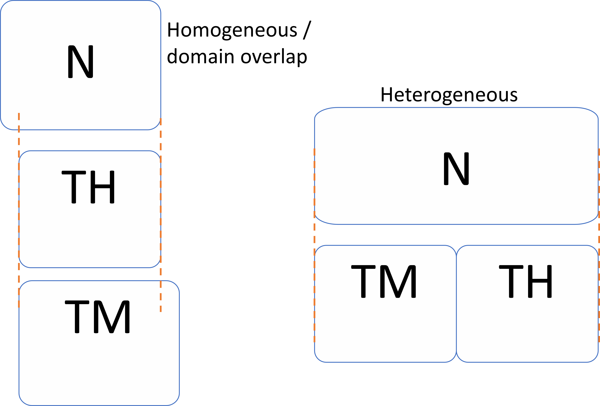
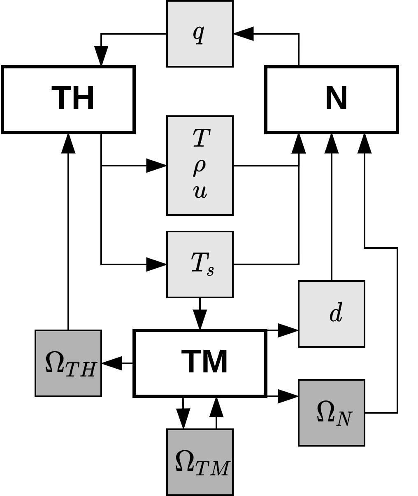

.. _couplingGF:

Achieving coupled solutions 
===========================

In GeN-Foam, the number of selected regions, each with their own mesh and solver, 
is completely arbitrary and specified by the user in the *system/regionsDict* dictionary. 
An example is shown below:

.. code :: cpp

    // In system/regionsDict

    regionSolvers
    {
        Level_0
        {
            fluidRegion     onePhase;
            neutroRegion    diffusionNeutronics;
        }
    }

If no additional coupling-specific settings are defined, the solutions for the
selected regions will be achieved independently, without exchange of information 
across them. In the following sections, the methods to achieve coupling between 
physics are detailed.

.. note ::
    Physics selected in *regionSolvers/Level_0* are solved only once per time-step. 
    Refer to the subsection about loops to see how multiple iterations per time-step 
    can be performed to achieve tight coupling.

Coupling logic
--------------

Different physics can be coupled in GeN-Foam through two main mechanisms:
volumetric coupling, which relies on volumetric field mappings between overlapping
domains, and boundary coupling, which enforces information exchange across a
shared interface via boundary conditions. The choice between the two depends on
the geometrical relationship between the regions involved and on how information
needs to be exchanged between the corresponding solvers. Both approaches rely on
OpenFOAM-native mapping capabilities and are fully configurable by the user.

    Example of coupled meshes with volumetric overlap and interface-based coupling.

.. note ::
    Hybrid approaches are also possible, where both volumetric and boundary
    coupling are employed within the same simulation to exchange information
    between different subsets of regions.

Volumetric coupling
-------------------

Volumetric coupling is best suited for geometrically overlapping domains and is
achieved by volumetrically mapping fields from one mesh to another, making use of
OpenFOAM mapping algorithms. In this approach, coupling variables are projected
from the mesh on which they are computed to the mesh on which they are required.

The details of the coupling are specified in *system/regionsDict*. Within the
sub-dictionary ``mappings``, each region defines the fields that are mapped
*onto* it. This is done by creating a *subDict* named after the region *from*
which the fields are mapped.

For example, if a field needs to be mapped into the *fluidRegion* from the
*neutroRegion*, the corresponding mapping configuration is defined under
*regionsDict/mappings/fluidRegion/neutroRegion*. Within this *subDict*, the name
of the field on the source mesh is specified in the *sourceFields* entry (e.g.,
``powerDensity`` in the neutroRegion), while the name of the field on the target
mesh is provided in the *targetFields* entry (e.g.,
``powerDensityStructure`` in the fluidRegion).

An example of the volumetric coupling setup:

.. code :: cpp

    // In system/regionsDict

    regionSolvers
    {
        Level_0
        {
            fluidRegion     onePhase;
            neutroRegion    diffusionNeutronics;
        }
    }

    mappings
    {
        fluidRegion
        {
            neutroRegion // to fluidRegion
            {
                sourceFields    ( powerDensity );
                targetFields    ( powerDensityStructure );
            }
        }
        neutroRegion
        {
            fluidRegion // to neutroRegion
            {
                sourceFields    ( T      thermo:rho );
                targetFields    ( TCool  rhoCool );
            }
        }
    }

This coupling routine is templated; therefore, the user does not need to specify
the field type (i.e., scalar or vector). A detailed example of the usage of this
coupling approach can be found in any multi-physics tutorial, such as
`3D_SmallESFR <https://gitlab.com/foamForNuclear/foamForNuclear/-/tree/master/tutorials/reactorCases/3D_SmallESFR/extendedThermoMechanics/>`_.
Moreover, tutorial `2D_fullCoupling <https://gitlab.com/foamForNuclear/foamForNuclear/-/tree/master/tutorials/featureCases/2D_fullCoupling>`_
has been created to allow users to play around with the volumetric couplings and understand
their logic.

.. note ::
    GeN-Foam can
    be used to map *any* scalar or vectorial field to *any* scalar of vectorial
    fields on a different mesh, enabling the simulation of any arbitrarily coupled
    multi-physics simulation that leverages the currently existing libraries.

.. note ::
    There is no need for the all domains to be the same. GeN-Foam will project 
    fields in a "clever" way whenever there is no overlap between 2 domains.

.. note ::
    When using the *legacyThermoMechanics* solver, the treatment of structural
    temperatures depends on the geometrical overlap between the thermo-mechanics and
    thermal-hydraulics regions. If an overlap with the fluid region is detected, the
    structural temperature is taken directly from the porous-medium structure
    calculation performed by the thermal-hydraulics solver, and no heat diffusion
    equation is solved in the solid. If no overlap is present, the temperature field
    is computed by solving the heat diffusion equation in the solid domain. In the
    case of a partial overlap, the thermo-mechanics solver computes the temperature
    only in the regions where no overlap with the thermal-hydraulics mesh exists.

Here is a list of the fields which are most commonly coupled across physics and
their names:

.. list-table:: Common field correspondence table
    :widths: 50 50 50 50
    :header-rows: 1

    * - Physics Field
      - Thermal-hydraulics
      - Neutronics
      - Thermo-mechanics
    * - Coolant temperature
      - T
      - TCool
      - N/A
    * - Coolant velocity
      - U
      - U
      - N/A
    * - Coolant density
      - thermo:rho
      - rhoCool
      - N/A
    * - Fuel temperature (avg)
      - T.fuelAvForNeutronics
      - TFuel
      - TFuel
    * - Clad temperature (avg)
      - T.cladAvForNeutronics
      - TClad
      - TFuel (if linked fuel)
    * - Structures temperature
      - T.passiveStructure
      - TStruct
      - TStructFromTH/T\*
    * - Power density (structures)
      - powerDensityStructure
      - powerDensity
      - powerDensityNeutronics
    * - Power density (liquid)
      - powerDensityLiquid
      - secondaryPowerDensity
      - N/A
    * - Displacement
      - N/A
      - disp
      - meshDisp/disp \*\*
    * - Coolant viscosity
      - mu
      - mu
      - N/A
    * - Coolant phase
      - alpha+phaseName e.g. alpha.liquid (twoPhase) alpha (onePhase)
      - alpha ***
      - N/A
    * - Thermal turbulent diffusivity
      - alphat (if exists)
      - alphat
      - N/A

\* In thermo-mechanics, the heat diffusion equation is solved only in the non-porous zones, while temperature from the thermal-hydraulics is expected in
the porous structures. Hence, the structures temperatures need to be mapped onto
the ``TStructFromTH`` field.

** The thermo-mechanics solver computes the displacement using the linear elastic
formulation. This result in the field named ``disp``. In order to compute the
neutronics deformation, the radial component of disp is combined to an axial
component computed as the thermal deformation of fuel/control rods (if
available). Hence, this is the field which is normally expected to be coupled to
the neutronics field named disp.

*** Most of the MSR cases which involve liquid fuel (and as a result the need to
map the coolant phase from TH to neutronics) are single-phase, hence simply
mapping alpha (TH) to alpha (neutronics) will work. However, in case a
multi-physics liquid-fuel, the coolant fraction that needs to be mapped is the
sum of ``alpha.liquid`` and ``alpha.vapour``. Such a field is currently not
existing in the thermal-hydraulics solver. However, using the conventional
OpenFOAM functions one can create a new field runTime and map it if needed. An
example of such approach is shown below.

In the *controlDict* add:

.. code :: cpp

    // In system/controlDict

    functions
    {
        newFieldCreation
        {
            type			coded;
            libs			("libutilityFunctionObjects.so");
            name			newFieldCreation;
            executeControl	timeStep;
            executeInterval 1;
            enabled			true;
            region          fluidRegion; //or whatever other region, but important to specify otherwise it is defaulted to region0 and the fields are not found

            codeExecute
            #{
                // Lookup the fields needed for the creation of the new field
                const volScalarField& field1 = mesh().lookupObjectRef<volScalarField>("field1"); // Use correct names of the fields
                const volScalarField& field2 = mesh().lookupObjectRef<volScalarField>("field2");

                // Creation of the new field

                static autoPtr<volScalarField> newField;

                if (!mesh().foundObject<volScalarField>("newField"))
                {
                    newField.reset
                    (
                        new volScalarField
                        (
                            IOobject
                            (
                                "newField",
                                mesh().time().timeName(),
                                mesh(),
                                IOobject::NO_READ,
                                IOobject::AUTO_WRITE
                            ),
                            field1 + field2 // here as an example the sum of the two fields is considered
                        )
                    );
                }
                else
                {
                    // Insert here any operation required
                    newField() = field1+field2;
                    newField().correctBoundaryConditions();
                }
            #};
        }
    }

Boundary coupling
-----------------

Boundary coupling is used when different physics are solved on distinct,
non-overlapping regions that share a common interface. In this case, information
is exchanged exclusively across the interface, and the coupling is enforced by
means of mapped boundary conditions provided by OpenFOAM.

When boundary coupling is employed, the user must explicitly define the coupled
boundaries in the *polyMesh/boundary* file. In addition, for each coupled field,
the coupling specifications must be provided in the corresponding field files
located in the *0* directory. These specifications can involve simple mappings or
more advanced coupling strategies, such as conjugate heat transfer, where
both temperature and heat flux are continuous at the interface. Many of these
boundary condition types are readily available in OpenFOAM.

Tutorial `2D_flowOverPlate <https://gitlab.com/foamForNuclear/foamForNuclear/-/tree/master/tutorials/featureCases/2D_flowOverPlate/boundaryCoupling>`_
shows an example of boundary coupling.

The *loops*
-----------

Many multi-physics simulations might require large flexibility on the
time-loops. For instance, while some physics might be tightly coupled, others
are only loosely coupled. This is often the case for multi-scale
simulations, where physics are tightly coupled within a scale and loosely across
scales. In order to create this additional flexibility, dedicated "loops" are
created. For example, the ``picardLoop`` consists of
a list of tightly coupled physics. During run-time, when the physics are
corrected, if they are part of a ``picardLoop``, the physics will be
corrected iteratively, until a user-input convergence criterion is met. At each
iteration of the loop, volumetric and boundary field exchanges are performed to
update the coupling variables between the involved regions. In addition to the
standard ``picardLoop``, other loop types exist that are designed for specific
coupling strategies and may involve additional field manipulations or residual
evaluations tailored to the physics being coupled. *loops* are
also defined in *system/regionsDict* in
the ``regionSolvers`` sub-dictionary. Each entry of the subDict corresponds
to a different ``loop``, characterized by a list of subSolvers (i.e.
the solvers that are tightly coupled), a minimum residual to reach before the iterations
are interrupted and a maximum number of iterations and possibly additional keywords
depending on the type of *loop* selected. Note that
*loops* can be nested within one other, possibly leading to
tree-like structure as shown below.

.. mermaid::

    graph TD
        A[GeN-Foam] --> B[Solver 1]
        A --> C[MultiPhysicsSolver 1]
        C --> D[Solver 2]
        C --> E[MultiPhysicsSolver 2]
        E --> F[Solver 3]
        E --> G[Solver 4]

Which can be translated in *system/regionsDict*:

.. code :: cpp

    // In system/regionsDict

    regionSolvers
    {
        Level_0
        {
            Solver1                 physicsB;
            MultiPhysicsSolver1     picardLoop;
        }
        MultiPhysicsSolver1
        {
            solvers
            {
                Solver2                 physicsD;
                MultiPhysicsSolver2     picardLoop;
            }
            maxResidual     0.00005;
            maxIterations   3;
        }
        MultiPhysicsSolver2
        {
            solvers
            {
                Solver3     physicsF;
                Solver4     physicsG;
            }
            maxResidual     0.00005;
            maxIterations   3;
        }
    }

Note that all the physics that are specified in the ``Level_0`` of the ``regionSolvers`` dict are
loosely coupled, whereas only those specified within a ``picardLoop`` are
tightly coupled.

The previous example would correspond to a time loop as shown below.

.. mermaid::

    graph TD
        S@{ shape: sm-circ, label: "Small start" } --> A
        A[New time step] --> B[Solver 1]
        B --> C[Solver 2]
        C --> D[Solver 3]
        D --> E[Solver 4]
        E --> F{Is MultiPhysicsSolver 2 converged?}
        F -- No --> D
        F -- Yes --> G{Is MultiPhysicsSolver 1 converged?}
        G -- No --> C
        G -- Yes --> A
        G --> End@{ shape: framed-circle, label: "Stop" }

Current loops available in *GeN-Foam* are:

toctreeHere

Typical coupling logic for a nuclear reactor
--------------------------------------------

The standard sequence used to solve multi-physics nuclear reactor problems is
summarized with reference to the figure below.

    Typical coupling for logic porous-medium  reactor calculations.

Given an input volumetric power density :math:`q`, the thermal-hydraulics
sub-solver computes the resulting fields:

- fluid temperature :math:`T`,
- fluid density :math:`\rho`,
- fluid velocity :math:`U`,
- and structural temperatures :math:`T_s`.

For two-phase treatments, the fields :math:`T`, :math:`\rho`, and :math:`U`
represent mass-weighted mixture values. The velocity field :math:`U` is only
used for solver coupling in molten salt reactors (MSRs), where it is required to
advect delayed neutron precursors.

The power density :math:`q` may refer either to a sub‑scale structure
(e.g. a fuel rod) or to the fluid itself in liquid-fuel systems, depending on the
reactor type. The symbol :math:`T_s` collectively denotes temperatures of solid
structures—fuel, cladding, control rod drivelines, wrapper tubes, the diagrid,
and others—depending on which structural models are assigned to each cell zone.

The neutronics sub-solver computes the updated fuel volumetric power density
:math:`q` based on the coupling fields. Depending on the neutronics model
(diffusion, :math:`S_N`, or :math:`SP_3`), the solver may incorporate feedbacks
from:

- coolant temperature :math:`T` and density :math:`\rho`,
- average fuel and cladding temperatures :math:`T_s`,
- fuel axial expansion and core radial expansion, collectively :math:`d`,
- temperatures predicted by the thermal-mechanics sub-solver.

Whenever macroscopic cross-sections are parameterized against these fields, the
solver can account for the associated reactivity feedbacks. For point-kinetics,
feedbacks follow standard coefficient-based models.

The thermal-mechanics sub-solver computes temperatures in solid regions and an
overall displacement field used to deform the neutronics mesh. The displacement
is decomposed into axial and radial components, collectively denoted
:math:`d`, and passed to the neutronics module to model expansion-related
feedback.

