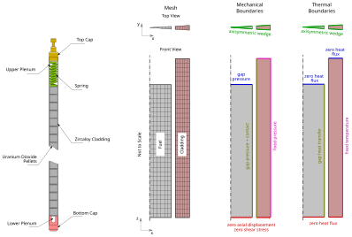
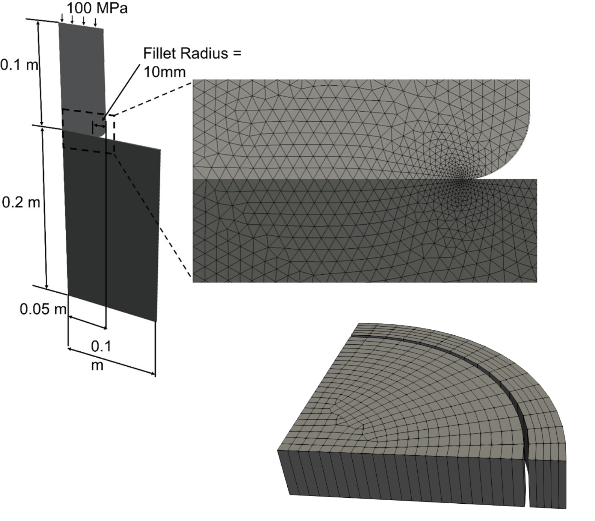

Computational domain, mesh, and boundary definitions
====================================================

OFFBEAT, like OpenFOAM, operates within a cell-centred finite-volume framework. The
computational domain is discretized into *cells*, while *patches* (i.e. boundaries) are
defined as collections of *faces*. Although OpenFOAM supports arbitrary unstructured
polyhedral meshes, hexahedral meshes are commonly used in OFFBEAT for one- and
two-dimensional r–z simulations (including discrete pellet models). This choice reflects
the relatively simple geometry of nuclear fuel rods and the high accuracy achievable with
structured meshes in such configurations.

This part of the User’s Guide provides essential information on computational domains,
meshes, and boundary definitions in OFFBEAT. It does not attempt to cover all aspects of
mesh generation, and users are strongly encouraged to become familiar with OpenFOAM
fundamentals, in particular mesh generation and discretization principles.

Mesh generation is often one of the most challenging aspects when first using OpenFOAM.
To facilitate this step, OFFBEAT provides dedicated tools to quickly define standard
nuclear fuel geometries. Further information is available in the Tools section of this
User’s Guide.

For fully three-dimensional simulations, it is generally advisable to rely on more
advanced meshing software, such as Cubit or Salome, which are not covered here.

.. warning::

    This guide focuses primarily on the use of ``blockMesh`` and does not cover advanced
    meshing tools. For detailed instructions on these tools, users should consult the
    corresponding software documentation.

Overview of a typical computational domain
------------------------------------------

The following figure illustrates a representative computational domain, mesh, and boundary
definitions for a light water reactor (LWR) fuel rod using a two-dimensional axisymmetric
configuration. In this example, the fuel is modeled as a smeared column and individual
pellets are not explicitly resolved.

   Example of a 2D axisymmetric computational domain for an LWR fuel rod.

Using the ``blockMesh`` utility
-------------------------------

The ``blockMesh`` utility is a core OpenFOAM tool for generating structured meshes. It reads
instructions from a dictionary file, typically named ``blockMeshDict``, which is usually
located in the ``system/`` folder of a case.

Although this section is not a comprehensive guide to ``blockMesh``, the main components
of a typical ``blockMeshDict`` are outlined below.

The dictionary is organized into four main sections:

* **Vertices**:
  Define the coordinates of the mesh vertices in three-dimensional space.

* **Blocks**:
  Define the mesh blocks connecting the vertices. This section controls the number of
  cells, mesh grading, and overall geometry.

* **Edges**:
  Used to define curved edges between vertices. This section is often empty for one- and
  two-dimensional smeared-column simulations, but can be used to represent curved pellet
  surfaces in two-dimensional r–z discrete pellet models.

* **Boundary**:
  Defines the boundary patches and their types (e.g. ``wall``, ``empty``, ``wedge``,
  ``symmetry``). Each patch corresponds to a region of the domain that interacts with
  external conditions or with another region.

A simplified and annotated example of a ``blockMeshDict`` is shown below. For full details,
users are referred to the official OpenFOAM documentation.

.. code-block:: c++

    convertToMeters 0.001;   // Units are in millimetres

    rFuel 4.525;             // Fuel radius
    // ... Additional variable definitions

    vertices
    (
        (0 0 0)        // Vertex 0
        ($rFuel 0 0)   // Vertex 1
        // ... Additional vertices
    );

    blocks
    (
        hex (0 1 2 0 3 4 5 3) fuel (30 10 1)
            simpleGrading (0.1 1 1)
        // ... Additional blocks
    );

    edges
    (
        // Empty for smeared-column meshes
    );

    boundary
    (
        fuelTop
        {
            type empty;
            faces ( (3 4 5 3) );
        }

        fuelOuter
        {
            type patch;
            faces ( (1 2 10 9) );
        }
    );

The use of variables and simple arithmetic operations in ``blockMeshDict`` allows mesh
definitions to be easily modified and extended. Cell grading options, such as
``simpleGrading``, enable localized mesh refinement without increasing the overall mesh
size.

While ``blockMesh`` is well suited for structured geometries up to two-dimensional r–z
discrete pellet simulations, it cannot generate fully unstructured meshes. For more
complex geometries, advanced tools such as Cubit or Salome should be used.

   Examples of meshes generated with Salome for complex geometries.

Boundary types for fuel rod simulations
---------------------------------------

Although OpenFOAM meshes are inherently three-dimensional, one- and two-dimensional
problems can be modeled efficiently by applying appropriate boundary conditions.

* Two-dimensional axisymmetric problems
    ``wedge`` boundaries are applied in the azimuthal direction to represent cylindrical
    symmetry. In OFFBEAT, this configuration deactivates the azimuthal component of the
    mechanical solution.

    .. warning::

        When using ``wedge`` patches, the corresponding boundary condition for each field in
        the ``0/`` folder must also be set to ``wedge``.

    .. warning::

        The wedge angle is typically chosen between one and two degrees. For highly refined
        radial meshes, OpenFOAM may issue warnings related to wedge face planarity. Reducing
        the wedge angle can help mitigate these warnings, particularly when the
        ``multiMaterial`` correction is active.

    .. figure:: ../images/wedge_BCs.svg
        :width: 400
        :align: center

        Boundary conditions for a 2D axisymmetric simulation.

* Two-dimensional r–\ :math:`\theta` problems  
    ``empty`` boundary conditions are applied at the top and bottom boundaries, with a
    single cell in the axial direction. ``symmetry`` or ``cyclic`` patches can be used to
    reduce the domain size.

    .. warning::

        When selecting ``empty`` as a patch type, the corresponding field boundary condition
        must also be set to ``empty``.

    .. note::

        OpenFOAM does not require explicit ``empty`` boundary definitions for all fields,
        although their inclusion is recommended for clarity.

    .. warning::

        This configuration corresponds to a plane-strain condition
        (:math:`\epsilon_{zz} = 0`). To model plane stress, the ``planeStress`` option must be
        activated in the ``rheologyOptions`` subdictionary of ``solverDict``.

    .. figure:: ../images/disc_BCs.svg
        :width: 400
        :align: center

        Boundary conditions for a 2D disc simulation.

* One-dimensional axisymmetric problems
    Applying ``empty`` boundaries to the axial faces of a 2D axisymmetric ``wedge`` model
    effectively reduces the problem to one dimension.

    .. warning::

        This configuration corresponds to full plane strain. To enable modified plane strain
        (often referred to as 1.5D), activate ``modifiedPlaneStrain`` in
        ``rheologyOptions`` within ``solverDict``.

    .. figure:: ../images/1D_BCs.svg
        :width: 400
        :align: center

        Boundary conditions for a 1D rod simulation.

Coupled boundaries for contact and heat exchange
------------------------------------------------

Coupled boundaries are required to model contact, heat transfer, and information exchange
between regions. OFFBEAT provides the ``regionCoupledOFFBEAT`` patch type for this purpose.
It can be defined directly in ``blockMeshDict`` or applied later using
``changeDictionary`` or ``foamDictionary``.

This patch type is typically used for the ``fuelOuter`` and ``cladInner`` interfaces, but
can also be applied to other coupled surfaces, such as pellet–pellet contact.

.. warning::

    ``regionCoupledOFFBEAT`` is required when using coupled boundary conditions or patch
    fields such as ``fuelRodGap`` or ``gapContact``.

For coupled patches, the neighboring patch and region must be specified, together with
options controlling the Arbitrary Mesh Interface (AMI):

* **Owner**:
  The smaller patch (typically the fuel side) should be selected as the owner to ensure
  correct AMI behaviour.

* **updateAMI**:
  When enabled, the mapping between patches is updated at each iteration to account for
  relative motion between regions. This is important when fuel and cladding move axially
  with respect to each other.

* **AMIMethod**:
  By default, ``faceAreaWeightAMI`` is used and is recommended for most applications.
  Alternative methods (e.g. ``directAMI`` or ``nearestFace``) are available if required.

.. code-block:: c++

    fuelOuter
    {
        type            regionCoupledOFFBEAT;
        neighbourPatch  cladInner;
        neighbourRegion region0;
        owner           true;
        updateAMI       true;
    }

    cladInner
    {
        type            regionCoupledOFFBEAT;
        neighbourPatch  fuelOuter;
        neighbourRegion region0;
        owner           false;
        updateAMI       true;
    }

Mesh and material zones
----------------------

In OFFBEAT, material regions are defined using ``cellZones``. Each ``cellZone`` represents
a region of the computational domain associated with a specific material.

The name of a ``cellZone`` is arbitrary, but the material assigned to it must correspond to
one of the materials available in OFFBEAT. For example, a zone named ``fuel`` may be
associated with the UO\ :sub:`2` material in the ``materials`` dictionary.

The method used to define ``cellZones`` depends on the meshing tool:

* With ``blockMesh``, each block can be assigned a name corresponding to a material zone.

* External meshers, such as Gmsh or Salome, provide alternative mechanisms for defining zones, 
  but the underlying concept remains the same.

.. note::

    If ``cellZones`` are not defined during mesh generation, they can be added later using
    OpenFOAM utilities such as ``topoSet``.

Mesh refinement recommendations
-------------------------------

General guidelines for mesh resolution in fuel rod simulations are as follows:

* **Radial direction**:
  Approximately 30 radial cells in the fuel and 10–20 in the cladding provide a reasonable
  balance between accuracy and computational cost.

* **Axial direction**:
  One cell per axial power node is typically sufficient for one-dimensional simulations.
  Two-dimensional smeared-column models often use 30–100 axial cells over the full rod
  length, while discrete pellet simulations benefit from at least 20–30 axial cells per
  pellet. The optimal resolution depends on the required accuracy and available resources.
