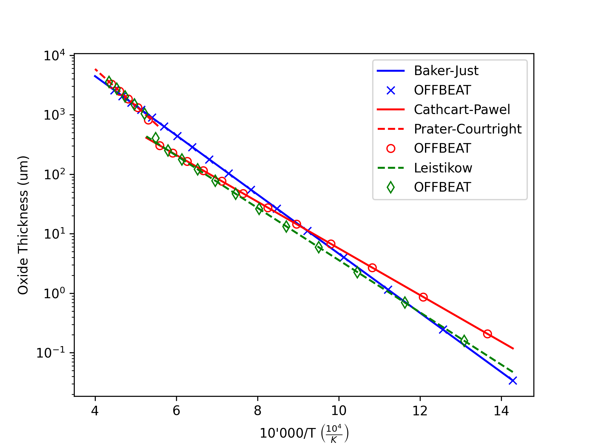

# Verification of high temperature oxidation models (1/2)

A 10cm long insulator has a linear temperature variation from 700 and 2300 K and a conductivity of zero.
The resulting oxide layer thickness after 1000 s is compared against the reference analytical solutions
for multiple high temperature oxidation models.

The comparison of results is shown in the figure below.

<figure>

<figcaption>Verification of high temperature oxidation models (1/2)</figcaption>
</figure>

