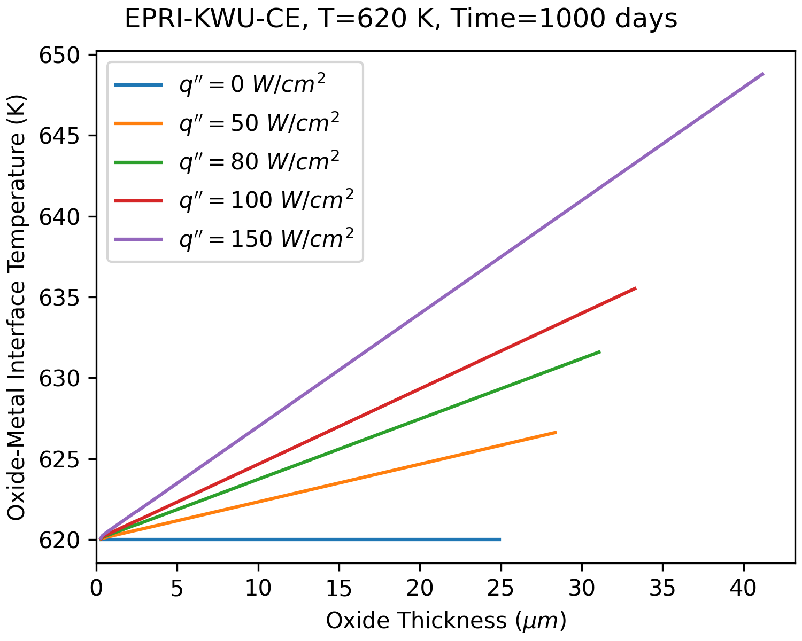
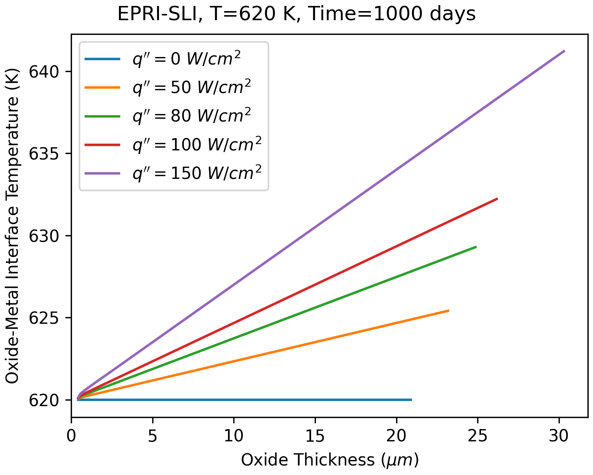
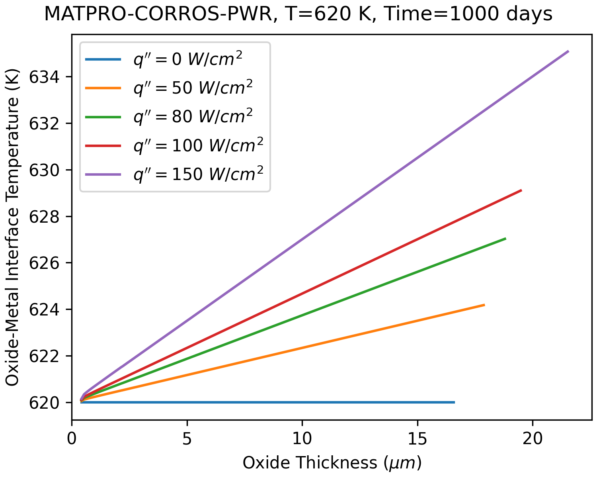
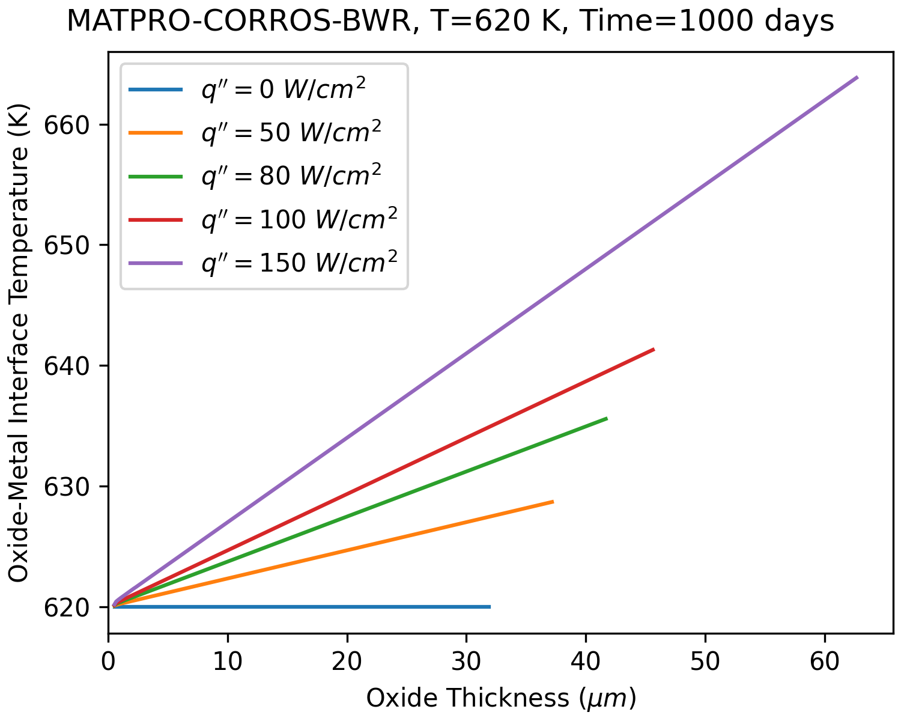

# Verification of low temperature oxidation models

This case is based on one of the cases included in the thesis of Almarshad[^1].
A zircaloy sample is subjected to a fixed outer (right) surface temperature of 620 K
and a constant heat flux at the inner (left) surface. The buildup of corrosion on
the outer surface is simulated for 1000 days.
The influence of the heat flux on the oxide thickness and interface temperature is
shown in the figures below for the low temperature oxidation models.

<figure>

<figcaption>Calculated influence of heat flux on the oxide-metal interface temperature 
and its effect on the corrosion rate for the EPRI KWU/CE model</figcaption>
</figure>

<figure>

<figcaption>Calculated influence of heat flux on the oxide-metal interface temperature 
and its effect on the corrosion rate for the EPRI SLI model</figcaption>
</figure>

<figure>

<figcaption>Calculated influence of heat flux on the oxide-metal interface temperature 
and its effect on the corrosion rate for the MATPRO PWR model</figcaption>
</figure>

<figure>

<figcaption>Calculated influence of heat flux on the oxide-metal interface temperature 
and its effect on the corrosion rate for the MATPRO BWR model</figcaption>
</figure>

[^1]: A. Almarshad, A Model For Waterside Oxidation of Zircaloy Fuel Cladding in 
      Pressurized Water Reactors, PhD thesis, Oregon State University, 1990
