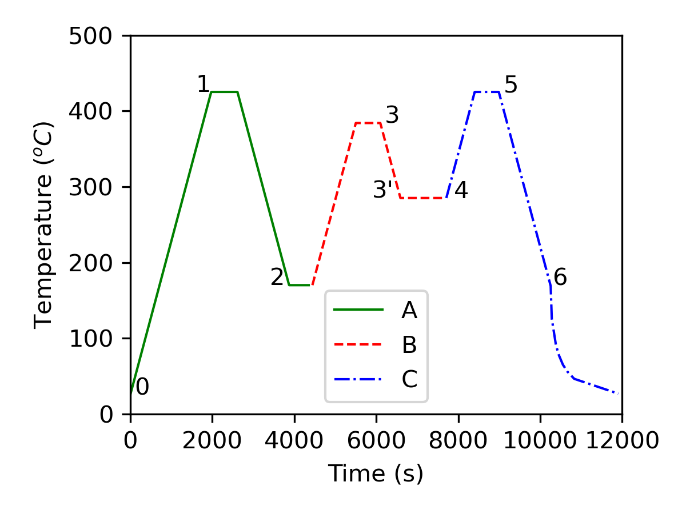
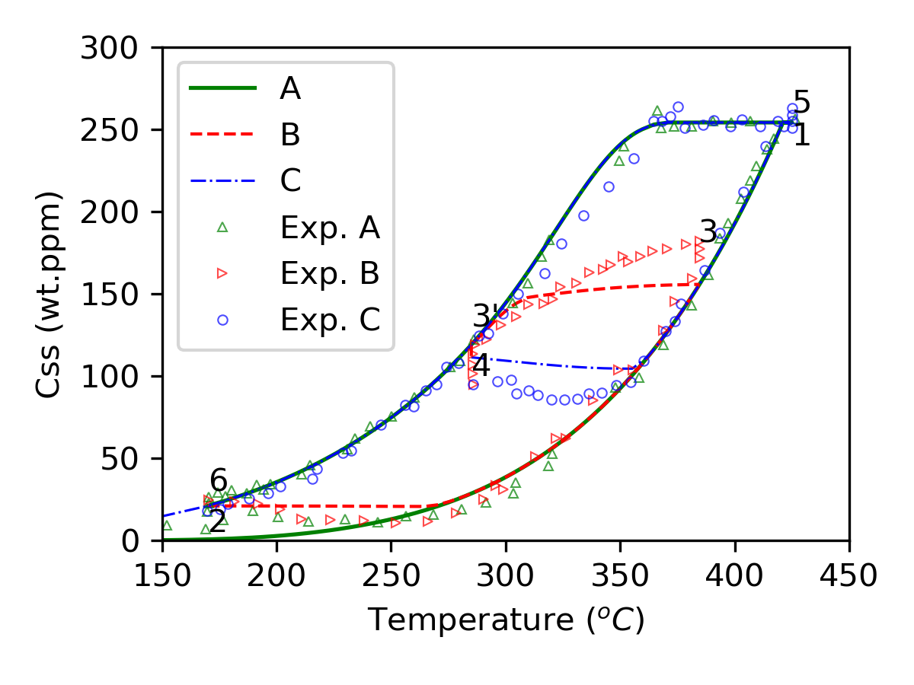

# La Croix Benchmark

Experimental studies of Lacroix [^1] to study the behaviour of hydrogen in a cold-worked stress-relieved Zircaloy-4 sheet subjected to repeated heating and cooling cycles.
The sample is initially charged with 254 wt.ppm of hydrogen.

The OFFBEAT simulation is run using the following fitted TSSp and TSSd curves.

$$
    TSSp = 6.8 \times 10^4 e^{\frac{29770}{RT}}
$$

$$
    TSSd = 1.6552 \times 10^6 e^{\frac{50660}{RT}}
$$

The temperature history and the resulting hydrogen concentration are shown below.

<figure>

<figcaption>Temperature history for the experiment of Lacroix</figcaption>
</figure>

<figure>

<figcaption>Hydrogen concentration history for the experiment of Lacroix</figcaption>
</figure>

[^1]: E. La Croix et al., Experimental determination of zirconium hydride precipitation and dissolution in zirconium alloy, Journal of Nuclear Materials, Volume 509,  October 2018, Pages 162-167
