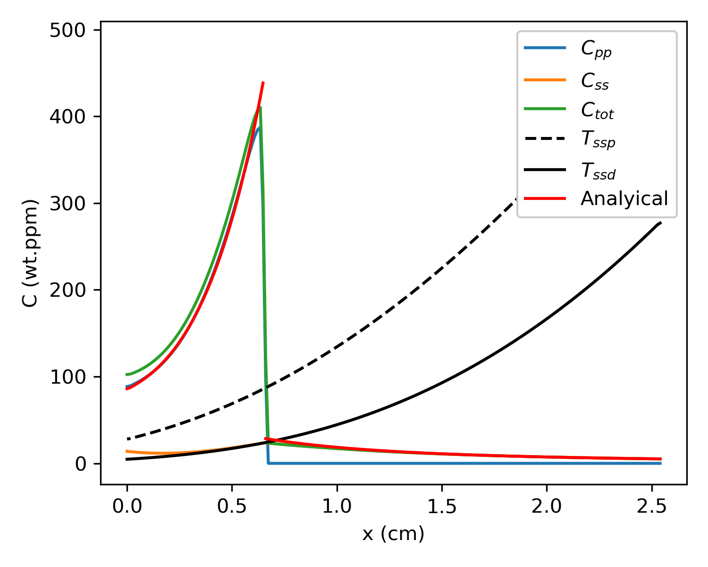

# Sawatksy Problem

Time-dependent hydrogen distribution in a precharged Zircaloy-2 specimen under a fixed temperature gradient, based on Sawatzky.[^1]

The case considered is a 25.4 mm long rectangular specimen, initially charged with 64 ppm hydrogen and left to anneal for 41 days in a constant temperature gradient. The cold and hot end temperatures are 157&deg;C and 454&deg;C respectively.

The analytical approximate solutions are given by:

* At the cold (two-phase) end

$$
N = C_0 e^{-\frac{Q^*}{RT}}
$$

* At the hot (single-phase) end

$$
N = N_i + \frac{K^2 D_0 N_0 \left(\Delta H + Q^*\right)}{RT^4}
      \left(\frac{\Delta H + Q}{R}-2T\right) t e^{-\frac{\Delta H + Q}{RT}}
$$

where

- $N$ is the total hydrogen concentration.
- $R$ is the universal gas constant.
- $T$ is the temperature
- The hydrogen diffusion coefficient is defined as $D = D_0 e^{-\frac{Q}{RT}}$
- $D_0$ is the frequency factor
- $Q$ is the activation energy for diffusion
- $Q^*$ is the heat of transport
- $\Delta H$ is the heat of mixing
- $N_0$ and $C_0$ are unknown constants fitted to the problem.

<figure>

<figcaption>Hydrogen profiles after 41 days</figcaption>
</figure>

[^1]: A. Sawatzky, Hydrogen in Zircaloy-2: its distribution and heat of transport, Journal of nuclear materials 2, No. 4 (1960) 321-328
