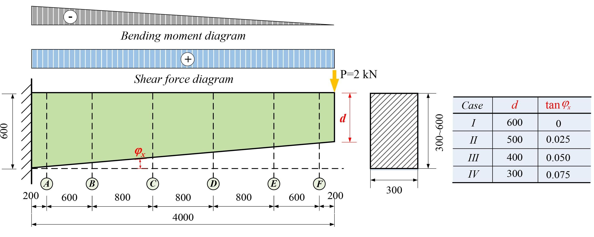
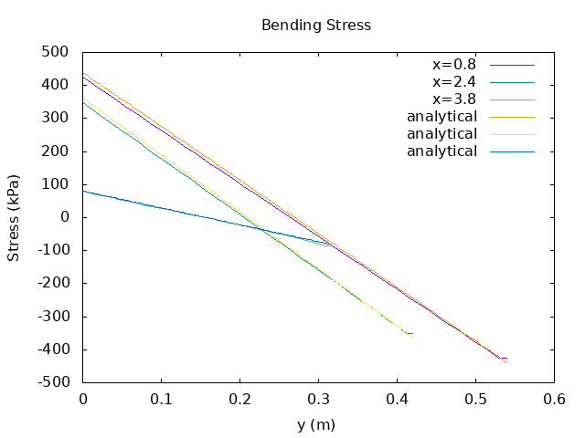
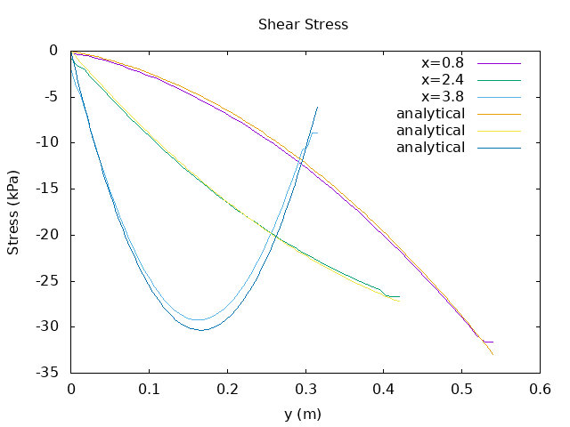

# Beam Bending Case

Tapered beam under combined bending and shear, case IV of [^1].

The geometry is shown below.

<figure>

<figcaption>Tapered beam geometry</figcaption>
</figure>

The OFFBEAT solutions for bending and shear stress are shown below.

<figure>

<figcaption>Bending stress at different locations along the beam length</figcaption>
</figure>

<figure>

<figcaption>Shear stress at different locations along the beam length</figcaption>
</figure>

[^1]: X. Su and M. Zhou, Analysis of shear stresses in tapered beams
     under bending, shear and axial force, Structures 41 (2022) 849–865, 
     https://doi.org/10.1016/j.istruc.2022.04.092
