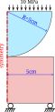

# Force conservation

We consider the traditional Hertz contact problem of a 5 cm radius cylinder pressing downwards
on a flat surface[^1] as illustrated below. The purpose of this case is not to verify the correct 
solution of the Hertz problem, but rather the conservation of forces for a case where the surfaces
are not aligned.

The mechanical properties of the flat base are \(E=50\) GPa and \(\nu=0.3\), and for the cylinder
are \(E=200\) GPa and \(\nu=0.3\).

For the OFFBEAT analysis, we specifically choose mismatching nodalisations at the contact point
so that corrections are needed to ensure conservation of forces on the contact surfaces. The
top, bottom and contact surfaces should all have total forces equal to the top pressure
multiplied by the surface area of the top surface and the force should be in the vertical
direction.

<figure>

<figcaption>Case geometry and configuration</figcaption>
</figure>

[^1]: R. G. Budynas and J. K. Nisbett, "Shigley's Mechanical Engineering Design, 11th edition," McGraw-Hill, Jan 2019.
     