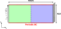
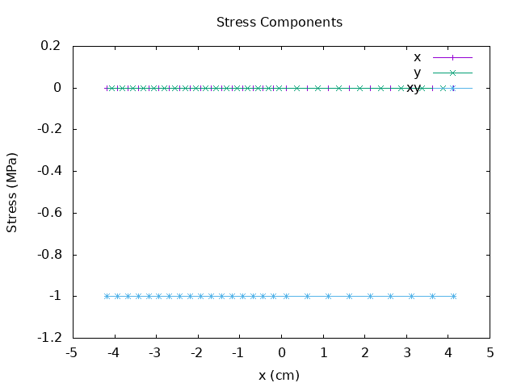
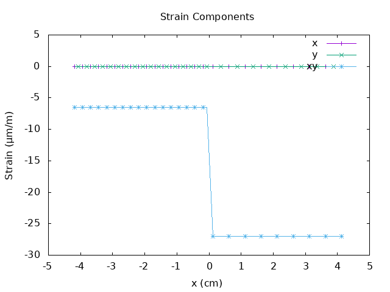

# Bi-material block 2

A 2D 10x4cm sample comprises two 5x4cm material regions subjected to a shear stress of 1 MPa on the left surface. The right surface is fixed. The domain is periodic in the y-direction.

<figure>

<figcaption>Bi-material block case layout</figcaption>
</figure>

For this case the shear stress \( \sigma_{xy} \) is constant across the interface while the other components are zero.

<figure>

<figcaption>Stress distribution in the x-direction</figcaption>
</figure>

Conversely, the shear strain  \( \epsilon_{xy} \) is discontinuous across the interface.

<figure>

<figcaption>Strain distribution in the x-direction</figcaption>
</figure>

