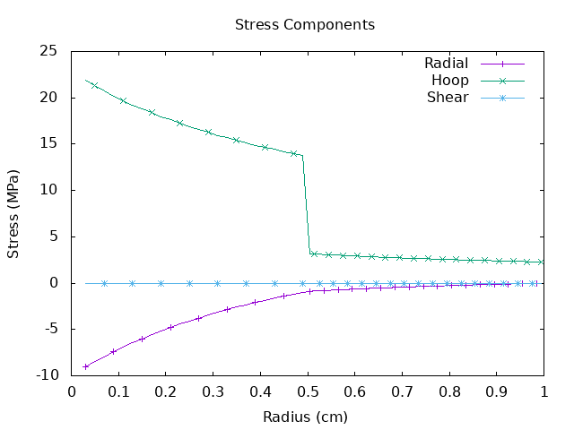
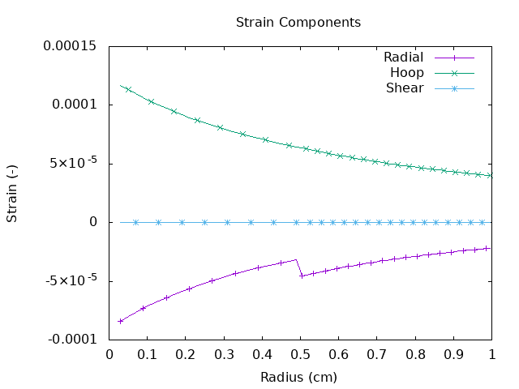

# Bi-material cylinder 1

Two concentric cylinders comprising materials with different mechanical properties are subjected to an internal pressure of 10 MPa. The case layout is shown below.

<figure>

<figcaption>Bi-material block case layout</figcaption>
</figure>

For this case the radial stress \( \sigma_r \) is constant across the interface while the hoop stress \( \sigma_\theta \) is discontinuous.

<figure>

<figcaption>Stress distribution in the x-direction</figcaption>
</figure>

Conversely, the radial strain \( \sigma_\theta \) is discontinuous.

<figure>

<figcaption>Strain distribution in the x-direction</figcaption>
</figure>

