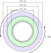
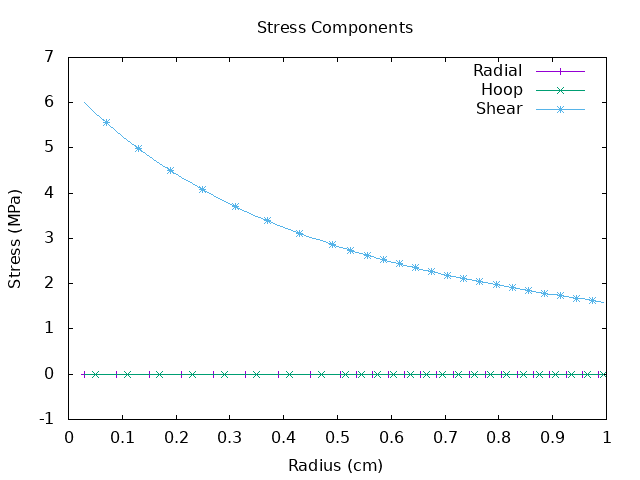
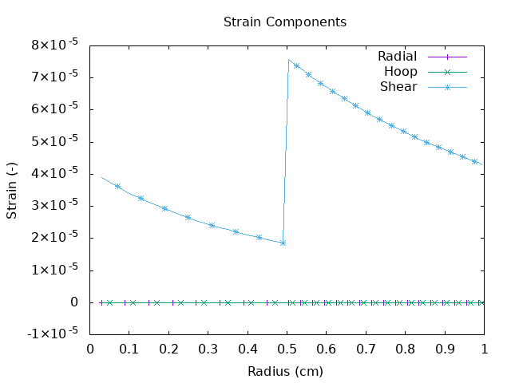

# Bi-material cylinder 2

Two concentric cylinders comprising materials with different mechanical properties are fixed at the inner surface and subjection to a torque of 1 Nm. The case layout is shown below.

<figure>

<figcaption>Bi-material block case layout</figcaption>
</figure>

For this case the shear stress \( \sigma_{r\theta} \) is constant across the interface while the other components are zero.

<figure>

<figcaption>Stress distribution in the x-direction</figcaption>
</figure>

Conversely, the shear strain  \( \epsilon_{r\theta} \) is discontinuous across the interface.

<figure>

<figcaption>Strain distribution in the x-direction</figcaption>
</figure>

