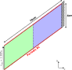
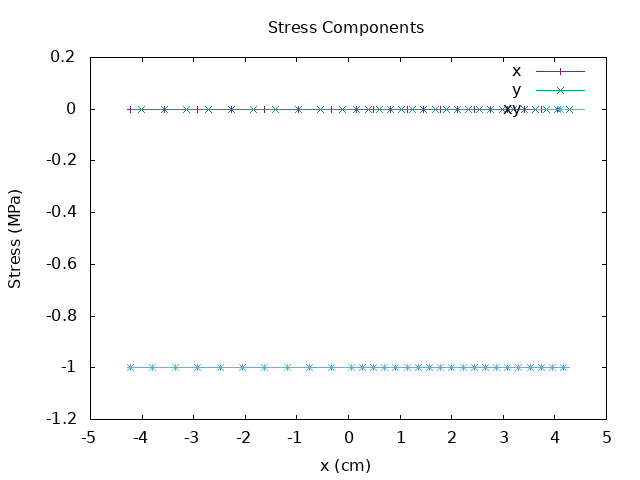
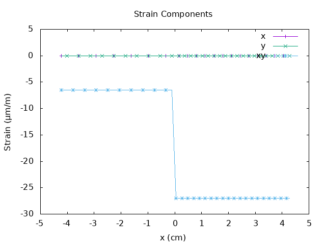

# Bi-material skew block 2

This case is identical to the bi-material block 1 case, except that the domain is distorted to test the non-orthogonality and skewness corrections.

<figure>

<figcaption>Bi-material block case layout</figcaption>
</figure>

For this case the shear stress \( \sigma_{xy} \) is constant across the interface while the other components are zero.

<figure>

<figcaption>Stress distribution in the x-direction</figcaption>
</figure>

Conversely, the shear strain  \( \epsilon_{xy} \) is discontinuous across the interface.

<figure>

<figcaption>Strain distribution in the x-direction</figcaption>
</figure>

