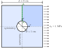
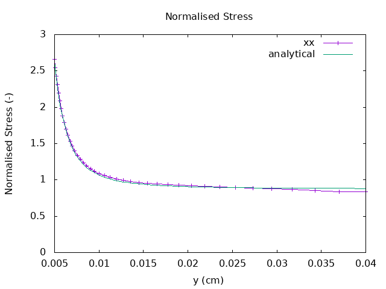

# Plate with Hole

We consider a 8x8 cm plate with 5 mm thickness, with a \( \phi \)1 cm hole in the centre.
The plate is modelled in two dimensions using the assumption of plain strain with symmetry in the x- and y-directions.
The plate is under \( \sigma_0 \) = 1 MPa tension in the x-direction.

<figure>

<figcaption>Case geometry and configuration</figcaption>
</figure>

The analytical solution for this case[^1] is given by

\[
    \sigma_{xx} = \sigma_0 \left( 1 + \frac{R^2}{2y^2} + 3\frac{R^4}{y^4} \right)
\]

where \( R=\frac{D}{2} \) and \( y \in (0.5, 4) \)cm.

The OFFBEAT solutions for normalised stress \( \frac{\sigma_{xx}}{\overline{\sigma}_{xx}} \)
along the section A-A is shown below, where \( \overline{\sigma}_{xx} \) represents the 
average stress along section A-A, i.e.

\[
    \overline{\sigma}_{xx} = \frac{\int{\sigma_{xx} dy}}{\int{dy}} = \frac{L-1}{L} \sigma_0
\]

<figure>

<figcaption>Normal stress along the section A-A </figcaption>
</figure>

The analytical stress concentration factor for this case is 2.662, which closely matches the
maximum predicted value.

[^1]: W. Bickley, The distribution of stress round a circular hole in a plate, 
     Philosophical Transactions of the Royal Society of London. Series A, 
     Containing Papers of a Mathematical or Physical Character, Volume 227, Issue 647-658, Jan 1928
     https://doi.org/10.1098/rsta.1928.0010
     