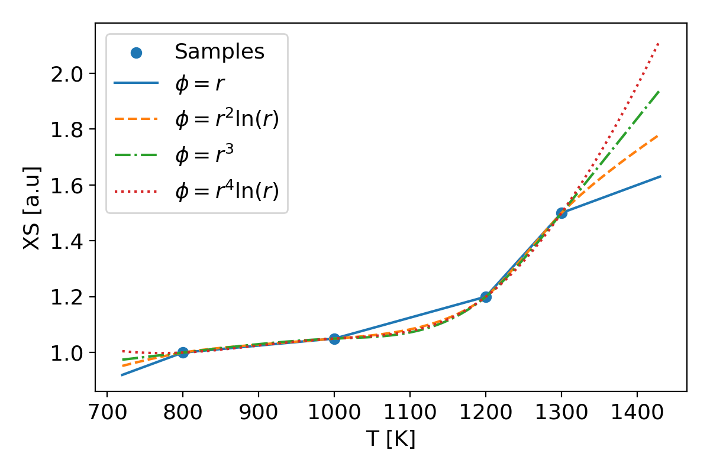

.. _userguide_neutronics_nuclearData:

The *nuclearData* dictionary
----------------------------

In the neutronics module, cross-sections and several other neutronics properties are handled
by the :ref:`XS.H <XS>` class. Detailed explanations on the file format are provided in
:ref:`XS.H <XS>` and in the tutorials (e.g `3D_SmallESFR
<https://gitlab.com/foamForNuclear/foamForNuclear/-/tree/master/tutorials/reactorCases/3D_SmallESFR/extendedThermoMechanics/constant/neutroRegion/neutronicsProperties>`_).

The *nuclearData* dictionary can be found under *constant/(neutronicsRegionName)/*. It
contains all basic nuclear properties for the reference and perturbed reactor
states. For instance, including ``TFuel`` in the ``reference`` state and a perturbed state
represents the temperatures at which the reference and perturbed cross-sections
have been calculated, respectively. Radial Basis Function interpolation is
performed by the module between reference and perturbed reactor states. It is
possible to provide the XS set with multiple perturbation variables (see example
below). If no perturbed state data are provided, the reference cross-sections
are used.

Special field for axial and radial expansions are provided as ``axExp`` and
``radExp`` (see `3D_SmallESFR
<https://gitlab.com/foamForNuclear/foamForNuclear/-/tree/master/tutorials/reactorCases/3D_SmallESFR/extendedThermoMechanics/constant/neutroRegion/neutronicsProperties>`_).

Nuclear data can be generated using any nuclear code such as `Serpent <https://serpent.vtt.fi/docs/>`_ or `OpenMC <https://docs.openmc.org/en/stable/>`_.
Several pre-processing tools are provided to the community to help format
the XS generated by these external tools to the neutronics module. Here follows
two external tools for Serpent and OpenMC.

:`serpentToFoam <https://gitlab.com/foamForNuclear/foamForNuclear/-/tree/master/tools/serpentToFoam/serpent2.1.23>`_:
    routines provided with GeN-Foam (in the *tools* folder) is an Octave script
    that automatically converts Serpent output files into the nuclear data files
    employed by GeN-Foam.
:`openmcToFoam <https://gitlab.com/foamForNuclear/foamForNuclear/-/tree/master/tools/openmcToFoam>`_:
    Python package provided with GeN-Foam automatically converts OpenMC output
    into nuclear data files.

These tools have also been implemented in the `Python API <https://foamfornuclear.gitlab.io/foamForNuclear/pythonapi/base.html#nuclear-data-and-neutronics-dictionaries>`_.
A tutorial is provided to show the usage of the data extraction with the API (see
`test_fuelPin_monteCarlo <https://gitlab.com/foamForNuclear/foamForNuclear/-/tree/docs/pythonapi/tutorials/developmentCases/test_fuelPin_monteCarlo?ref_type=heads>`_).

The entry ``discFactor`` is used only if discontinuity factors have to be used.
The term ``integralFlux``, is used only if the automatic adjustment of
discontinuity factors is performed (see :ref:`FIORINA2016212 <FIORINA2016212>`). Nonetheless, these entries
should always be present.

XS parametrization
~~~~~~~~~~~~~~~~~~

The neutronics module features XS parametrization using the Radial Basis Function (RBF)
interpolation scheme on any field found in the neutronics region. This method allows to
interpolate the XS using multiple parameters/perturbations (see example below).

It is possible to select different radial basis function based on the
polyharmonic splines using the ``polyharmonicSplineMode`` keyword in the
``neutronicsProperties`` file. The figure below shows the radial basis function
influence on the interpolation. The default mode is ``1``, which guarantee a
linear interpolation:

:`1`: :math:`\phi(r) = |r|`
:`2`: :math:`\phi(r) = r^2 \ln(r)`
:`3`: :math:`\phi(r) = |r^3|`
:`4`: :math:`\phi(r) = r^4 \ln(r)`

    Effects of Polyharmonic Spline Radial Basis Function order on arbitrary set of XS points.

In combination to the RBF interpolation, three laws are currently provided to
the user to modify the behavior and improve interpolation accuracy:

:``lin``: linear
:``sqrt``: square root
:``log``: logarithmic

It is possible to assign the law through the ``xsVariables`` sub dictionary in
*nuclearData* with the name of the field. If one or several fields provided in
``xsVariables`` are not default to the solver (e.g ``Tmatrix``), the code will
automatically create it in the neutronics region and can be used for additional
coupling with other solvers (see the :ref:`coupling page <couplingGF>`).

.. code :: cpp

    energyGroups    2;

    precGroups      6;

    xsVariables
    {
        TFuel       log;
        rhoCool     lin;
    }

    states
    (
        reference // Mandatory name not to be modified
        {
            TFuel   900;
            rhoCool 4125;

            zones
            (
                zone1
                {
                    fuelFraction 0.5;
                    IV nonuniform List<scalar> 2 (<value1> <value2>);
                    ...
                }
                ...
            );
        }

        Tfuel1200K // Arbitrary name
        {
            TFuel   1200;
            #include "XSTfuel1200K" // OpenFOAM shortcut to attach file content at this location
        }

        rhoCool3500kgm3
        {
            rhoCool 3500;
            #include "XSrhoCool3500kgm3"
        }

        Tfuel1200KandRhoCool3500kgm3
        {
            TFuel   1200;
            rhoCool 3500;
            #include "XSTfuel1200KandRhoCool3500kgm3"
        }
    );

.. note ::

    Cross-sections must be expressed according to the International System of
    Units (so m, not cm).

.. note ::

    ``defaultPrec`` has 1/m3 units except for the adjoint solver that needs 1/m2/s.

.. note ::

    The *nuclearData* file must always be present, even when not parametrizing
    cross-sections. If no parametrization is needed, the ``zones`` card must be
    left "blank" as:

.. code :: cpp

    xsVariables
    {}

    states
    (
        reference
        {
            zones
            ();
        }
    );

One can find more details on all the parameters in the :ref:`XS.H <XS>` file and commented
examples of *nuclearData* in the tutorials
`3D_SmallESFR <https://gitlab.com/foamForNuclear/foamForNuclear/-/tree/master/tutorials/reactorCases/3D_SmallESFR/extendedThermoMechanics/constant/neutroRegion/neutronicsProperties>`_ (for diffusion or SP3),
`Godiva_SN <https://gitlab.com/foamForNuclear/foamForNuclear/-/tree/master/tutorials/reactorCases/Godiva_SN/constant/neutroRegion/neutronicsProperties>`_ (for discrete ordinates) and
`2D_onePhaseAndPointKineticsCoupling <https://gitlab.com/foamForNuclear/foamForNuclear/-/tree/master/tutorials/featureCases/2D_onePhaseAndPointKineticsCoupling/rootCase/constant/neutroRegion/neutronicsProperties>`_ (for point kinetics).
`2D_onePhaseAndSubcriticalPointKineticsCoupling <https://gitlab.com/foamForNuclear/foamForNuclear/-/tree/master/tutorials/featureCases/2D_onePhaseAndSubcriticalPointKineticsCoupling/rootCase/constant/neutroRegion/externalSource>`_ (for subcritical point kinetics).

XS data
~~~~~~~

The nuclear data are composed of predefined XS and spatial kinetics related
parameters. For each cellZone, the sub-dict must contains the following
keywords as scalar:

:fuelFraction: Volume of fuel per lattice volume
:secondaryPowerVolumeFraction: (Optional) Volume fraction of secondary
                               power-producing structure e.g., graphite in
                               MSRs
:fractionToSecondaryPower: (Optional) Fraction of total power that goes
                           to secondary power-producing structure

And as a ``nonuniform List<scalar> ng`` with ``ng`` the number of energy
groups, which must be equal to ``energyGroups``:

:IV: Inverse velocity (constant)
:D: Diffusion coefficient (variable with XS parametrization)
:nuSigmaEff: Fission neutrons cross-section (variable with XS parametrization)
:sigmaPow: Fission energy release cross-section (variable with XS parametrization)
:sigmaRemoval: Removal cross-section (variable with XS parametrization)
:scatteringMatrixP0: Scattering cross-section matrix (variable with XS parametrization)
:chiPrompt: Prompt fission emission spectrum
:chiDelayed: Delayed fission spectrum
:discFactor: Discontinuity factors
:integralFlux: Integral flux for adapting discontinuity factors

And as a ``nonuniform List<scalar> nd`` with ``nd`` the number of delayed
neutron groups, which must be equal to ``precGroups``:

:Beta: Delayed neutron fraction
:lambda: Precursor decay constant

XS extraction and parametrization using the Python API
~~~~~~~~~~~~~~~~~~~~~~~~~~~~~~~~~~~~~~~~~~~~~~~~~~~~~~

As mentioned above, one can use solely the foamForNuclear Python API to
pre-process nuclear data from the output of external tools such as Serpent
or OpenMC.

A tutorial is provided to show the usage of the data extraction with the API (see
`test_fuelPin_monteCarlo <https://gitlab.com/foamForNuclear/foamForNuclear/-/tree/docs/pythonapi/tutorials/developmentCases/test_fuelPin_monteCarlo?ref_type=heads>`_).

Here follows an example of usage using Serpent:

.. code :: python

    import foamForNuclear as ffn

    referenceState = ffn.nuclearData.NuclearDataState('reference')
    referenceState.read_from_serpent(
        outputFilename="path/to/serpent/main_res.m",
        universes=[
            # List the mapping of Serpent universe to the OpenFOAM's cellZones
            # Serpent universe name
            # |         OpenFOAM cellZone name
            # |         |           Volume fraction of fuel
            # |         |           |
            ('uFuel',   'fuel',     1),
            ('uClad',   'cladding', 0),
            ('uWater',  'water',    0),
        ]
    )

    # Then add the nuclear data state to the nuclear data
    neutronicsSolver.nuclearData.add_state(referenceState)

One can also parametrize multiple external code results in the API as follow:

.. code :: python

    import foamForNuclear as ffn

    refState = ffn.nuclearData.NuclearDataState(
        "reference",
        parameters={'Tfuel': 1000, 'rhoCool': 1000},
        zones=[...]
    )
    refState.read_from_serpent(...)

    Tfuel1200K = ffn.nuclearData.NuclearDataState(
        "Tfuel1200K",
        parameters={'Tfuel': 1200}, # Assume by default that rhoCool is not perturb and uses rhoCool = 1000
        zones=[...]
    )
    Tfuel1200K.read_from_serpent(...)

    TfuelAndRhoHot = ffn.nuclearData.NuclearDataState(
        "TfuelAndRhoHot",
        parameters={'Tfuel': 1200, 'rhoCool': 900},
        zones=[...]
    )
    TfuelAndRhoHot.read_from_serpent(...)

    # Then add the states to the nuclear data
    neutronicsSolver.nuclearData.add_state(refState)
    neutronicsSolver.nuclearData.add_state(Tfuel1200K)
    neutronicsSolver.nuclearData.add_state(TfuelAndRhoHot)

If the ``nuclearData`` has been prepared using another tool, one can import it
using the API as follow:

.. code :: python

    neutronicsSolver.nuclearData.import_from_openfoam("path/to/nuclearData")
