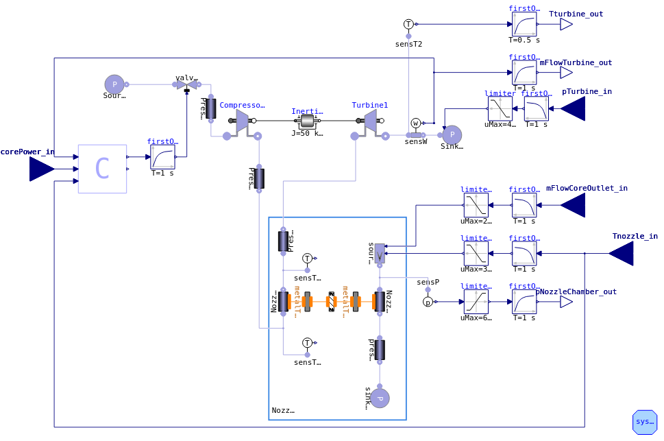
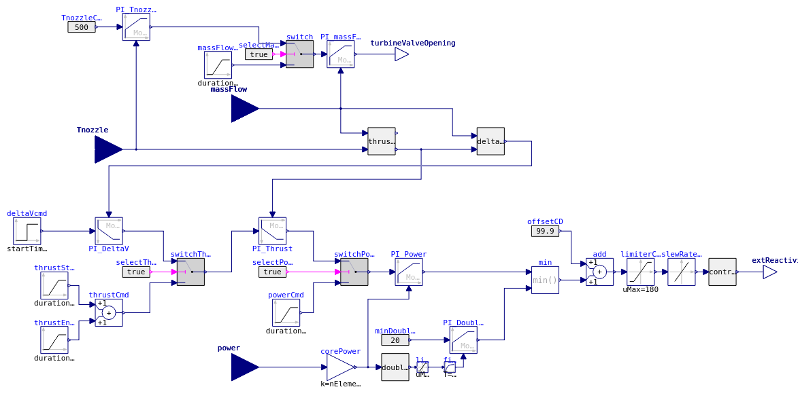
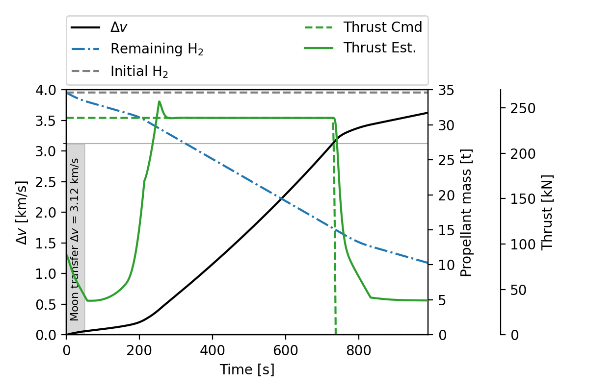
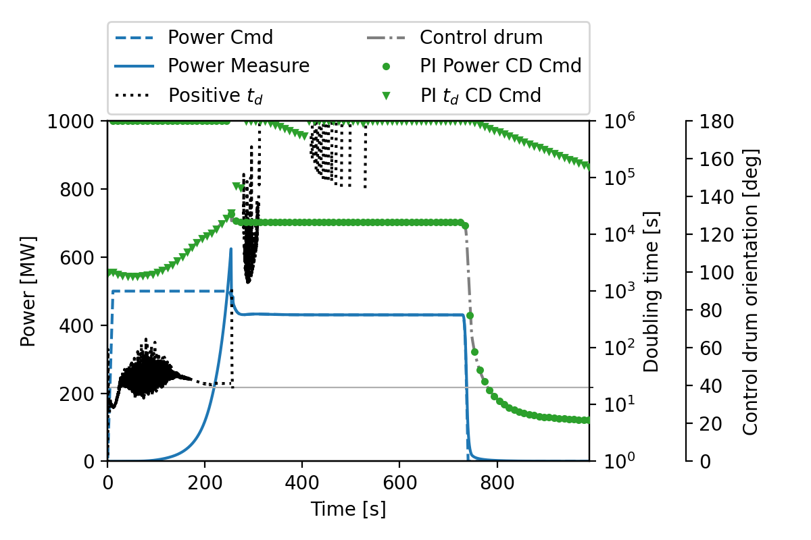
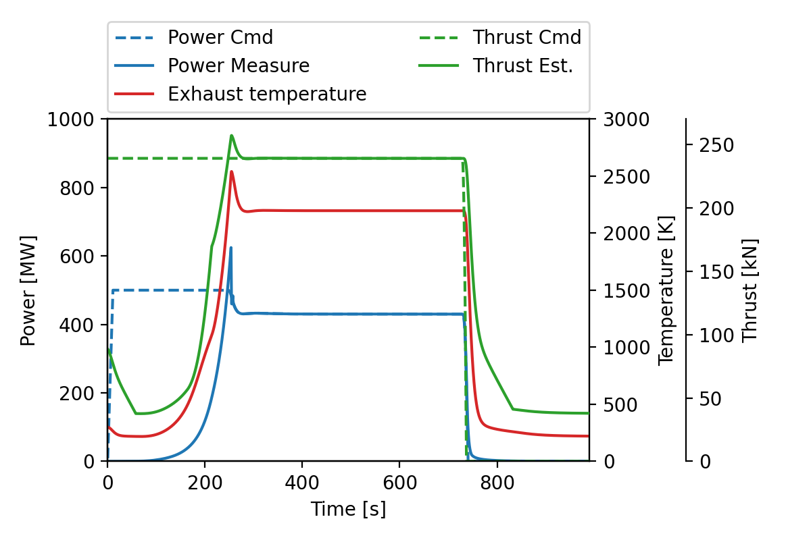

# NTP Fuel Assembly with Turbomachinery

Tags: []() []() []() []()

Author: Thomas Guilbaud


## Description

This tutorial is a test case to couple GeN-Foam and Modelica through fluid boundary conditions. This case simulate a trans-lunar injection maneuver using a Nuclear Thermal Propulsion engine. The engine is derived from KIWI-B-4E.

The nuclear core is modeled using GeN-Foam with a 1D slab mesh. The neutronics and thermal-hydraulics are coupled. The coolant and propellant used is $H_2$. The reactivity can be controled using an external FMI port.

The turbomachinery is modeled using OpenModelica and the ThermoPower package. It containes a turbo-pump and a simplified nozzle.



*Fig 1. Modelica model of NTP turbomachine with the control system.*


A control system has been added to monitor engine performances. It contains 6 controllers for outlet temperature, mass flow rate, delta-V, thurst, core power and doubling time. The control system ensure that the core is well cooled and that the power doubling time is no less than 20 s.



*Fig 2. Modelica model of NTP control system.*


## Scenario

The spacecraft is designed to perform a single round-trip from the low-earth orbit (LEO) to the low-moon orbit (LMO). This case simulate the first trans-lunar injection maneuver with a target $\Delta v_{LEO-LMO}$ of 2440 + 679 = 3119 m/s.


**Spacecraft design parameters**

| Parameter             | Value     |
|:----------------------|:---------:|
| Dry mass              | 20 t      |
| Exhaust temperature   | 2200 K    |
| Mass flow rate        | 30 kg/s   |


**Target delta-v (LEO 250km to LMO 100km)**

- One trip: 2440 + 679 + 145 + 676 = 3940 m/s
- Round-trip + margin: 2 x 3940 + 120 = 8000 m/s

The exhaust velocity can be computed as follow:

$$
v_{exh} = \sqrt{\frac{2 \gamma}{\gamma - 1} \frac{RT}{M_{mol}}} = 7965 \, \text{m/s}
$$

Which leads to a thrust of $F = \dot m v_{exh}$ = 239 kN.

With a target $\Delta v_{LEO-LMO}$ simulated of 2440 + 679 = 3119 m/s, and using the Tsiolkovsky rocket equation ($\Delta v = v_{exh} \ln\left( \frac{m_{wet}}{m_{dry}} \right)$), one can estimate the propellant mass. From [`Allcompute_astroflight.py`](./Allcompute_astroflight.py), the propellant mass for the target total delta-v is given by:

$$
m_{prop} = m_{dry} \left( e^\frac{\Delta v}{v_{exh}} - 1 \right) = 34602.7 \, \text{kg}
$$

Burn time during the injection maneuver:

$$
t_{burn} = \frac{m_{wet}}{\dot m} \left( 1 - e^{-\frac{\Delta v_{LEO-LMO}}{v_{exh}}} \right) \approx 589.7 s
$$


## Simulation

```bash
# Optional: Generate the FMU
./AllgenerateFMU

# Run the case with already prepared FMU
python3 Allclean.py
python3 Allrun_2FMU.py

# Post process the results and simulation status
python3 Allplot_fmi.py CoreFMU
```


## Results



*Fig 3. ∆v and propellant consumption during a trans-lunar injection maneuver.*




*Fig 4. Power, doubling time td, and control drum orientation during a trans-lunar injection maneuver.*




*Fig 5. Nuclear reactor and engine performances during a trans-lunar injection maneuver.*


## Notes

- Never put `InitOutput` in `firstOrder` objects in Modelica


## References

[1] Thomas Guilbaud, "Multi-Fidelity Nuclear Power Plant Analysis through a Code-Agnostic FMI-Based Framework", Ph.D. dissertation, École Polytechnique Fédérale de Lausanne (EPFL), 2025.
