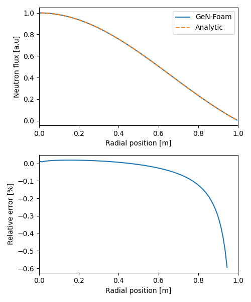
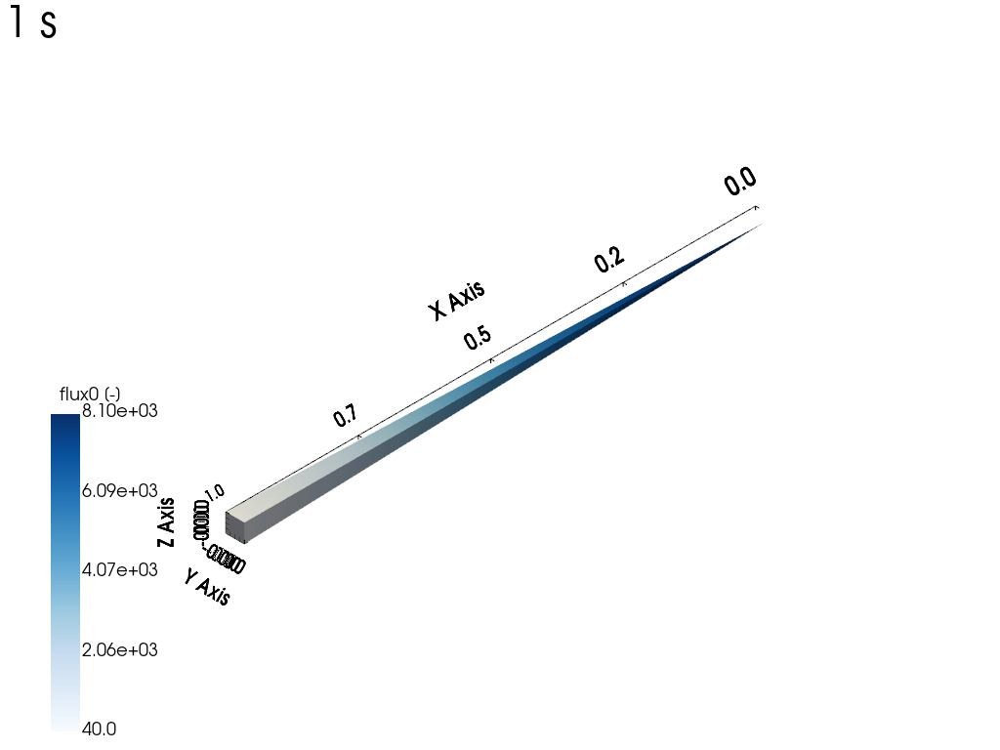
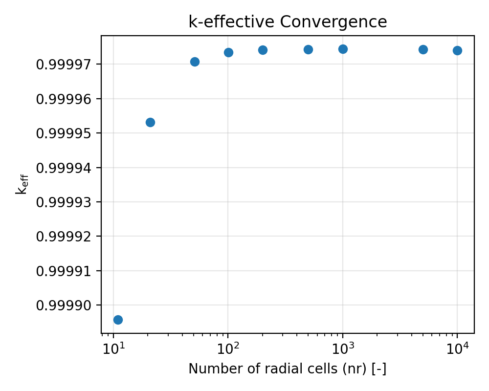
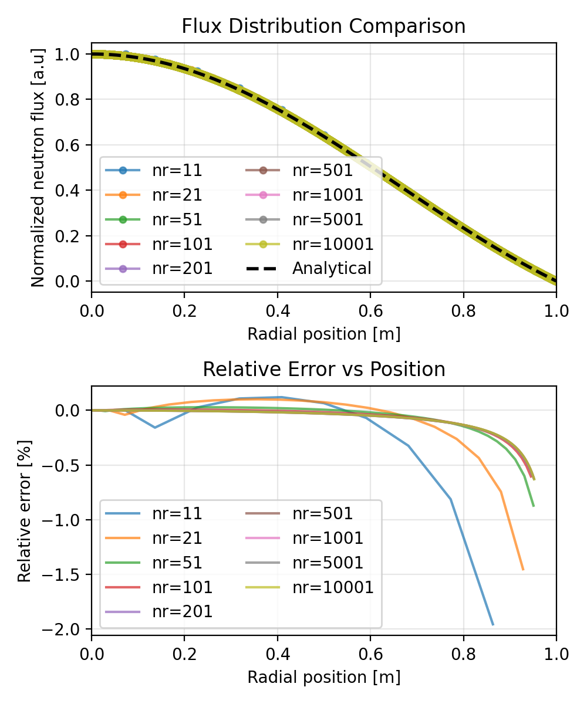
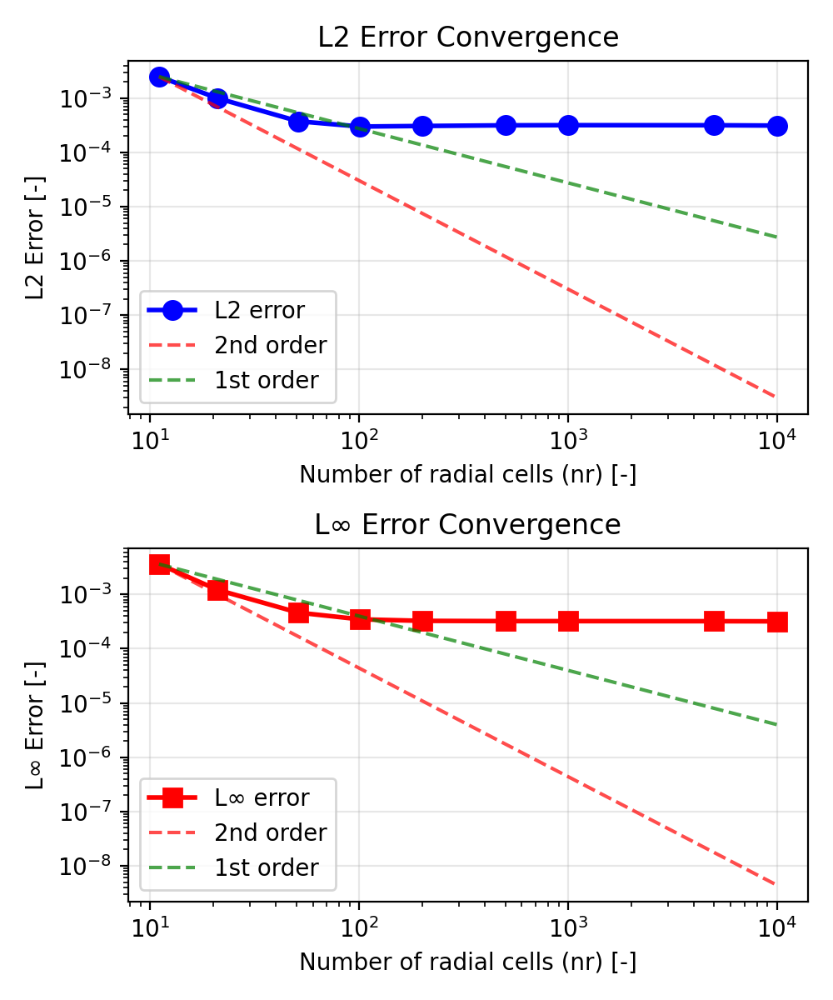

# Neutronics Diffusion: Spherical Reactor

Tags: []()

## Description

The tutorial is a simple demonstration of GeN-Foam neutronic solvers. We propose to solve the classical spherical 1D reactor problem using one energy group and no reflectors.

The one group neutronics diffusion equation can be expressed as:

$$
\underbrace{D \nabla^2 \phi}_\text{diffusion} + \underbrace{\nu \Sigma_f \phi}_\text{fission} \underbrace{- \Sigma_a \phi}_\text{absorption} = 0
$$

For a spherical reactor of size $R$ in a 1D spherical symmetry case, the diffusion equation can be simplified:

$$D \left[ \frac{d^2\phi(r)}{dr^2} + \frac{2}{r} \frac{d\phi(r)}{dr} \right] - \Sigma_a\phi(r) + \nu\Sigma_f\phi(r) = 0$$

or

$$\frac{d^2\phi(r)}{dr^2} + \frac{2}{r} \frac{d\phi(r)}{dr} + B_m^2\phi(r) = 0$$

The solution of the diffusion equation is based on a substitution $\phi(r) = 1/r \cdot \psi(r)$, that leads to an equation for $\psi(r)$:

$$\frac{d^2\psi(r)}{dr^2} + B_m^2\psi(r) = 0$$

Here, we introduce the material buckling $B_m^2$ parameter in the diffusion equation:

with:

$$
B_m^2 = \frac{k_\infty -1}{M^2}
\quad \quad
k_\infty = \frac{\nu \Sigma_f}{\Sigma_a}
\quad \quad
M = \sqrt \frac{D}{\Sigma_a}
$$

For $r > 0$, this differential equation has two possible solutions, $\sin(B_m r)$ and $\cos(B_m r)$, which give a general solution:

$$\psi(r) = A\sin(B_m r) + C\cos(B_m r)$$

which gives

$$\phi(r) = A \frac{\sin(B_m r)}{r} + C \frac{\cos(B_m r)}{r}$$

with $A$ and $C$ which are the normalization constants. Due to finite flux condition $(0 \leq \phi(r) < \infty)$. The term $\cos(B_m r)/r$ goes to $\infty$ as $r \rightarrow 0$ and therefore cannot be part of a physically acceptable solution.

The boundary conditions imposed to the spherical reactor are the following:
the center of the sphere ($r=0$) is a symmetry border so the Neumann boundary condition is applied.
At the outer surface ($r=R$) a vacuum boundary condition $\phi(r=R)=0$ is used.
The physically acceptable solution must then be:

$$\phi(r) = A \frac{\sin(B_g r)}{r}$$
Because of the vacuum boundary condition $B_g$ must be equal to $\frac{n\pi}{R}$, where n is any odd integer. The only one physically acceptable odd integer is $n=1$ because higher values of $n$ would give sine functions which would become negative for some values of $r$ before returning to 0 at $R$.

$$
\phi(r) = A \frac{\sin \left( \frac{\pi r}{R} \right)}{r}
$$

The critical equation closes the system, which implies:

$$
B_m^2 = B_g^2
\rightarrow
\frac{k_\infty -1}{M^2} = \left( \frac{\pi}{R} \right)^2
$$

If we assume the following values for:
- $\nu \Sigma_f$ = 4.81
- $\Sigma_a$ = 4.612608
- $D$ = 0.02 [m]

The resulting $k_\infty$ is $\approx$ 1.11424, and the reactor should reach criticality for a length $R$ of:

$$
R = \pi \sqrt \frac{M^2}{k_\infty -1} = \pi \sqrt \frac{D}{\nu \Sigma_f - \Sigma_a} \approx 1 \, \text{m}
$$

For more details see *J. R. Lamarsh, Introduction to Nuclear Reactor Theory, 2nd ed., Addison-Wesley, Reading, MA (1983)*.


## Simulation

The case has been prepared to verify the above results. One can change the geometry in the [`Allrun.py`](./Allrun.py) script by modifying the `dr` parameter (reactor radius) or the `nr` parameter (number of radial cells). The nuclear data are set directly in the script.


### Running a single mesh case

Before running the case, make sure to clean it using the following command:
```bash
python3 Allclean.py
```

Then run the case with:
```bash
python3 Allrun.py
```

The case should take no more than a few seconds. The script automatically performs post-processing and generates:

1. **Results files**: Stored in the `1` folder
   - `1/uniform/reactorState`: Integral parameters ($k_\text{eff}$, power)
   - `1/neutroRegion/flux0`: Flux distribution

2. **Console output**: $k_\text{eff}$ value

3. **Visualization plot** (`fig_results_fluxDistribution.png`):



*Fig 1. Top: Neutron flux comparison between GeN-Foam and the analytical solution. Bottom: Relative error distribution. Note: The analytical solution is as derived above.*



*Fig 2. Neutron flux distribution in the spherical 1D reactor (visualized using [ParaView](https://www.paraview.org/)).*


## Convergence study

A mesh convergence study is performed to verify the spatial discretization accuracy. The study compares GeN-Foam results against the analytical solution derived above.


### Running the study

The mesh study script [`Allrun_convergence.py`](Allrun_convergence.py) automatically runs multiple simulations with different mesh resolutions and compares them to the analytical solution:

```bash
python3 Allrun_convergence.py
```

The script performs the following steps:
1. Loops over different mesh resolutions defined in `nr_values` (default: [11, 21, 51, 101, 201, 501, 1001, 5001, 10001])
2. For each mesh: creates geometry, runs simulation, extracts $k_{eff}$, flux distribution, and radial coordinates
3. Computes the analytical solution at each mesh's cell centers using the formula: $\phi(r) = A \frac{\sin(\pi r / R)}{r}$
4. Calculates error metrics: L2 norm and L∞ norm over the full domain
5. Computes relative errors for visualization where only $\phi_{\text{analytical}} >$ threshold $\times \max(\phi_{\text{analytical}})$ are displayed to avoid numerical artifacts from division by near-zero values. the threshold can be changed from the parameter `threshold`


### Output plots

The script generates three figures:

**1. K-effective convergence** (`fig_results_keff.png`)



*Fig 3. $k_{eff}$ convergence with mesh refinement.*

**2. Flux distribution comparison and relative errors** (`fig_results_flux_comparison.png`)



*Fig 4. Top: Normalized neutron flux comparison between different mesh resolutions and the analytical solution calculated using the same points as the most refined mesh. Bottom: Relative error vs radial position. Only points where analytical flux exceeds a threshold (default 5% of maximum) are shown to avoid division by near-zero values in the low-flux regions.*

**3. Error convergence** (`fig_results_error_convergence.png`)



*Fig 5. Top: L2 flux error norm. Bottom: L∞ flux error norm. Both metrics show convergence vs number of cells, computed over the full radial domain. Reference lines show expected first and second order convergence rates.*

It can be deduced that as the mesh becomes more refined, the results get closer to the predicted analytical solution. The relative flux error worsens significantly as we approach the outer radial coordinate, due to divisions with values ​​close to zero.


## Possible exercises

- How is $k_\text{eff}$ affected when increasing/decreasing the radius `dr` in [`Allrun.py`](Allrun.py)?
- How is $k_\text{eff}$ affected when increasing/decreasing `nuFissionXS`, `removalXS` or `diffusionCoefficient` in [`Allrun.py`](Allrun.py)?
- Modify `nr_values` in [`Allrun_convergence.py`](Allrun_convergence.py) to study convergence with fewer or more mesh resolutions
- Change the threshold value (default 0.05) in [`Allrun.py`](Allrun.py) and [`Allrun_convergence.py`](Allrun_convergence.py) and observe how it affects the relative error plots
