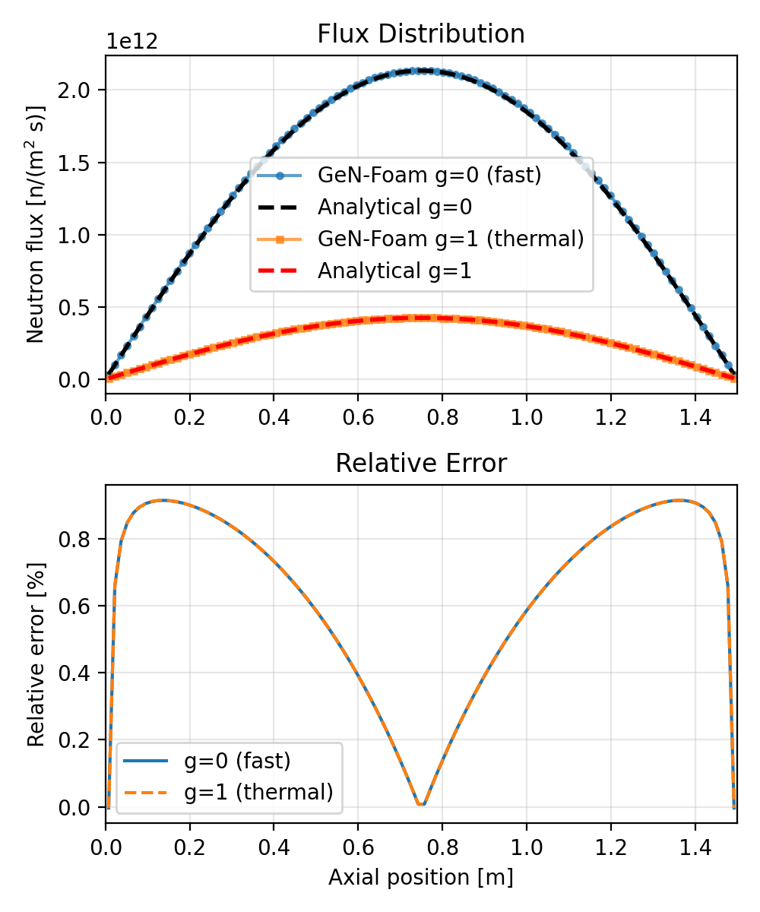
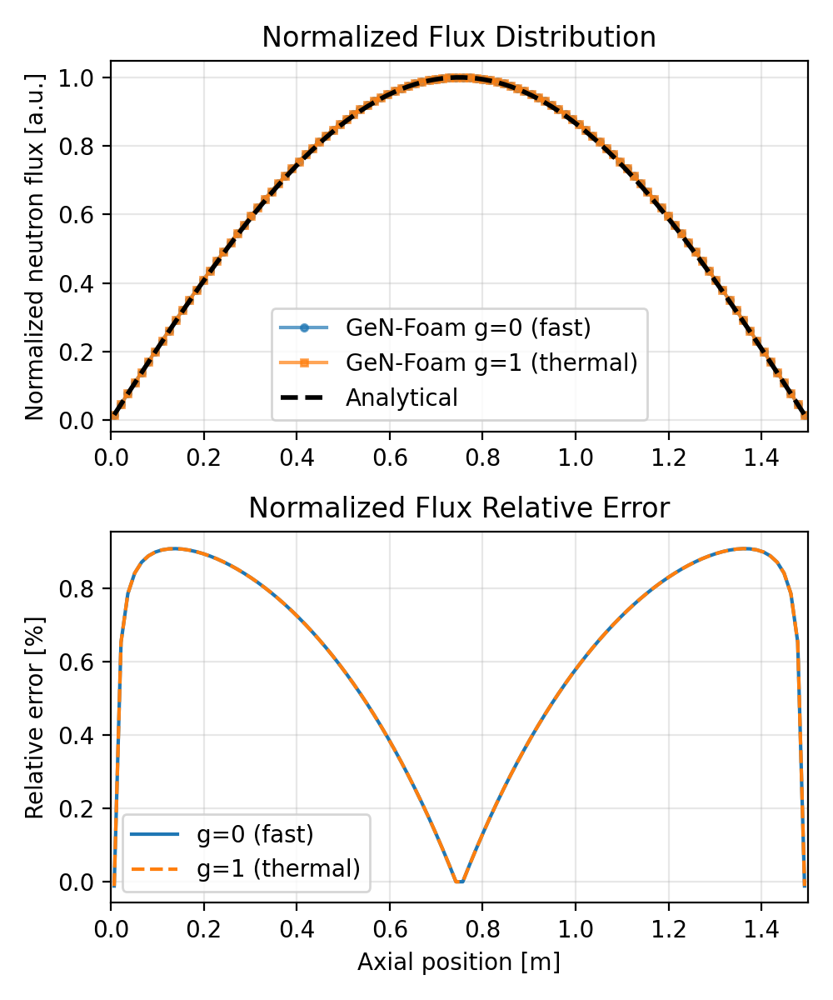
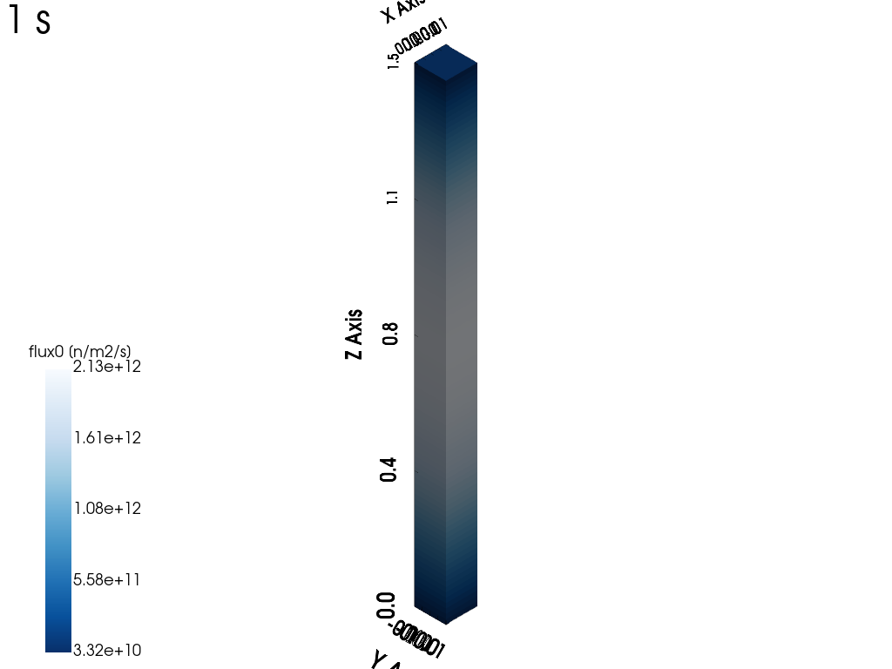
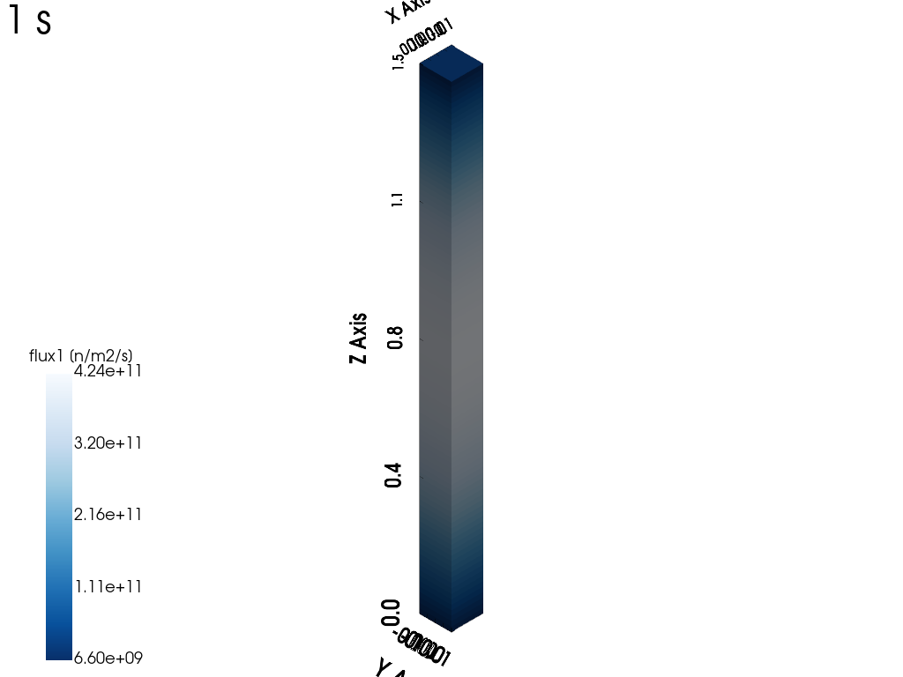
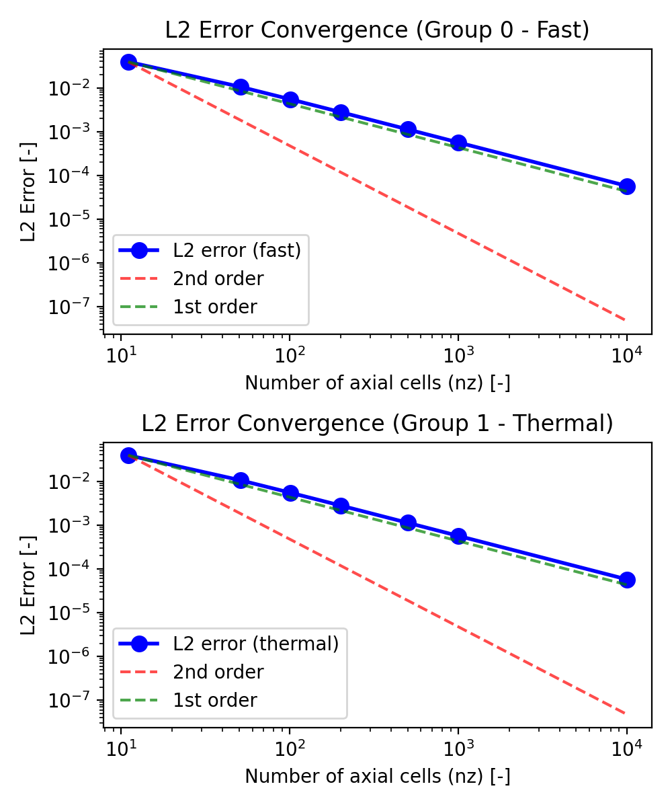
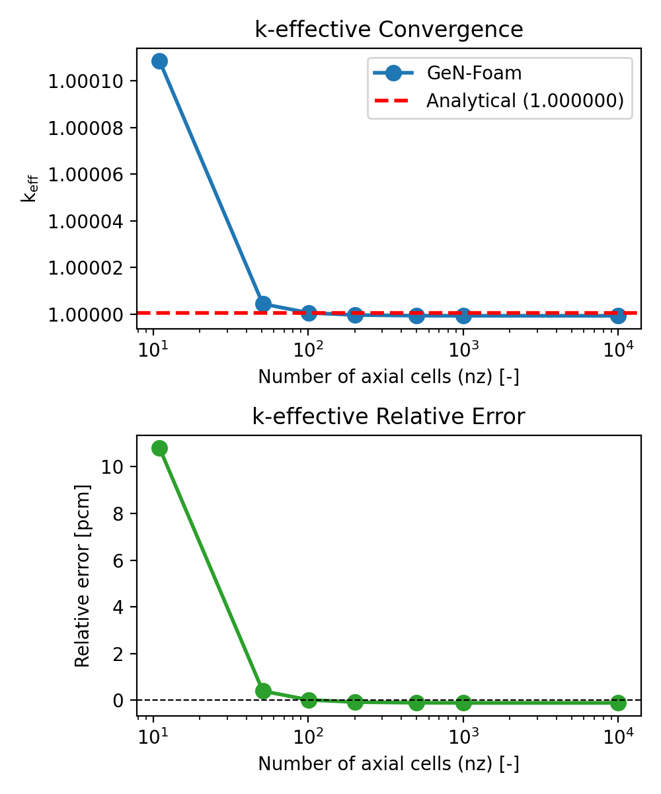
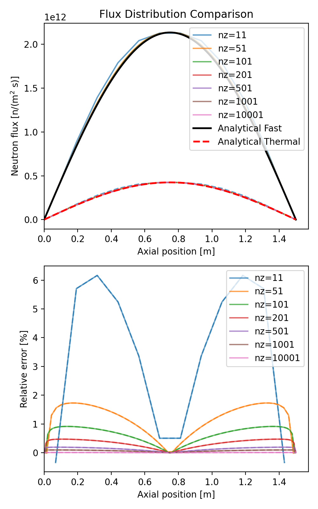

# Neutronics Diffusion: 1D Slab Reactor (Two-Group)

Tags: []()

## Description

This tutorial demonstrates GeN-Foam's multi-group neutronic solver capabilities by solving the two-group neutron diffusion equations for a 1D slab reactor. The case provides verification against an analytical solution.


## Theory

### Two-Group Diffusion Equations

For a slab reactor with two energy groups (fast and thermal), the steady-state diffusion equations are:

**Fast Group (g=0):**

$$-\nabla \cdot D_0 \nabla \phi_0
+ \left( \Sigma_{a,0} + \Sigma_{s}^{0\rightarrow1} \right)\phi_0
= \frac{1}{k}\left( \nu \Sigma_{f,0}\phi_0 + \nu \Sigma_{f,1}\phi_1 \right)
$$

**Thermal Group (g=1):**

$$-\nabla \cdot D_1 \nabla \phi_1
+ \Sigma_{a,1}\phi_1
= \Sigma_{s}^{0\rightarrow1}\phi_0
$$

where:
- $\phi_g(z)$ = neutron flux in group $g$
- $D_g$ = diffusion coefficient for group $g$ [m]
- $\Sigma_{a,g}$ = absorption cross-section for group $g$ [m⁻¹]
- $\nu\Sigma_{f,g}$ = nu-fission cross-section for group $g$ [m⁻¹]
- $\Sigma_{s}^{0\rightarrow 1}$ = scattering from fast to thermal [m⁻¹]


### Analytical Solution

For a bare slab reactor of height $L$ with vacuum boundary conditions at $z=0$ and $z=L$, the flux solutions have the form:

$$\phi_g(z) = A_g \cdot \sin\left(\frac{\pi z}{L}\right)$$

where $A_g$ is the amplitude determined by the power.

The geometric buckling is:

$$B_g^2 = \left(\frac{\pi}{L}\right)^2$$

The two-group k-effective for a critical reactor is:

$$
k_{\text{eff}}
=
\frac{\nu \Sigma_{f,0}}
     {\Sigma_{r,0} + D_0 B_{g}^2}
\;+\;
\frac{\Sigma_{s}^{0\rightarrow1}}
     {\Sigma_{r,0} + D_0 B_{g}^2}
\cdot
\frac{\nu \Sigma_{f_1}}
     {\Sigma_{a,1} + D_1 B_{g}^2}
$$

where:
- $\Sigma_r^g$ is the removal cross-section for group $g$
- Note: The removal cross-section already includes the scattering-out term, so $\Sigma_s^{0\rightarrow 1}$.

This formula assumes all fission neutrons are born in the fast group ($\chi = [1, 0]$) and no upscattering.


### Flux Ratio

From the thermal group balance equation, the flux ratio can be derived analytically.

$$\frac{\phi_0}{\phi_1} = \frac{D_1 B_g^2 + \Sigma_{a,1}}{\Sigma_s^{0\rightarrow 1}}$$

For more details see *Weston M. Stacey, "Nuclear Reactor Physics", 3rd Edition, Chapter 4*.


## Nuclear Data

The nuclear data is adapted from **Weston M. Stacey, "Nuclear Reactor Physics", 3rd Edition, Exercise 4.11, Table P4.11**. The original data represents typical PWR fuel compositions.

**Note:** The dimensions ($L = 1.5$ m) and $\nu\Sigma_f$ values have been adjusted from the textbook values to create an exactly critical system ($k_{\text{eff}} = 1.0$) for verification purposes.


## Simulation

The case is prepared to verify the analytical solution described above. One can modify geometry parameters in [`Allrun.py`](./Allrun.py) by changing `fuelLength`, `NuclearData`, or `nz` (number of axial cells).


### Running a Single Mesh Case

Before running the case, clean it using:

```bash
python3 Allclean.py
```

Then run the case with:

```bash
python3 Allrun.py
```

The case should complete in seconds. The script automatically performs post-processing and generates:

1. **Results files**: Stored in the `1` folder
   - `1/uniform/reactorState`: Integral parameters ($k_\text{eff}$, power)
   - `1/neutroRegion/flux0`: Fast flux distribution (Group 0)
   - `1/neutroRegion/flux1`: Thermal flux distribution (Group 1)

2. **Console output**: $k_\text{eff}$ value, with its analytical value and relative error.

3. **Visualization plots**:



*Fig 1. Top: Neutron flux comparison between GeN-Foam and analytical solution for both energy groups. Bottom: Relative errors with respect to the analytical solution.*



*Fig 2. Top: Normalized flux distributions demonstrating that both energy groups follow the same analytical shape. Bottom: Relative errors for normalized fluxes.*



*Fig 3. Fast (g=0) neutron flux distribution in the reactor (visualized using [ParaView](https://www.paraview.org/)).*



*Fig 4. Thermal (g=1) neutron flux distribution in the reactor (visualized using [ParaView](https://www.paraview.org/)).*


## Mesh Convergence Study

A comprehensive mesh convergence study verifies the spatial discretization accuracy by comparing GeN-Foam results against the analytical solution across multiple mesh resolutions.


### Running the Study

The mesh study script [`Allrun_convergence.py`](./Allrun_convergence.py) automatically runs simulations with different mesh resolutions:

```bash
python3 Allrun_convergence.py
```

The script performs:
1. Loops over mesh resolutions in `nz_values` (default: [11, 51, 101, 201, 501, 1001, 10001])
2. Calculates error metrics:
   - **L2 norm** (RMS error)
   - **L∞ norm** (maximum error)
   - Both computed using **absolute (non-normalized) flux values** over the full domain
3. Computes relative errors using **absolute (non-normalized) flux values** over the full domain


### Output Plots

**1. L2 Error Convergence** (`fig_results_convergence_L2.png`)



*Fig 5. L2 error convergence for both energy groups. Top: Fast group (Group 0). Bottom: Thermal group (Group 1). The reference lines indicate expected first-order and second-order convergence rates. The L2 norm measures the root-mean-square error over the entire domain.*

**2. K-effective Convergence** (`fig_results_convergence_keff.png`)



*Fig 6. Top: K-effective convergence. Bottom: Relative error in k-eff vs number of cells.*

**3. Flux Distribution Comparison** (`fig_results_convergence_flux.png`)



*Fig 7. Top: Neutron flux comparison across all mesh resolutions. Analytical solutions shown as black and red dashed lines. Bottom: Spatial distribution of relative errors for different mesh resolutions (Fast group (Group 0) in plain lines and Thermal group (Group 1) in dashed lines).*


## Possible Exercises

- Change the slab height `fuelLength` and observe the effect on $k_{\text{eff}}$
- Add upscattering to the scattering matrix and observe how it affects the flux ratio (theoretical formulas above don't apply anymore)
- Modify the scattering matrix and observe how it affects the flux ratio
- See how changing the values of $\chi$ changes the flux ratios (theoretical formulas above don't apply anymore).
