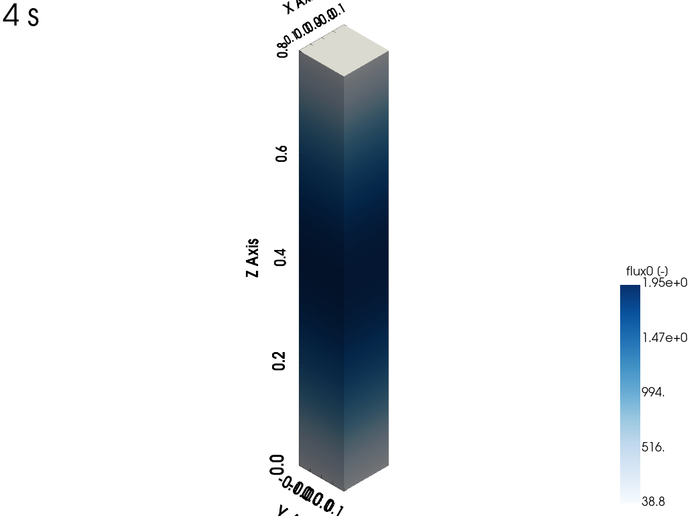
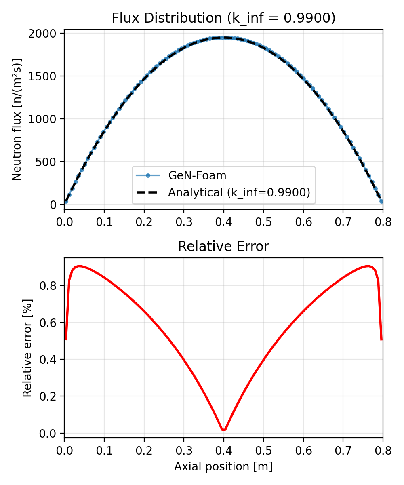
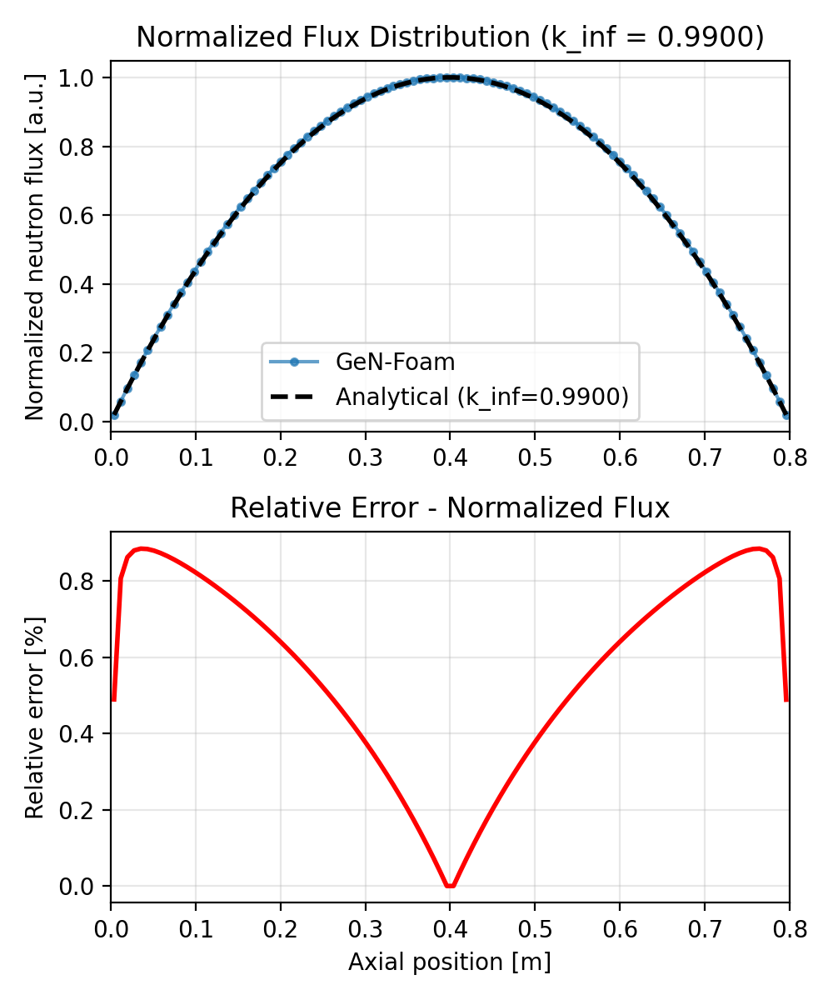
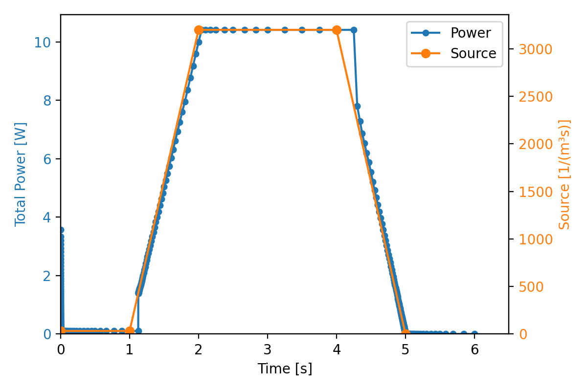
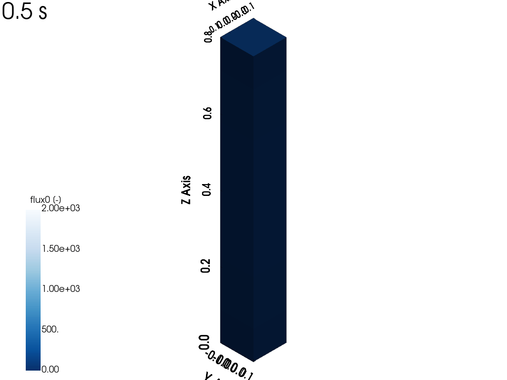
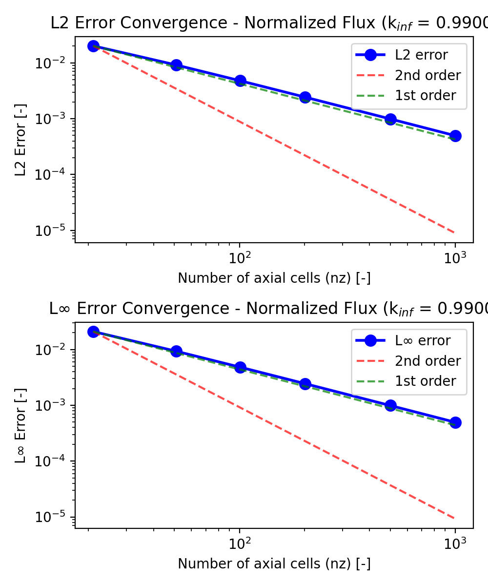
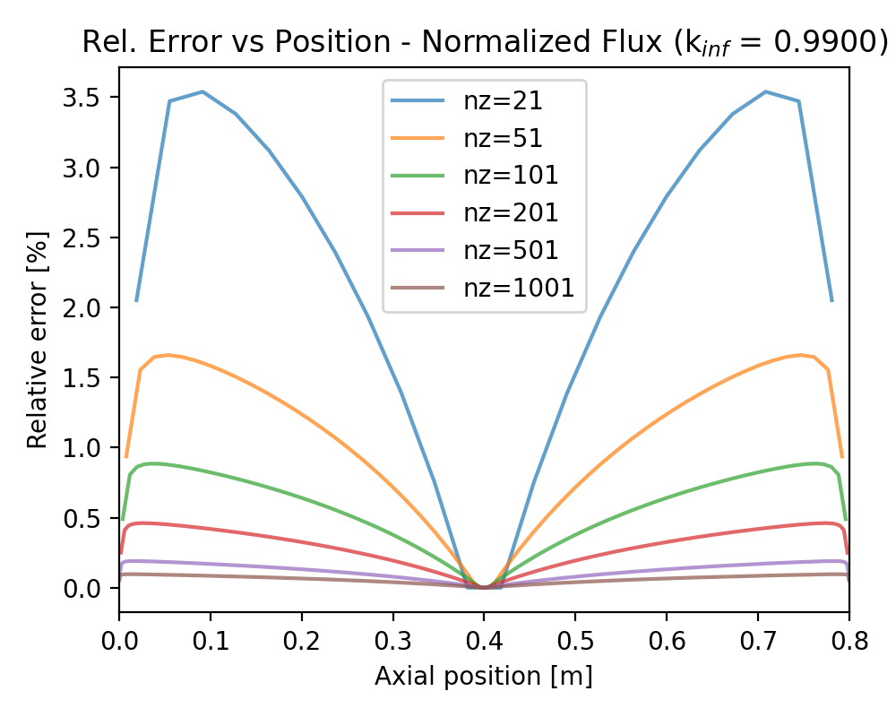
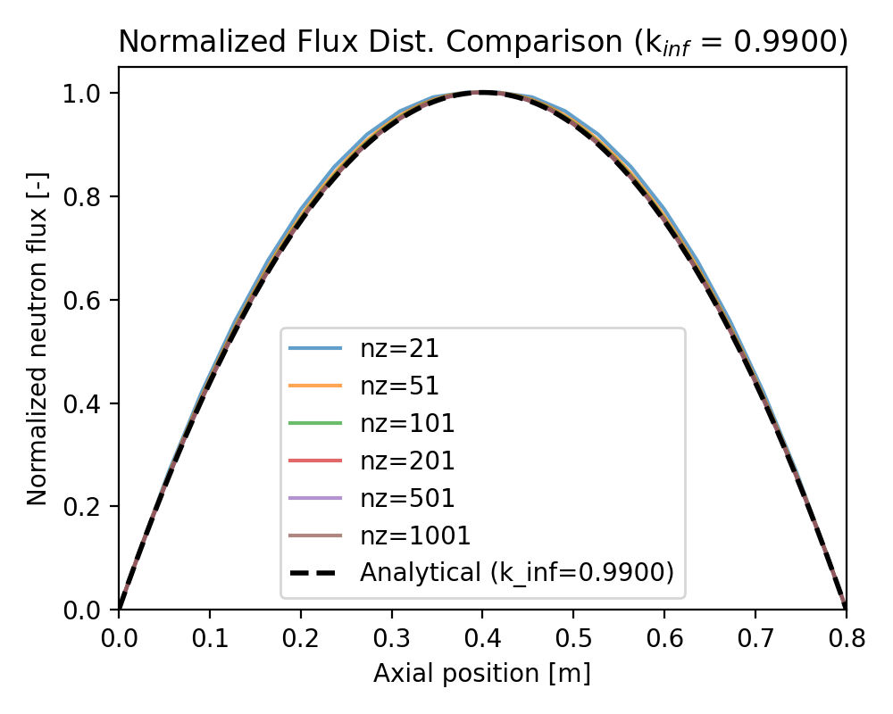

# Neutronics Diffusion: 1D Slab Reactor with External  Constant in Space Source

Tags: []()

## Description

This tutorial demonstrates GeN-Foam's capability to solve neutron diffusion problems with external neutron sources. The case considers a 1D slab reactor with a constant volumetric external source in the subcritical regime.

**Important note**: The objective of this tutorial is to verify steady-state analytical solutions, not transient behavior. The simulation is run transiently only to demonstrate how the external source time table works. The delayed neutron fractions are set to zero to reach steady state faster. There is a small difference (<0.1% relative error) between calculations using normalized versus non-normalized flux due to residual transient effects (see Fig. 2 and Fig. 3 for comparison of the relative errors). Using normalized flux for error calculations eliminates this small discrepancy without requiring excessively long simulation times that would generate many output files.

The one-group neutronics diffusion equation with an external source can be expressed as:

$$
\underbrace{D \nabla^2 \phi}_\text{diffusion} + \underbrace{\nu \Sigma_f \phi}_\text{fission} \underbrace{- \Sigma_a \phi}_\text{absorption} + \underbrace{S(x,t)}_\text{external source} = 0
$$

For a 1D slab of height $H$ with a constant external source $S_0$, the steady-state diffusion equation simplifies to:

$$D \frac{d^2\phi(x)}{dx^2} + (\nu\Sigma_f - \Sigma_a)\phi(x) + S_0 = 0$$

This can be rewritten using the infinite multiplication factor $k_\infty = \nu\Sigma_f / \Sigma_a$ and the diffusion length $L^2 = D/\Sigma_a$:

$$\frac{d^2\phi(x)}{dx^2} + \frac{k_\infty - 1}{L^2}\phi(x) + \frac{S_0}{D} = 0$$

### Analytical Solutions

The analytical solution depends on the reactor regime determined by $k_\infty$.Using the coordinate system centered at the slab midplane ($x \in [-H/2, H/2]$), the problem is symmetrical, we impose an even solution. The problem to solve is:

#### Subcritical case ($k_\infty < 1$)

With $\alpha^2 = \frac{1 - k_\infty}{L^2}$, and using the coordinate system centered at the slab midplane ($x \in [-H/2, H/2]$), the boundary value problem is:

$$
\begin{cases}
\frac{d^2\phi(x)}{dx^2} - \frac{1 - k_\infty}{L^2}\phi(x) + \frac{S_0}{D} = 0 \\
\phi\left(x = \frac{H}{2}\right) = 0 \\
\frac{d\phi(x)}{dx}\bigg|_{x=0} = 0
\end{cases}
$$

The solution is obtained as the sum of the homogeneous and particular solutions:

$$
\begin{aligned}
\phi_h(x) &= C \cosh(\alpha x) + A \sinh(\alpha x) \\
\phi_p(x) &= M \rightarrow \phi_p(x) = \frac{S_0}{D\alpha^2}
\end{aligned}
$$

The requirement of an even solution implies that the hyperbolic sine term must vanish, thus $A = 0$. Imposing the boundary condition:

$$
C \cosh\left(\alpha\frac{H}{2}\right) + \frac{S_0}{D\alpha^2} = 0 \rightarrow C = -\frac{S_0}{D\alpha^2}\frac{1}{\cosh(\alpha H/2)}
$$

The complete solution is:

$$
\phi(x) = \frac{S_0}{D\alpha^2} \left[1 - \frac{\cosh(\alpha x)}{\cosh(\alpha H/2)}\right]
$$

#### Critical case ($k_\infty = 1$)

The equation to solve becomes:

$$
\begin{cases}
\frac{d^2\phi(x)}{dx^2} + \frac{S_0}{D} = 0 \\
\phi\left(x = \frac{H}{2}\right) = 0 \\
\frac{d\phi(x)}{dx}\bigg|_{x=0} = 0
\end{cases}
$$

If the second derivative of the flux is a constant, the flux must be a second-degree polynomial:

$$
\phi(x) = Ax^2 + Cx + E
$$

For an even solution, we must set $C = 0$. Substituting into the differential equation:

$$
\frac{d^2}{dx^2}(Ax^2 + E) + \frac{S_0}{D} = 0 \rightarrow 2A + \frac{S_0}{D} = 0 \rightarrow A = -\frac{S_0}{2D}
$$

Imposing the boundary condition:

$$
-\frac{S_0}{2D}\left(\frac{H}{2}\right)^2 + E = 0 \rightarrow E = \frac{S_0}{2D}\frac{H^2}{4}
$$

The complete solution is:

$$
\phi(x) = \frac{S_0}{2D}\left(\frac{H^2}{4} - x^2\right)
$$

#### Supercritical case ($k_\infty > 1$)

To have a steady-state solution, we must require that the effective multiplication factor $k_{\text{eff}}$ is still less than 1:

$$
k_{\text{eff}} = \frac{k_\infty}{1 + L^2B^2} < 1 \rightarrow k_\infty < 1 + L^2B^2
$$

Under this hypothesis, the equation to solve becomes:

$$
\begin{cases}
\frac{d^2\phi(x)}{dx^2} + \frac{k_\infty - 1}{L^2}\phi(x) + \frac{S_0}{D} = 0 \\
\phi\left(x = \frac{H}{2}\right) = 0 \\
\frac{d\phi(x)}{dx}\bigg|_{x=0} = 0
\end{cases}
$$

Defining $\alpha^2 = \frac{k_\infty - 1}{L^2}$, the solution of the homogeneous part has the form of trigonometric functions:

$$
\begin{aligned}
\phi_h(x) &= C \cos(\alpha x) + A \sin(\alpha x) \\
\phi_p(x) &= M \rightarrow \phi_p(x) = -\frac{S_0}{D\alpha^2}
\end{aligned}
$$

The odd part of the homogeneous solution is eliminated ($A = 0$) and the right boundary condition is imposed:

$$
\phi\left(x = \frac{H}{2}\right) = C\cos\left(\alpha\frac{H}{2}\right) - \frac{S_0}{D\alpha^2} = 0 \rightarrow C = \frac{S_0}{D\alpha^2\cos(\alpha H/2)}
$$

The complete solution is:

$$
\phi(x) = \frac{S_0}{D\alpha^2}\left[\frac{\cos(\alpha x)}{\cos(\alpha H/2)} - 1\right]
$$

### Nuclear Parameters

The case is configured with the following parameters:
- Height: $H = 0.8$ m
- External source: $S_0 = 3.2 \times 10^3$ n/(m³·s)
- Diffusion coefficient: $D = 0.1275$ m
- Absorption cross section: $\Sigma_a = 5.725$ m⁻¹
- Nu-fission cross section: $\nu\Sigma_f = 5.6675$ m⁻¹

This gives $k_\infty = 0.9895$ (subcritical regime) and $L^2 = 0.02227$ m².

The external source follows a time-dependent modulation profile:
- 0-1 s: 1% of $S_0$
- 1-2 s: Linear ramp from 1% to 100% of $S_0$
- 2-4 s: 100% of $S_0$ (steady state)
- 4-5 s: Linear ramp to 0 (shutdown)
- after 5 s: Source off

Verification is performed at $t = 4$ s when steady state is essentially reached with full source strength. The code automatically identifies and applies the appropriate analytical solution

## Simulation

The case setup can be modified in [`Allrun.py`](./Allrun.py) by changing the `nz` parameter (number of axial cells) or the nuclear data parameters (`H`, `S0`, `D`, `sigma_a`, `nu_sigma_f`).

### Running a single mesh case

Before running the case, make sure to clean it using the following command:
```bash
python3 Allclean.py
```

Then run the case with:
```bash
python3 Allrun.py
```

The case should take no more than a few seconds. The script automatically performs post-processing and generates:

1. **Results files**: Stored in time folders
   - `4/neutroRegion/flux0`: Flux distribution at steady state

2. **Console output**: $k_\infty$ and $k_\text{eff}$ values

3. **Visualization plots**:

**Flux distribution and relative error**

(`fig_results_neutroRegion_4_flux0.png`):



*Fig 1.  Neutron flux distribution in the reactor (visualized using [ParaView](https://www.paraview.org/)).**

(`fig_results_fluxDistribution.png`):



*Fig 2. Top: Neutron flux comparison between GeN-Foam and the analytical solution. Bottom: Relative error distribution.*

**Normalized flux distribution** (`fig_results_normFluxDistribution.png`):



*Fig 3. Top: Normalized neutron flux comparison between GeN-Foam and the analytical solution. Bottom: Relative error distribution for normalized flux.*

**Power profile** (`fig_results_powerProfile.png`):



*Fig 4. Total reactor power (left axis, blue) and external source strength (right axis, orange) versus time. The plot shows the source modulation profile and the corresponding power response.*

**Flux evolution animation** (`flux0.gif`):



*Fig 5. Time evolution of the neutron flux distribution showing the response to the external source modulation. The animation demonstrates the rapid approach to steady state (enabled by setting delayed neutron fractions to zero) and the subsequent shutdown transient.*


## Convergence study

A mesh convergence study is performed to verify the spatial discretization accuracy. The study compares GeN-Foam results against the analytical solution using **normalized flux** to eliminate small transient effects.

### Running the study

The mesh study script [`Allrun_convergence.py`](Allrun_convergence.py) automatically runs multiple simulations with different mesh resolutions and compares them to the analytical solution:

```bash
python3 Allrun_convergence.py
```

The script performs the following steps:
1. Loops over different mesh resolutions defined in `nz_values` (default: [21, 51, 101, 201, 501, 1001])
2. For each mesh: creates geometry, runs simulation, extracts flux distribution at $t = 4$ s (steady state)
3. Computes the analytical solution at each mesh's cell centers using the regime-appropriate formula
4. Normalizes both numerical and analytical solutions by their maximum values
5. Calculates error metrics: L2 relative error and L∞ error over the full domain on normalized flux

### Output plots

The script generates three figures:

**1. Error convergence** (`fig_error_convergence.png`)



*Fig 6. Top: L2 relative error norm for normalized flux vs number of cells. Bottom: L∞ error norm for normalized flux vs number of cells.*

**2. Relative errors vs position** (`fig_relative_errors.png`)



*Fig 7. Relative error distribution for different mesh resolutions.*

**3. Flux distribution comparison** (`fig_flux_comparison.png`)



*Fig 8. Normalized neutron flux comparison between different mesh resolutions and the analytical solution..*

The script prints a summary table with quantitative convergence metrics (L2 and L∞ errors) for each mesh resolution.

## Possible exercises

- How do the flux distribution and $k_\text{eff}$ change when modifying `nu_sigma_f` to make the system critical ($k_\infty = 1$) or supercritical ($k_\infty > 1$)? The analytical solution will automatically switch to the appropriate regime.
- What is the limiting value for $k_{eff}$ ?
- How does increasing the slab height `H` affect the flux distribution shape?
- Modify the external source strength `S0` and observe how it affects the absolute flux magnitude (but not the normalized distribution).
- Change the source modulation time profile in `source_table` to study different transient scenarios.
- Modify the `delayedFraction` values in the nuclear data (currently set to zero) and observe how this affects the transient behavior. Non-zero delayed fractions will slow down the power response and produce more realistic reactor dynamics.
- Increase `endTime` and `source_table` in [`Allrun.py`](Allrun.py) and observe how the difference between normalized and non-normalized error calculations becomes even smaller as the transient fully settles.
