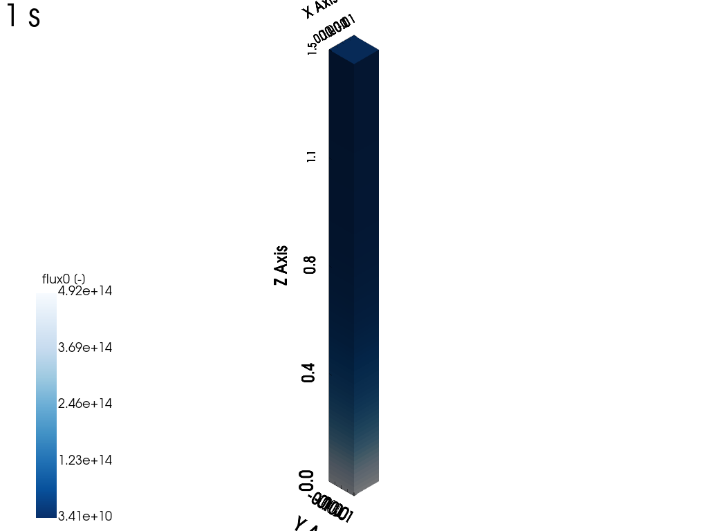
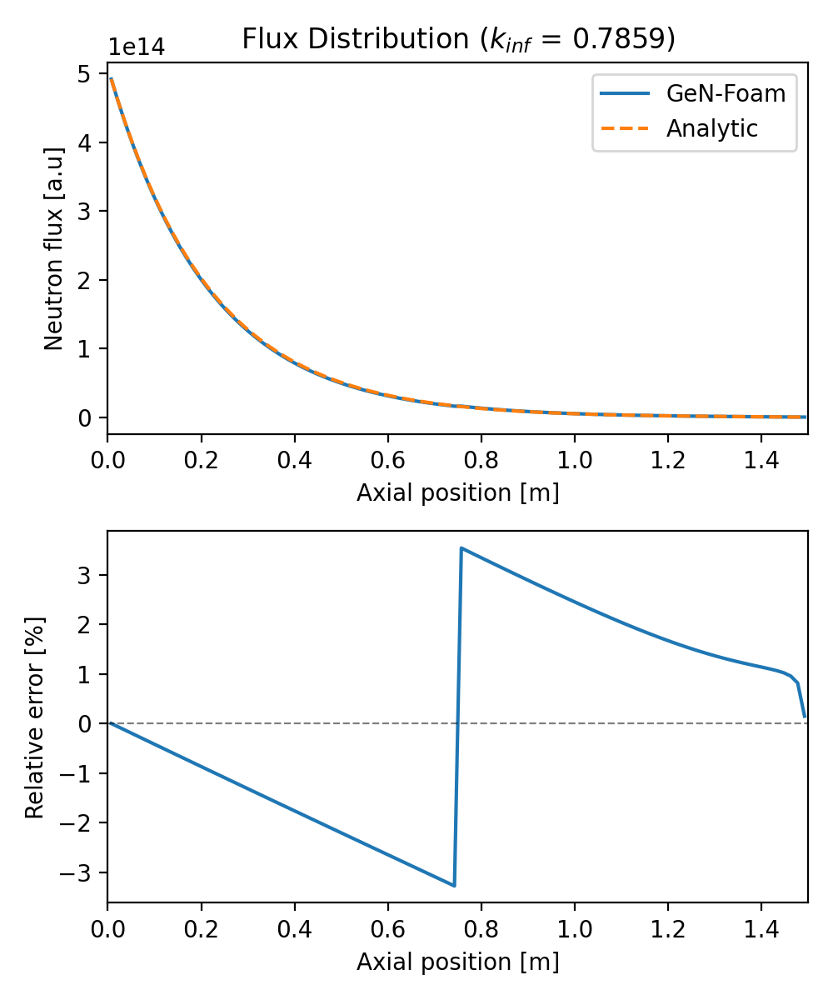
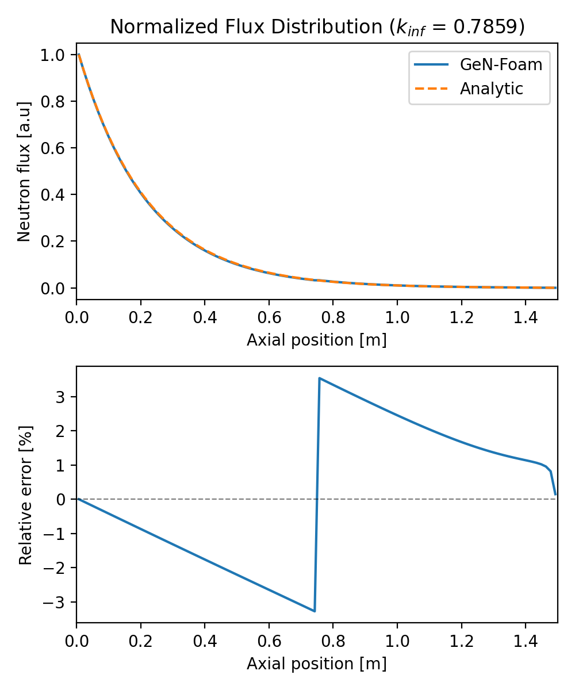
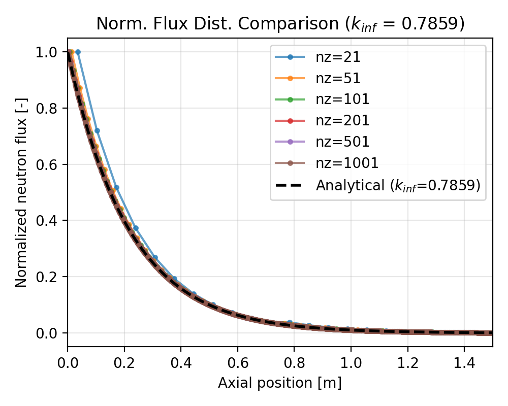
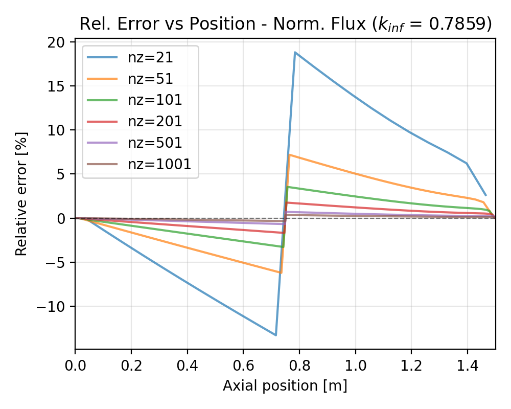
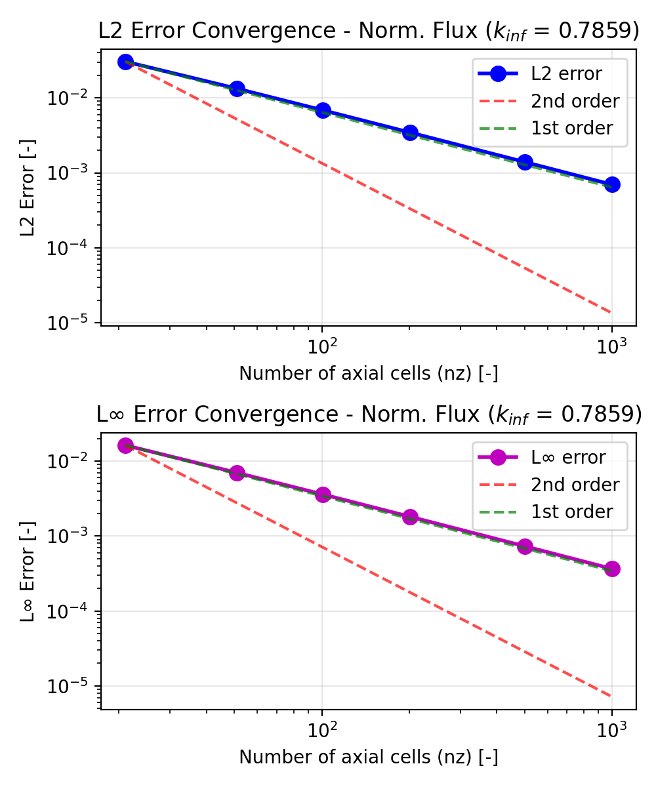

# Neutronics Diffusion: 1D Slab Reactor with Plane Source Boundary Condition

Tags: []()

## Description

This tutorial demonstrates GeN-Foam's capability to solve neutron diffusion problems with a net current (plane source) boundary condition. The case considers a 1D slab reactor.

**Physical interpretation**: This problem can be viewed as half of a slab with thickness $2a$ that has a plane source at its center ($z = a$) emitting neutrons symmetrically in both directions with strength $J_0$.

The one-group neutronics diffusion equation can be expressed as:

$$
\underbrace{D \nabla^2 \phi}_\text{diffusion} + \underbrace{\nu \Sigma_f \phi}_\text{fission} \underbrace{- \Sigma_a \phi}_\text{absorption} = 0
$$

For a 1D slab of height $a$ with a plane source at $z = 0$ (incoming neutron net current $J_0$), the steady-state diffusion equation becomes:

$$D \frac{d^2\phi(z)}{dz^2} + (\nu\Sigma_f - \Sigma_a)\phi(z) = 0$$

This can be rewritten using the infinite multiplication factor $k_\infty = \nu\Sigma_f / \Sigma_a$ and defining $B^2 = (\nu\Sigma_f - \Sigma_a)/D$:

$$\frac{d^2\phi(z)}{dz^2} + B^2\phi(z) = 0$$

### Boundary Conditions

The problem is subject to the following boundary conditions:
- At $z = 0$: Fixed gradient representing the incoming neutron current: $-D\frac{d\phi}{dz}\bigg|_{z=0} = J_0$
- At $z = a$: Zero flux (vacuum boundary): $\phi(a) = 0$

### Analytical Solutions

The analytical solution depends on the reactor regime determined by $k_\infty = \nu\Sigma_f / \Sigma_a$. Applying the boundary conditions to the general solution of the diffusion equation yields:

#### Subcritical case ($k_\infty < 1$)

With $\alpha^2 = (\Sigma_a - \nu\Sigma_f)/D = (1 - k_\infty)\Sigma_a/D$:

$$\phi(z) = \frac{J_0}{D\alpha\cosh(\alpha a)}\sinh(\alpha(a-z))$$

#### Critical case ($k_\infty = 1$)

$$\phi(z) = \frac{J_0}{D}(a - z)$$

#### Supercritical case ($k_\infty > 1$)

With $B^2 = (\nu\Sigma_f - \Sigma_a)/D$ and $B = \sqrt{B^2}$:

$$\phi(z) = \frac{J_0}{DB\cos(Ba)}\sin(B(a-z))$$

### Nuclear Parameters

The case is configured with the following parameters:
- Slab height: $a = 1.5$ m
- Diffusion coefficient: $D = 0.1275$ m
- Removal cross section: $\Sigma_a = 12.725$ m⁻¹
- Nu-fission cross section: $\nu\Sigma_f = 10.0$ m⁻¹ (subcritical configuration)
- External source current: $J_0 = 3 \times 10^{14}$ n/(m²·s)

With these parameters, $k_\infty = \nu\Sigma_f / \Sigma_a \approx 0.786$ (subcritical regime). Users can modify some parameters (e.g.
`removalXS`, `nuSigmaf`) in [`Allrun.py`](./Allrun.py) to explore critical ($k_\infty = 1$) or supercritical ($k_\infty > 1$) regimes. The analytical solution automatically adjusts based on the computed value of $k_\infty$.

## Simulation

The case setup can be modified in [`Allrun.py`](./Allrun.py) by changing:
- `nz`: number of axial cells (mesh resolution)
- `fuelLength`: slab height $a$
- `D`: diffusion coefficient
- `removalXS`: removal cross section $\Sigma_a$
- `nuSigmaf`: nu-fission cross section $\nu\Sigma_f$
- `externalSourceCurrent`: incoming neutron current $J_0$

### Running a single mesh case

Before running the case, make sure to clean it using the following command:
```bash
python3 Allclean.py
```

Then run the case with:
```bash
python3 Allrun.py
```

The case should take no more than a few seconds. The script automatically performs post-processing and generates:

1. **Results files**: Stored in time folders
   - `1/neutroRegion/flux0`: Steady-state flux distribution

2. **Console output**: $k_\infty$ analytical value

3. **Visualization plots**:

**Flux distribution** (`fig_results_neutroRegion_1_flux0.png`):



*Fig 1. Neutron flux distribution in the reactor (visualized using [ParaView](https://www.paraview.org/)).*

**Flux comparison and relative error** (`fig_results_FluxDistribution.png`):



*Fig 2. Top: Neutron flux comparison between GeN-Foam and the analytical solution. Bottom: Relative error distribution.*

**Normalized flux distribution** (`fig_results_normFluxDistribution.png`):



*Fig 3. Top: Normalized neutron flux comparison between GeN-Foam and the analytical solution. Bottom: Relative error distribution for normalized flux.*

## Convergence study

A mesh convergence study is performed to verify the spatial discretization accuracy. The study compares GeN-Foam results against the analytical solution using normalized flux.

### Running the study

The mesh study script [`Allrun_convergence.py`](Allrun_convergence.py) automatically runs multiple simulations with different mesh resolutions and compares them to the analytical solution:

```bash
python3 Allrun_convergence.py
```

The script performs the following steps:
1. Loops over different mesh resolutions defined in `nz_values` (default: [21, 51, 101, 201, 501, 1001])
2. For each mesh: creates geometry, runs simulation, extracts steady-state flux distribution
regime-appropriate formula
3. Calculates error metrics: L2 relative error and L∞ error over the full domain on normalized flux

### Output plots

The script generates three figures:

**1. Flux distribution comparison** (`fig_flux_comparison.png`)



*Fig 4. Normalized neutron flux comparison between different mesh resolutions and the analytical solution.*

**2. Relative errors vs position** (`fig_relative_errors.png`)



*Fig 5. Relative error distribution for different mesh resolutions.*

**3. Error convergence** (`fig_error_convergence.png`)



*Fig 6. Top: L2 relative error norm for normalized flux vs number of cells. Bottom: L∞ error norm for normalized flux vs number of cells.*

The script prints a summary table with quantitative convergence metrics (L2 and L∞ errors) for each mesh resolution.

## Possible exercises

- Modify `nuSigmaf` to explore different reactor regimes:
  - Set `nuSigmaf = removalXS` for the critical case ($k_\infty = 1$)
  - Set `nuSigmaf > removalXS` for supercritical ($k_\infty > 1$)
  - Set `nuSigmaf < removalXS` for subcritical ($k_\infty < 1$)

  The analytical solution will automatically switch to the appropriate regime formula.

- Change the external source current strength `externalSourceCurrent` and observe how it affects the absolute flux magnitude (but not the normalized distribution).

- Change the external source current sign `externalSourceCurrent` and observe how it affects the flux distribution for the different regimes.

- For the supercritical case, what happens when $Ba$ approaches $\pi/2$? This represents a critical geometry where the denominator $\cos(Ba)$ goes to zero, leading to an unbounded flux (resonance condition).

## References

Lamarsh, J. R., & Baratta, A. J. (2001). *Introduction to Nuclear Engineering* (3rd ed.). Prentice Hall.
