# Neutronics Diffusion: 2D Cylindrical Reactor (R-Z Geometry)

Tags: []()

## Description

This tutorial demonstrates GeN-Foam's capability to solve neutron diffusion problems in 2D cylindrical (R-Z) geometry. The case considers a bare cylindrical reactor with homogeneous composition.

### Analytical Solution

The analytical solution for a finite bare cylinder is obtained by the method of separation of variables as the product of the solutions for an infinite slab and an infinite cylinder (see Lamarsh & Baratta, *Introduction to Nuclear Engineering*, Chapter 6, for complete derivation):

$$
\phi(r,z) = J_0\left(\frac{\lambda_0}{R} r\right) \cdot \sin\left(\frac{\pi}{H} z\right)
$$

where:
- $J_0$ is the Bessel function of the first kind, order zero
- $\lambda_0 \approx 2.4048$ is the first zero of $J_0$
- $R$ is the reactor radius
- $H$ is the reactor height
- The coordinate system origin is at the bottom center of the cylinder

The analytical effective multiplication factor is given by:

$$
k_\mathrm{eff} = \frac{\nu\Sigma_f}{\Sigma_a + D B^2}
$$

where the geometric buckling for a bare finite cylinder is:

$$
B^2 = \left(\frac{\lambda_0}{R}\right)^2 + \left(\frac{\pi}{H}\right)^2
$$

### Nuclear Parameters

The case is configured with the following parameters:
- Radius: $R = 0.6$ m
- Height: $H = 1.3$ m
- Diffusion coefficient: $D = 0.1275$ m
- Removal cross section: $\Sigma_r = 5.0082$ m⁻¹
- Nu-fission cross section: $\nu\Sigma_f = 7.8024$ m⁻¹

This gives $k_\mathrm{eff,analytical} \approx 1.000009$.

### Geometry Implementation

The case uses OpenFOAM's wedge boundary condition to represent the full 3D cylindrical geometry using an azimuthal sector (default: 1°):
- **wedge** (front/back): Symmetry boundaries for the azimuthal sector
- **wall** (outer, top, bottom): Zero flux boundaries
- **empty** (axis): Axis boundary condition

The wedge angle can be adjusted in the mesh creation call - smaller angles provide better accuracy since the wedge approximation to the cylinder becomes more accurate.

### Error Calculation with Threshold

To avoid numerical issues in regions with very low flux (particularly near boundaries where flux approaches zero), relative errors are calculated only in regions where the normalized analytical flux exceeds a threshold value (default: 5% of maximum flux).

## Simulation

The case setup can be modified in [`Allrun.py`](./Allrun.py) by changing:
- `nr`, `nz`: Number of radial and axial cells
- `threshold`: Fraction of maximum flux for error masking (default: 0.05)
- `wedge_angle`: Azimuthal sector angle in degrees (default: 1°) - smaller angles increase accuracy
- Nuclear data parameters: `D`, `Sigmar`, `nuSigmaf`

### Running a single mesh case

Before running the case, clean it using:
```bash
python3 Allclean.py
```

Then run the case with:
```bash
python3 Allrun.py
```

The case should complete in a few seconds. The script automatically performs post-processing and generates:

1. **Console output**: Analytical and numerical $k_\mathrm{eff}$ values

2. **Visualization plots**:

(`fig_results_mesh_neutroRegion_1_flux0_xz.png`):

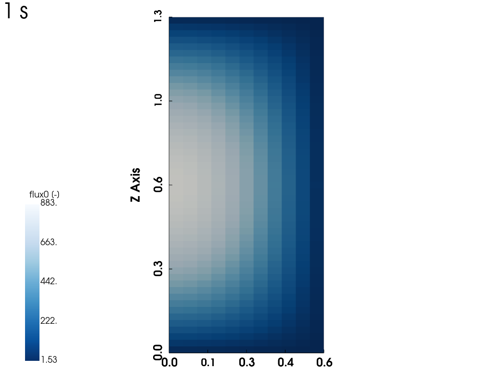

*Fig 1.  Neutron flux distribution in the reactor (visualized using [ParaView](https://www.paraview.org/)).**

(`fig_results_flux2D_mask.png`):

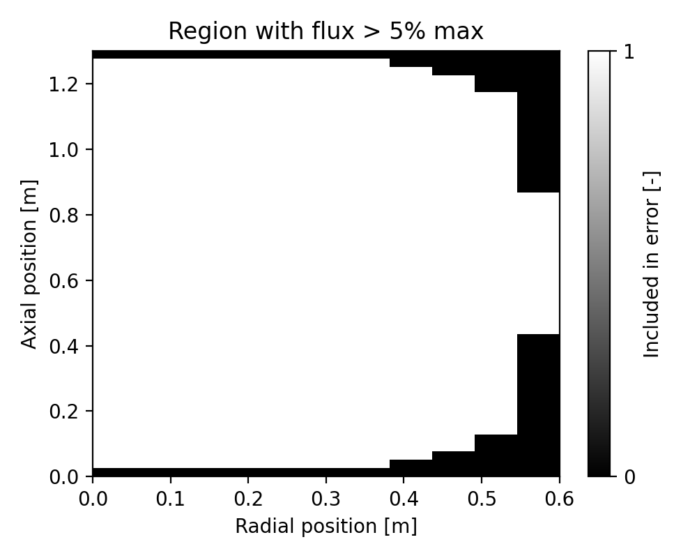

*Fig 2. Threshold mask (regions included in error analysis).*

(`fig_results_flux2D_error.png`):

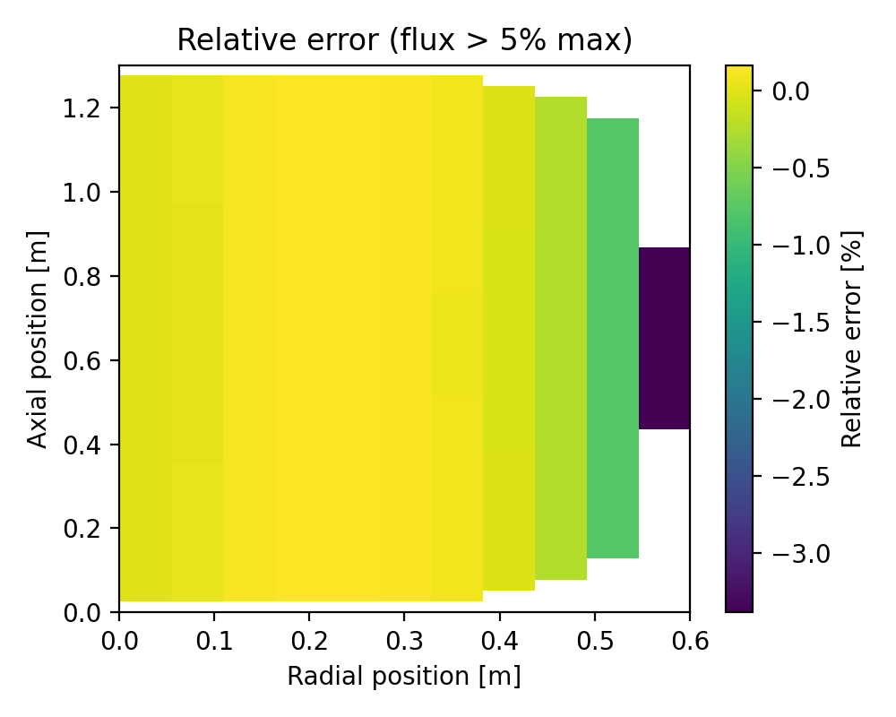

*Fig 3. 2D relative error plot.*

(`fig_results_radial_profile.png`):

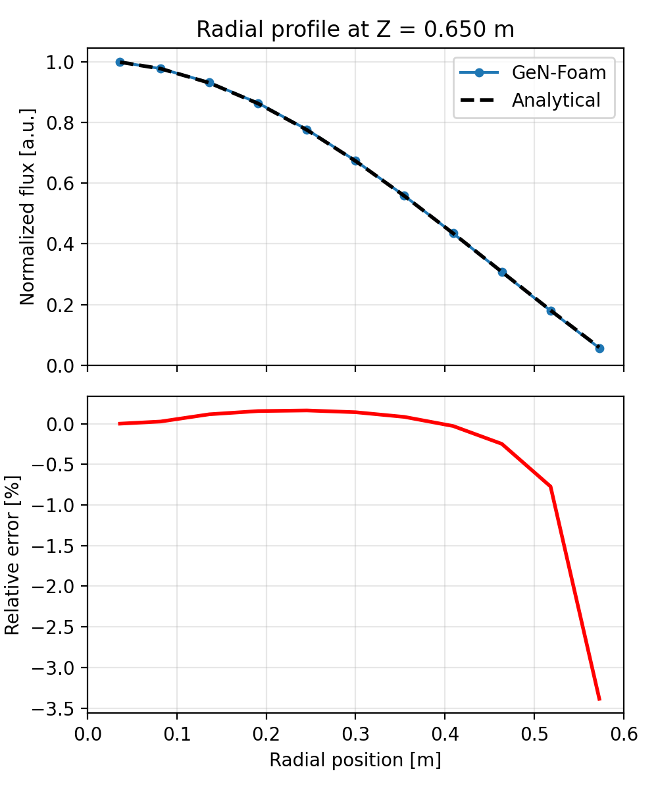

*Fig 4. Top: Radial flux profile extracted at mid-height (Z = 0.65 m) comparing GeN-Foam and analytical solutions. Bottom: Relative error distribution along the radius.*

(`fig_results_axial_profile.png`):

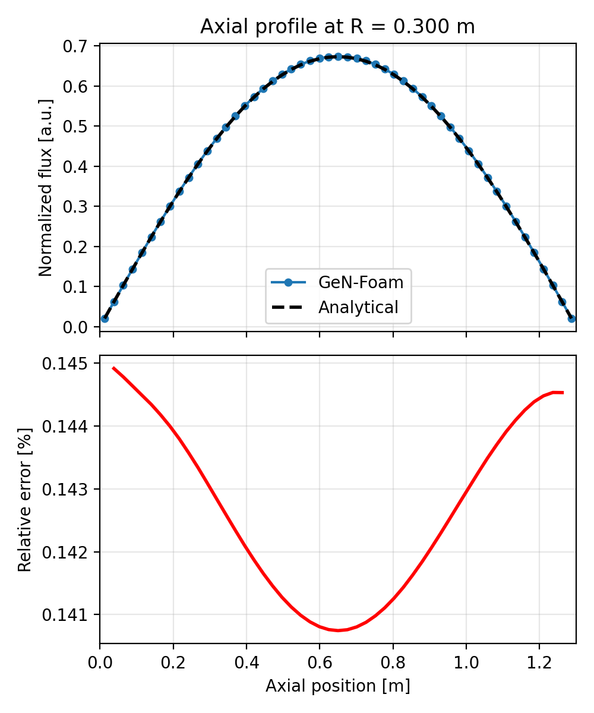

*Fig 5. Top: Axial flux profile extracted at mid-radius (R = 0.3 m) comparing GeN-Foam and analytical solutions. Bottom: Relative error distribution along the height.*

Both numerical and analytical solutions are normalized by their respective maximum values.

## Convergence Study

A mesh convergence study verifies the spatial discretization accuracy by comparing GeN-Foam results against the analytical solution across multiple mesh resolutions.

### Running the study

The mesh study script [`Allrun_convergence.py`](Allrun_convergence.py) automatically runs multiple simulations:

```bash
python3 Allrun_convergence.py
```

The script performs the following steps:
1. Loops over mesh resolutions defined in `nr_values` and `nz_values` (default: [5, 11, 21, 51, 201] for both)
2. For each combination: creates geometry, runs simulation, extracts flux
3. Computes analytical solution at actual mesh cell centers
4. Normalizes both solutions and calculates error metrics (L2 and L∞) on the normalized flux in the **masked regions**
5. Stores 1D profiles (radial at mid-height, axial at mid-radius) for each mesh

### Output plots

The script generates six convergence analysis figures:

**1. Radial profile convergence** (`fig_results_radial_profiles_convergence.png`)

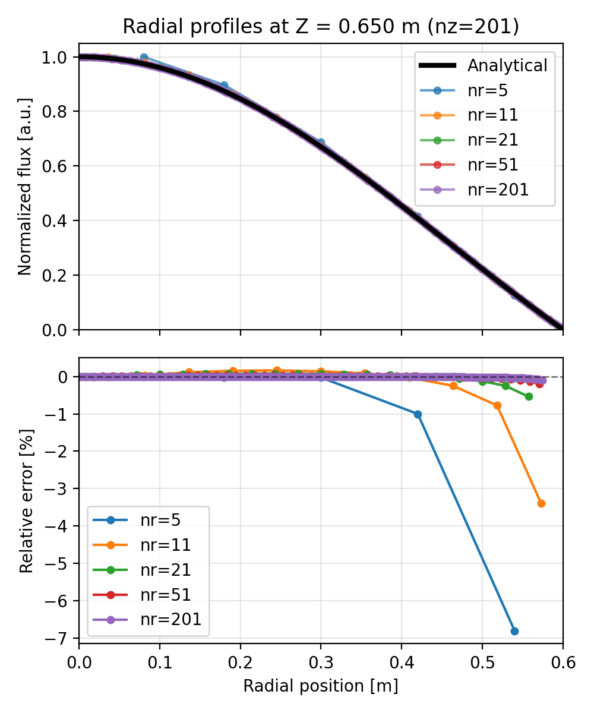

*Fig 6. Top: Radial flux profiles at mid-height (Z = 0.65 m) for different radial mesh resolutions for the finest axial mesh (nz = 201). Bottom: Relative error for different number of axial cells.*

**2. Axial profile convergence** (`fig_results_axial_profiles_convergence.png`)

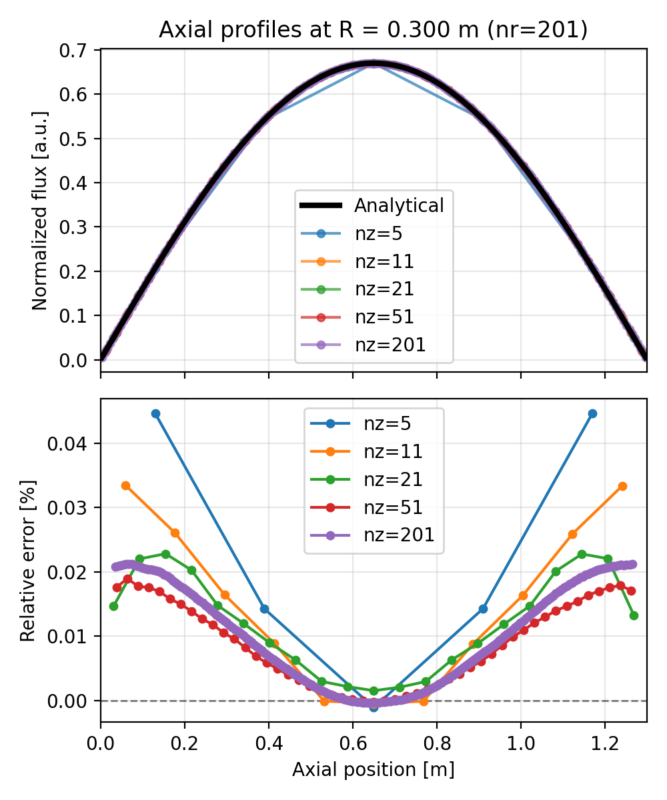

*Fig 7. Top: Axial flux profiles at mid-radius (R = 0.3 m) for different axial mesh resolutions for the finest radial mesh (nr = 201). Bottom: Relative error for different number of radial cells.*

**3. L2 radial convergence** (`fig_results_L2_convergence_radial.png`)

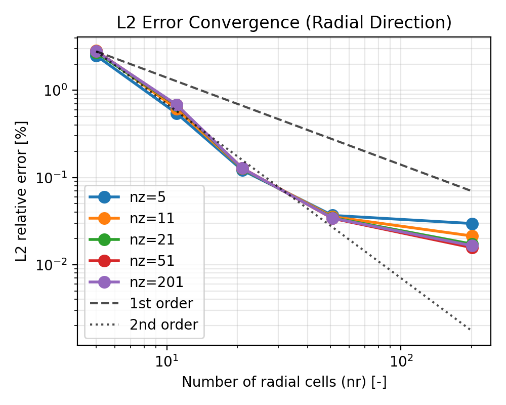

*Fig 8. L2 relative error norm vs. number of radial cells for different fixed nz values. Reference lines show 1st and 2nd order convergence rates.

**4. L2 axial convergence** (`fig_results_L2_convergence_axial.png`)

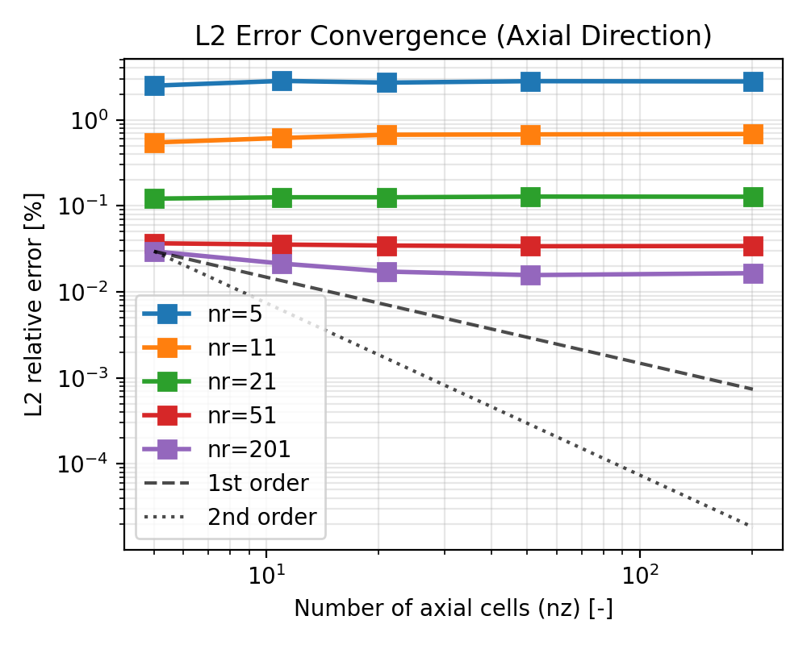

*Fig 9. L2 relative error norm vs. number of axial cells for different fixed nr values. The axial convergence shows flatter behavior because the radial discretization error dominates the total error.*

**5. 2D L2 error contour** (`fig_results_L2_error_2D.png`)

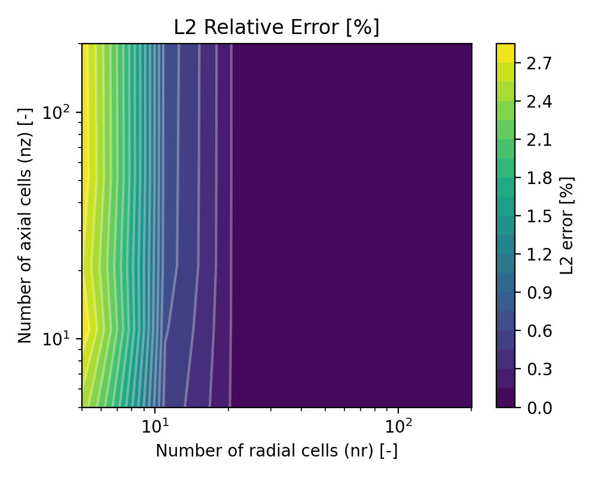

*Fig 10. Two-dimensional contour plot of L2 error as a function of both nr and nz, showing that radial refinement has a stronger impact on error reduction than axial refinement.*

**6. k_eff convergence** (`fig_results_keff_convergence.png`)

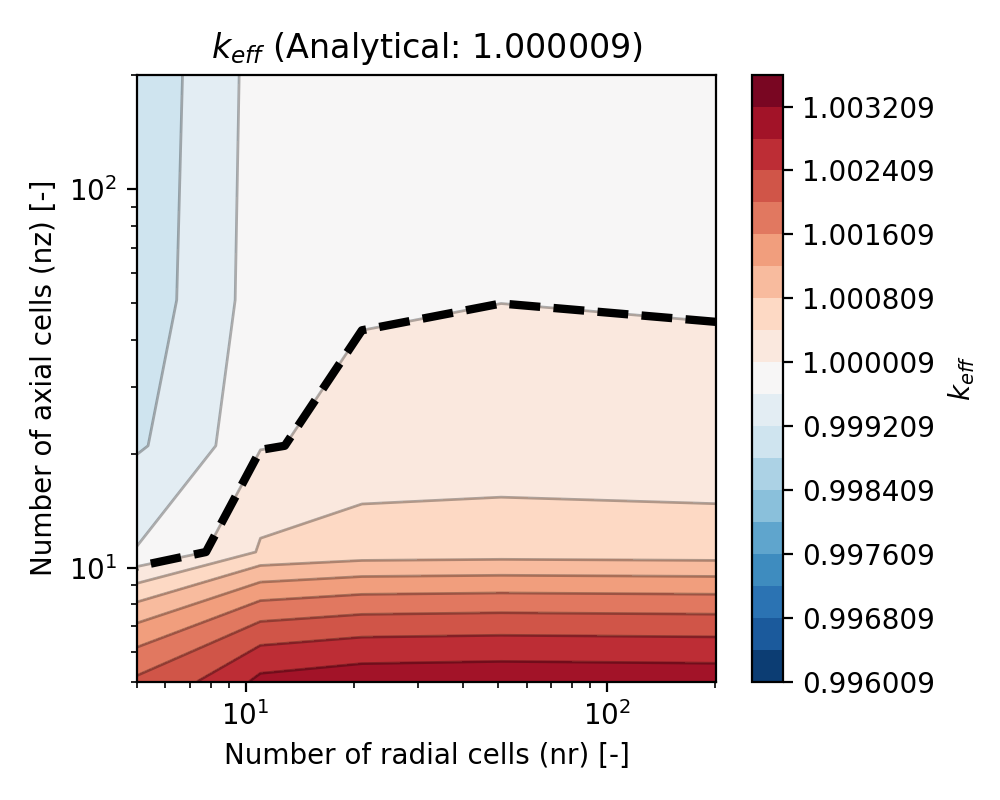

*Fig 11. Two dimensional $k_{eff}$ convergence, black dashed line indicating the analytical value.*

The script also prints a summary table with quantitative convergence metrics (nr, nz, k_eff, L2 error) for all mesh combinations.

## Possible Exercises

- Modify the reactor dimensions (rOut, fuelHeight) and observe how the flux distribution changes. How does the aspect ratio affect the relative importance of radial vs. axial discretization?
- Investigate the effect of wedge angle on the solution by keeping the rest of the parameters constant.
