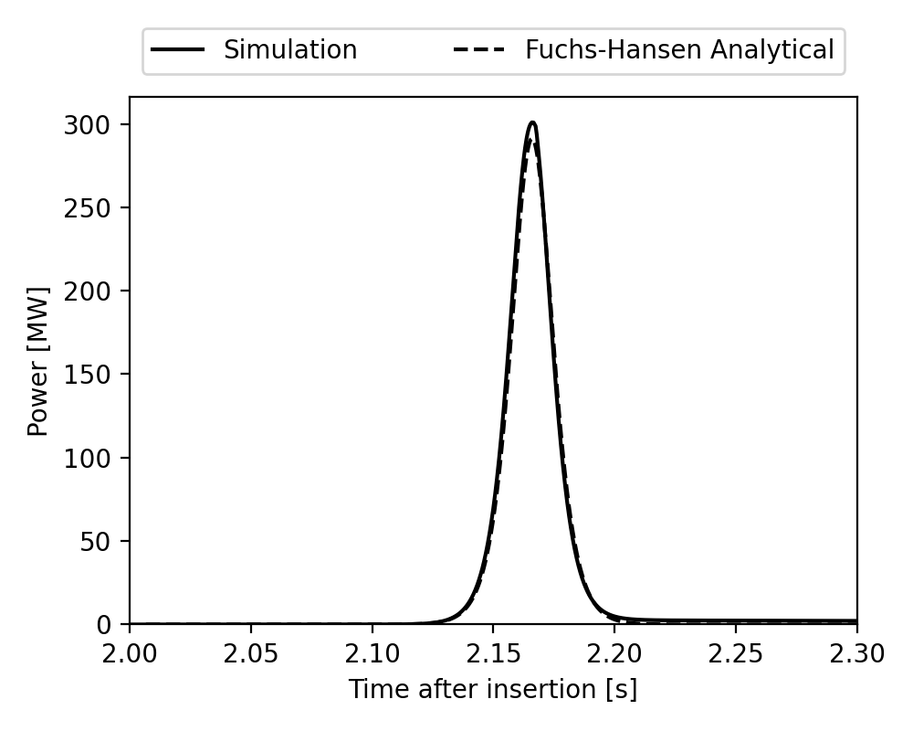
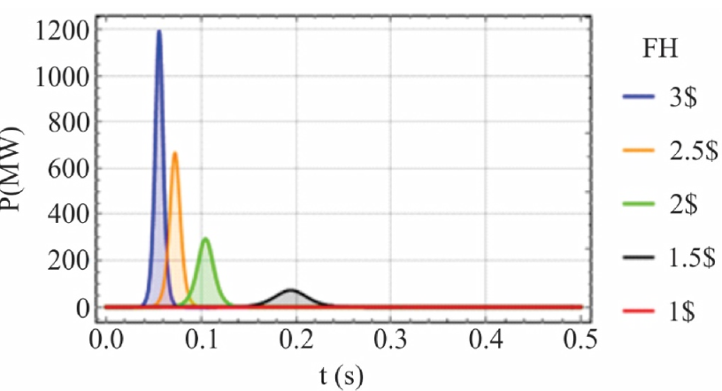
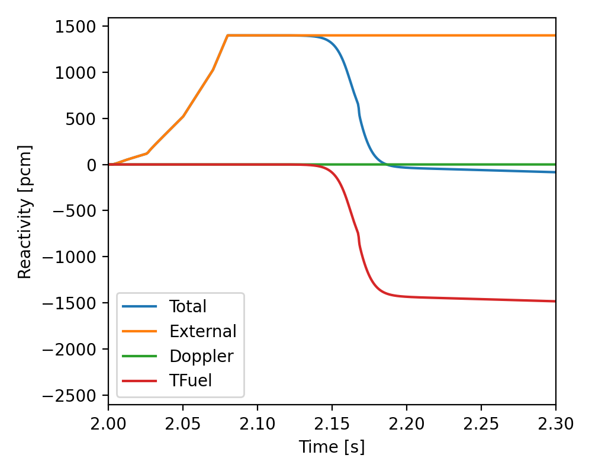
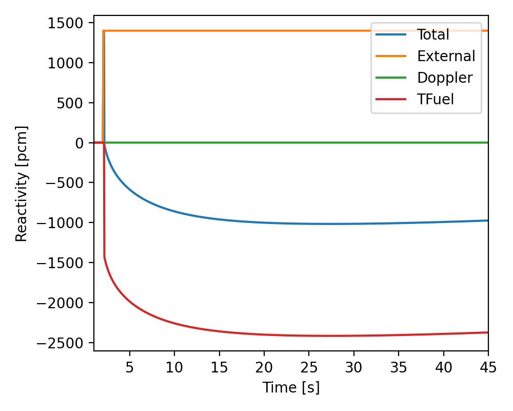
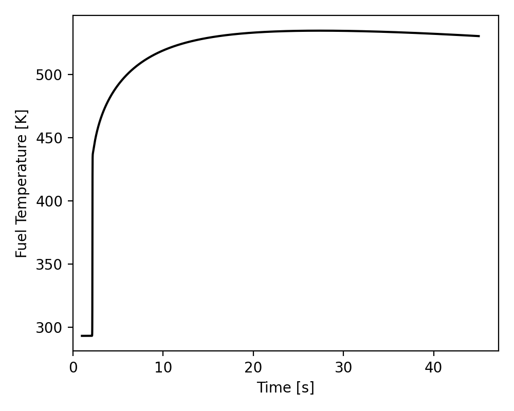
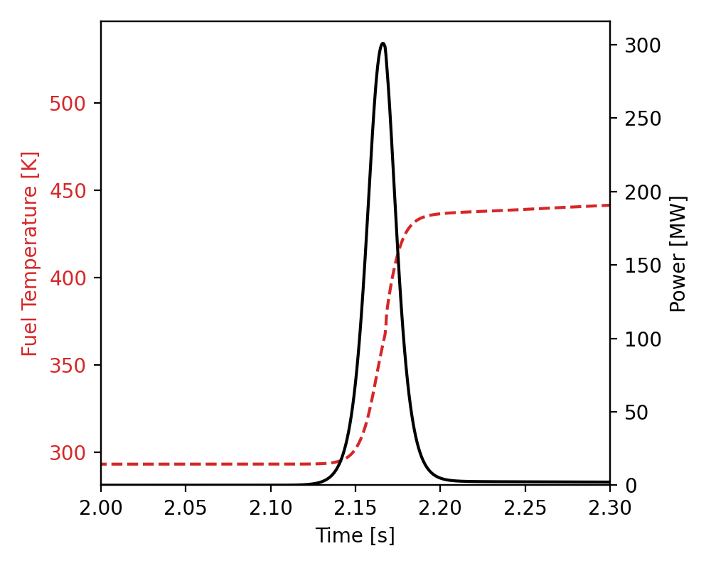
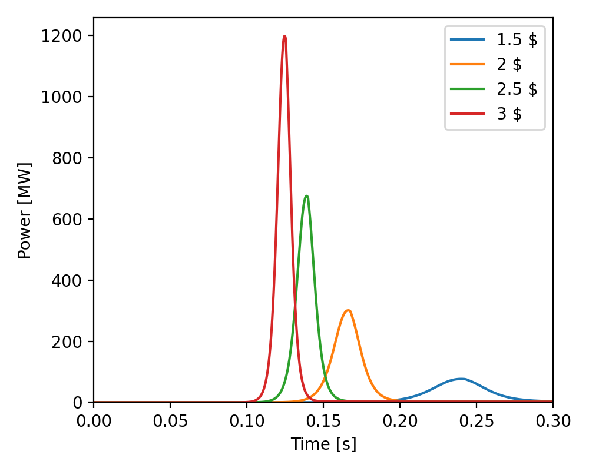
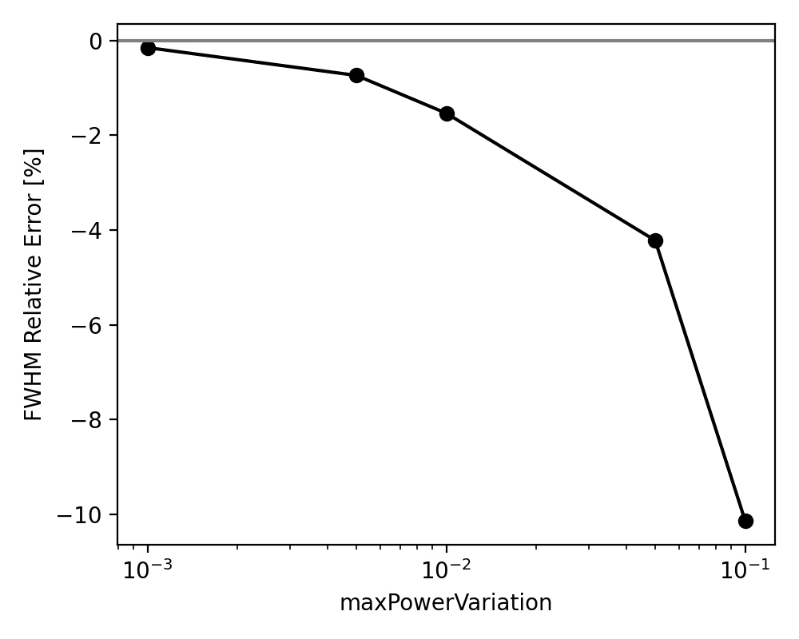
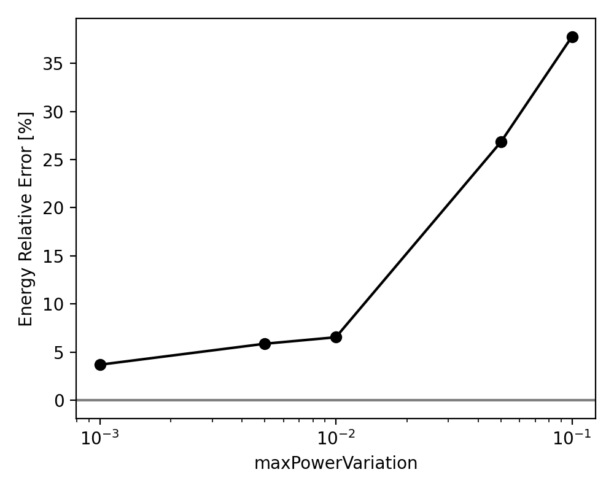
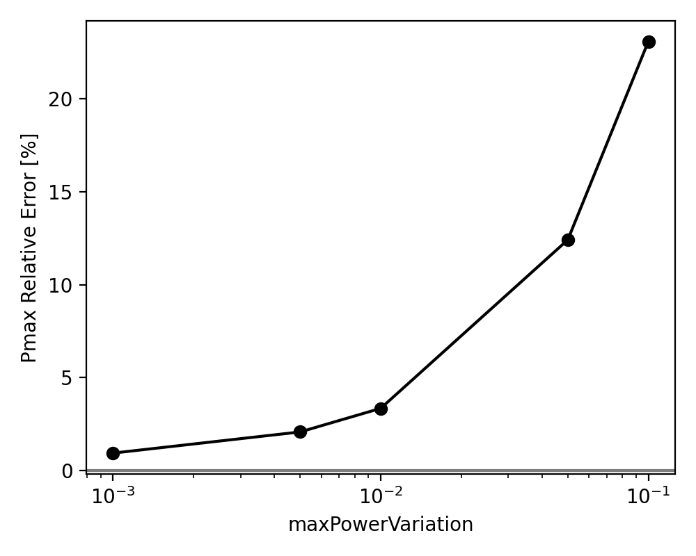

# Reactivity Insertion Transient: Pulsed Reactor (JSI TRIGA Benchmark)

Tags: []() []() []()


## Description

This tutorial demonstrates the simulation and verification of a Fuchs-type reactivity insertion transient using GeN-Foam, following the benchmark and methodology of:

> I. Švajger, D. Čalič, A. Pungerčič, A. Trkov, L. Snoj, Evaluation of reactor pulse experiments, Nuclear Engineering and Technology, Volume 56, Issue 4, 2024, Pages 1165-1203, ISSN 1738-5733, https://doi.org/10.1016/j.net.2023.11.021.

The case is based on a single fuel block (no spatial discretization), representing one pin and an azimuthal fraction of the JSI TRIGA Mark II reactor. The geometrical dimensions are taken from a TRIGA fuel pin as reported in the above reference. The cross section is adjusted so that the system is critical, but all other physical parameters (precursor concentrations and fractions, prompt generation time, feedback coefficient, specific heat, fuel density, inserted reactivity profile, etc.) are taken directly from the paper. The initial power is set to 10 W, scaled to match the single pin and azimuthal sector.


### Physical Model

- **Diffusion phase:** The simulation starts with a 1-second steady-state diffusion calculation to establish the initial conditions.
- **Point kinetics phase:** The case is then restarted and solved using the point kinetics equations with a prescribed reactivity insertion profile (Fuchs experiment).
- **No mesh discretization:** The mesh is a single block. It is not recommended to change it for this benchmark. Discretizing the block introduces spatial effects not present in the Fuchs model.
- **Boundary conditions:** The original Fuchs model assumes the fuel is completely adiabatic. In this code, all surfaces are adiabatic except the external one, which has a very weak convection boundary condition. This allows the fuel temperature to decrease slowly after the pulse. The effect is negligible for the pulse results because the convection is extremely weak.


### Analytical Solution

The Fuchs-Hansen analytical solution is used as a reference for the transient. The derivation of the Fuchs-Hansen and Nordheim-Fuchs models, as well as the the underlying assumptions, can be found in the cited paper; here only the final formulas used for comparison are stated:

- **Power pulse:**
$$
P(t) = \frac{2c^2 A e^{-ct}}{b (A e^{-ct} + 1)^2}
$$
where $c = \sqrt{\alpha_0^2 + 2bP_0}$, $A = \frac{\alpha_0 + c}{c - \alpha_0}$, $\alpha_0 = \frac{\rho_{ext} - \beta}{\Lambda}$, $b = \frac{|\alpha|}{C_p m_f \Lambda}$, $P_0$ is the initial power.\
Note that this model is not supposed to give the correct power profile as a function of time (that's why they are shifted in the script). Instead the model is supposed to predict the pulse width (FWHM) and the pulse height.

- **Peak power:** $P_{max,analytical} = \frac{\alpha_0^2}{2b}$
- **Full-Width Half Maximum (FWHM):** $\mathrm{FWHM}_{analytical} = \frac{3.525}{\alpha_0}$
- **Energy to peak:** $E_{analytical} = \frac{\alpha_0}{b}$


## Running a Single Case

Before running, clean the case with:
```bash
python3 Allclean.py
```

Then run the case with:
```bash
python3 Allrun.py
```

- The reactivity insertion profile can be changed by editing the `externalReactivityTimeProfile` in `Allrun.py`, in the default configuration it's trying to mimic the profile from the paper, also the amount of inserted reactivity can be changed via `rho_ext` (default 2$).
- The simulation in `Allrun.py` is stopped at a user-chosen time (`t_end` default: 45 s) so that the user can appreciate the fuel temperature cooling. To see full stabilization would require a much longer simulation.


### Output

**Console output:** Peak power, FWHM, and energy relative errors.

**Plots:**

(`fig_results_power_comparison_zoom.png`):



*Fig 1. Power pulse: simulation vs Fuchs-Hansen analytical (whole reactor, power has been rescaled)*

This matches the profile illustrated in the paper for the 2$ reactivity insertion.



*Fig 2. Time dependent power for different inserted reactivity, Fuchs-Hansen model, from Švajger, I., et al. Evaluation of reactor pulse experiments.*

(`fig_results_reactivity_zoom.png`):



*Fig 3. Reactivity components during the pulse.*

(`fig_results_reactivity_full.png`):



*Fig 4. Reactivity components during the transient.*

(`fig_results_fuel_temperature.png`):



*Fig 5. Fuel temperature evolution during the transient.*

(`fig_results_fuel_temperature_power_zoom.png`):



*Fig 6. Fuel temperature and power (single pin, azimuthal sector) evolution during the pulse.*


## Reactivity insertion variation

A sensitivity study on the reactivity insertion is performed in [`Allrun_insertionVariation.py`](./Allrun_insertionVariation.py).


(`fig_results_reactivityInsertion_power.png`):



*Fig 7. Pulse evolution for various reactivity insertion.*


## Convergence Study

A convergence study is provided in [`Allrun_convergence.py`](./Allrun_convergence.py).

**Note:** This study focuses on convergence with respect to time-integration parameters (not mesh). The following parameters are the most critical for achieving convergence:
- `maxPowerVariation` (power variation threshold for adaptive time stepping)

For each parameter, the script:
1. Runs a full 1s diffusion simulation
2. Restarts with point kinetics and the intended parameter value
3. Extracts and compares key metrics (peak power, FWHM, energy) to the analytical solution

**Note:** The convergence study as set up can take some minutes to complete. Here, a much shorter end time is used (default: 3 s after pulse start) to focus on the pulse and immediate aftermath, avoiding long runtimes due to the small maxDeltaT required for accuracy during the pulse.


### Running the convergence study

```bash
python3 Allrun_convergence.py
```


### Output

- **Summary table:** Relative errors for all parameter sets are printed at the end of the run.

|   maxPowerVariation |   Pmax err. [%] |   Energy err. [%] |   FWHM err. [%] |
|--------------------:|----------------:|------------------:|----------------:|
|               0.1   |           23.06 |             37.78 |          -10.13 |
|               0.05  |           12.4  |             26.83 |           -4.22 |
|               0.01  |            3.35 |              6.53 |           -1.54 |
|               0.005 |            2.09 |              5.86 |           -0.74 |
|               0.001 |            0.95 |              3.68 |           -0.15 |

- **Plots:** Each metric (FWHM, energy, peak power) is plotted separately for each parameter sweep, saved as PNG files.


(`fig_convergence_maxPowerVariation_FWHM.png`):



*Fig 8. FWHM relative error vs maxPowerVariation.*

(`fig_convergence_maxPowerVariation_Energy.png`):



*Fig 9. Energy relative error vs maxPowerVariation.*

(`fig_convergence_maxPowerVariation_Pmax.png`):



*Fig 10. Peak power relative error vs maxPowerVariation.*


## Possible Exercises

- Try changing the reactivity insertion profile and observe the effect on the transient (edit `externalReactivityTimeProfile` and `rho_ext` in `Allrun.py`).

---

**Reference:**

I. Švajger, D. Čalič, A. Pungerčič, A. Trkov, L. Snoj, Evaluation of reactor pulse experiments, Nuclear Engineering and Technology, Volume 56, Issue 4, 2024, Pages 1165-1203, ISSN 1738-5733, https://doi.org/10.1016/j.net.2023.11.021.
