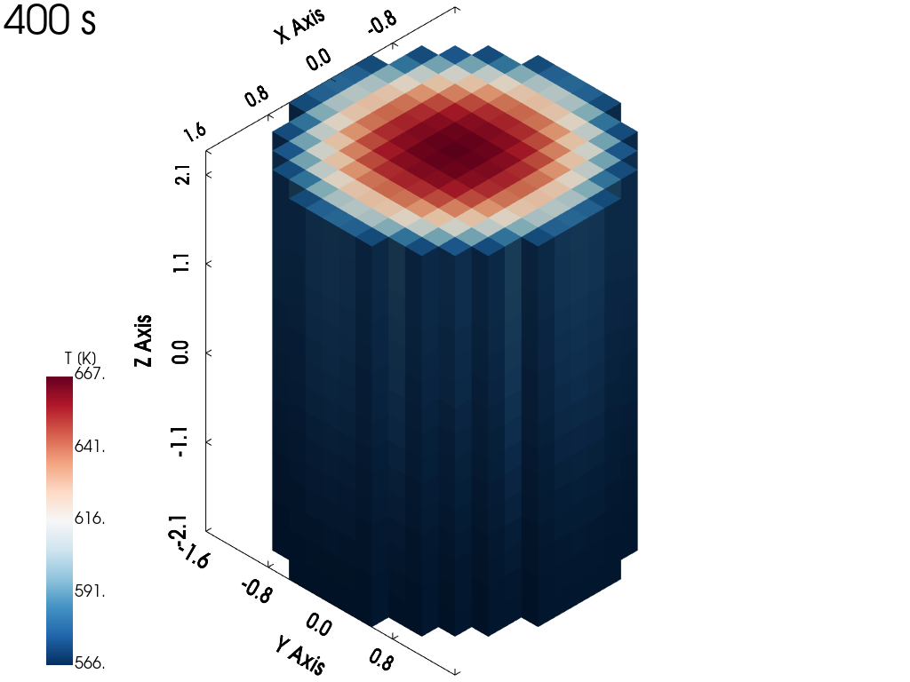
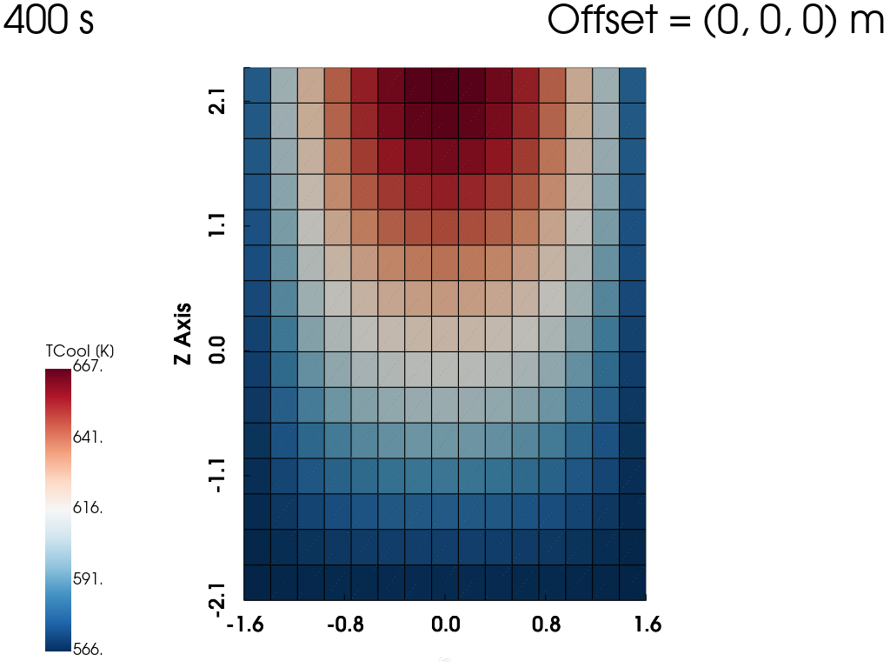
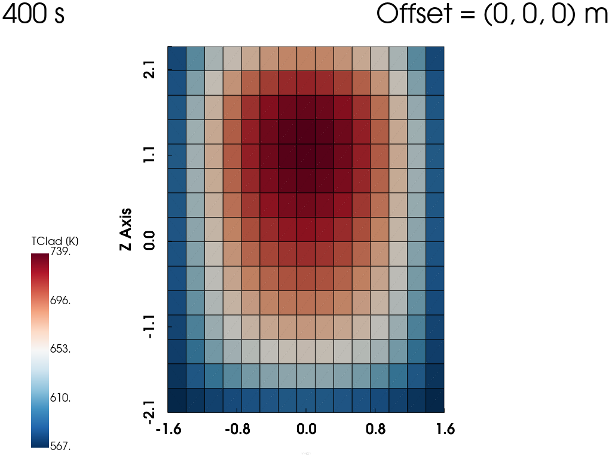
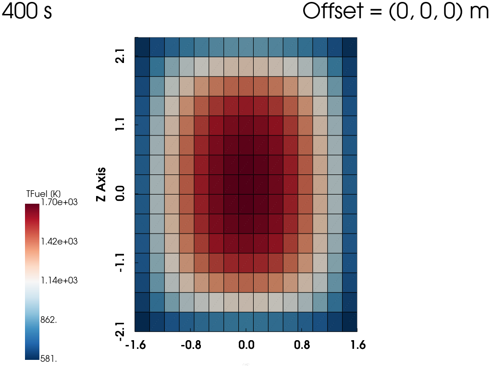

# PWR core

Tags: []() []() []()


## Description

Simple PWR core model using coupled neutronics diffusion and one-phase thermal-hydraulics sub-solvers. Only one fuel zone is used.


## How to run

```bash
python3 Allclean.py

python3 Allrun.py
```

## Results



*Fig 1. Temperature distribution in 3D.*

<div>
    
    
    
</div>

*Fig 2. Temperature distributions of coolant, cladding and fuel in XY-projection.*
