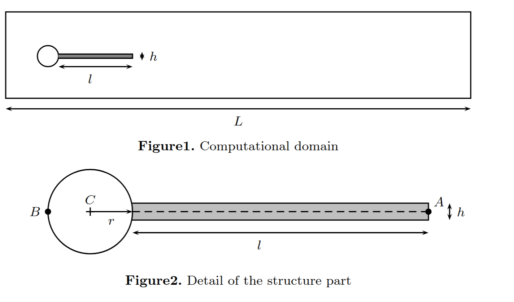

# Hron–Turek FSI3 Benchmark

## Overview

The Hron–Turek benchmark is a classical 2-D fluid–structure interaction (FSI) test consisting of laminar incompressible flow in a channel past a rigid circular cylinder with an elastic rectangular beam attached to the downstream side of the cylinder.
The **FSI3** variant is the most demanding of the series: it targets strong added-mass coupling and large-amplitude, self-excited oscillations of the flexible beam, and therefore is a standard test to validate partitioned and monolithic FSI solvers.

## Geometry
- **Channel length:** L = 2.5 m
- **Channel height:** H = 0.41 m
- **Cylinder center (from left/bottom corner):** (0.2, 0.2) m
- **Cylinder radius:** r = 0.05 m
- **Elastic beam (attached to cylinder):**
  - Length: l = 0.35 m
  - Thickness: h = 0.02 m
  - Right-bottom corner of undeformed beam: (0.6, 0.19) m
- **Reference point on beam tip:** A(0) = (0.6, 0.2) m

The geometry was generated using blockMesh and the blockMeshDict files were taken from the public repository of solids4Foam [https://www.solids4foam.com/tutorials/more-tutorials/fluid-solid-interaction/HronTurekFsi3.html]

## Governing Equations

- **Fluid:** incompressible Newtonian (Navier–Stokes, laminar)
- **Solid:** compressible elastic, Saint-Venant–Kirchhoff model
- **FSI interface:** no-slip (velocity continuity) and traction equilibrium

## Boundary & Initial Conditions

- **Inlet (x = 0):** parabolic profile with mean velocity $\bar{U}$ and maximum $1.5 \bar{U}$:
  $v_{\text{in}}(y) = 1.5\,\bar{U}\ \frac{y(H-y)}{(H/2)^2}$
  Ramp smoothly from zero during the first 2 seconds:
  $v(t) = v_{\text{in}} \cdot \frac{1 - \cos\left(\frac{\pi}{2}t\right)}{2}, \quad t < 2\ \text{s}$
- **Walls (top/bottom):** no-slip
- **Cylinder surface:** rigid, no-slip
- **Beam root:** clamped to cylinder
- **Outlet (x = L):** zero-mean pressure (reference pressure at outlet)

## Material Properties

|            Parameter             | Value (FSI3) |   Units    |
| :------------------------------: | :----------: | :--------: |
|    Fluid density, $\rho_f$     |     1000     | kg/m$^3$ |
|    Fluid viscosity, $\nu_f$    |    0.001     | m$^2$/2  |
| Mean inlet velocity, $\bar{u}$ |      2       |    m/s     |
|    Solid density, $\rho_s$     |     1000     | kg/m$^3$ |
|  Solid Young's modulus, $E_s$  |     5.6      |    MPa     |
| Solid Poisson's ratio, $\nu_s$ |     0.4      |            |

## Numerical Guidelines

- **Inlet ramp:** use cosine ramp for first 2 s to avoid transients
- **Time step:** \($\Delta t \approx 10^{-3}$\) s (refine if needed)
- **Mesh:** refined near cylinder/beam interface
- **Coupling:** for partitioned solvers, use acceleration/relaxation to handle strong added-mass effect

## Expected Results

The parameters employed to benchmark the results are the tip horizontal and vertical displacement histories and dominant oscillation frequency

|           Parameter           |    foamForNuclear      | Expected Results [1] |
| :---------------------------: | :--------------------: | :------------------: |
| $u_x$ in mm |  −2.67 ± 2.59 [10.81]  | −2.69 ± 2.53 [10.9]  |
| $u_y$ in mm |  1.53 ± 33.45 [5.38]   |  1.48 ± 34.38 [5.3]  |

## How to run

To run, simply launch the Allrun script with `./Allrun`. Note that because of the large deformations of the solid body, the convergence of the problem is relatively slow and requires a strong under-relaxation of the FSI coupling (0.05). The case takes about 15 hours to converge and domain decomposition does not help as the mesh size is relatively small. The solid body oscillations cease to vary after 4 seconds, hence the compuation time can be halved by simulating until 4 seconds instead of 6. Future work to accelerate the convergence of tightly coupled FSI problems like this one is foreseen.

## Reference

S. Turek & J. Hron — *Proposal for numerical benchmarking of fluid–structure interaction between an elastic object and laminar incompressible flow* (2006)
