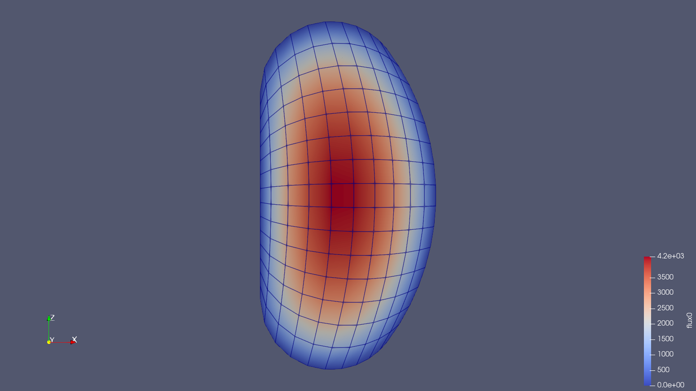

# 2D external source diffusion

Tags: []()


## Description

This tutorial tests the implementation of an external neutron source to the GeN-Foam neutronics diffusion sub-solver.

New features:
- neutronicsProperties: externalSourceNeutronics set to true to add the external source to the diffusion calculation
- New files for the external source definition: `defaultExternalSourceFlux` or `externalSourceFlux[i]`


## How to run

```bash
./Allclean

./Allmesh

./Allrun
# or
./Alltest
```


## Analysis

The final power must converge to an asymptotic value only if the system is subcritical with an external source of neutron. To see this convergence, the following script can be executed

```bash
python3 plot.py steadyState/GeN-Foam.dat
```

In addition, the final number of neutron generated must satisfy the following equation:

$$ N_{tot} = S + \sum_i \nu \Sigma_{f,i} \phi_i = \frac{S}{1-k_{eff}}  \quad [neutrons/s] $$

This can be tested using the following script:

```bash
python3 analysis.py steadyState/100
```


## Gallery


*Fig 1: Flux 0 RZ distribution.*
