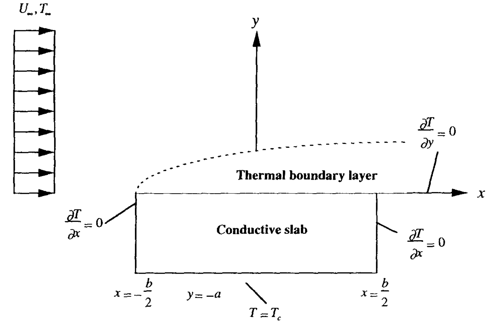

# Vynnycky Conjugate Heat Transfer (CHT) Benchmark

Tags:   

## Description

The **Vynnycky et al. CHT benchmark** is a canonical problem for validating conjugate heat transfer solvers, based on the study:

> Vynnycky M., Kimura S., Kanev K., Pop I. (1998) *Forced convection heat transfer from a flat plate: the conjugate problem*. Int. J. Heat Mass Transfer, 41(1), 45–59.

The problem consists of steady forced convection over a finite-thickness flat plate, with heat conduction occurring within the solid and heat removal by the fluid flow. The coupling between the conduction in the plate and convection in the fluid makes it a well-suited benchmark for verifying CHT implementations.

In this case, the replicated configuration corresponds to:
- Reynolds number: $Re = 10^4$
- Prandtl number: $Pr = 10^{-2}$
- Fluid thermal conductivity: $k_f = 5 Wm^{-1}K^{-1}$
- Plate aspect ratio: $\frac{L_s}{L_f} = 0.25$

---

## Geometry

The geometry consists of:
- A flat plate of thickness $L_s$ and length $L_f$
- The plate is embedded in a fluid domain of height $H$ and length $L_d$
- Flow is aligned with the plate (parallel flow configuration)

| Parameter        | Symbol | Value      | Unit  |
|------------------|--------|-----------|-------|
| Plate length     | $L_f$  | 1.0       | m     |
| Plate thickness  | $L_s$  | 0.25      | m     |
| Domain height    | $H$    | 1.0       | m     |
| Domain length    | $L_d$  | 3.0       | m     |

The mesh was generated using the blockMeshDict files available in the multiRegionFoam git repository  
https://github.com/hmarschall/multiRegionFoam/tree/dev/tutorials/conjugateHeatTransfer/flowOverHeatedPlate

---

## Material Properties

| Property                   | Symbol    | Fluid Value  | Solid Value | Unit      |
|----------------------------|-----------|--------------|-------------|-----------|
| Density                    | $\rho$    | 1.0          | 1.0         | kg/m³     |
| Specific heat capacity     | $c_p$     | 500          | 100         | kJ/kg/K   |
| Thermal conductivity       | $k$       | 5            | 100         | W/m/K     |
| Kinematic viscosity        | $\nu$     | $1.0 \times 10^{-4}$ | —   | m²/s      |
| Prandtl number             | $Pr$      | $10^{-2}$    | —           | —         |

---

## Boundary & Initial Conditions

- **Inlet:** uniform velocity profile $U_\infty = 1 \ m/s$ such that  
  $Re = \frac{U_\infty L_f}{\nu} = 10^4$  
  with uniform fluid temperature $T_\infty$.

- **Plate top surface (fluid-solid interface):**
  - Coupled CHT:
    $-k_f \left.\frac{\partial T_f}{\partial y}\right|_{\text{interface}} = -k_s \left.\frac{\partial T_s}{\partial y}\right|_{\text{interface}}$
  - Temperature continuity:
    $T_f|_{\text{interface}} = T_s|_{\text{interface}}$

- **Plate bottom surface:** Dirichlet BC  
  $T_s = 310 \ K$

- **Plate left and right surfaces:** adiabatic BC  
  $\frac{\partial T_s}{\partial y} = 0$

- **Outlet:** zero-gradient for velocity and temperature; fixed reference pressure.

- **Walls:** no-slip velocity, adiabatic temperature boundary.

---

## Folder Structure and Coupling Strategies

This benchmark case is provided in **two alternative subfolders**, showcasing two different approaches to perform the fluid–solid thermal coupling:

### 1. `CHTLoop`

In this folder, the coupling is handled using the **FFN** feature of `CHTLoop`.  
This approach provides:
- A **simplified input deck**, with reduced boundary-condition complexity
- A **dedicated interface residual**, computed as the temperature mismatch across the coupling interface and hence a more physically meaningful convergence criterion, compared to the classical Picard-loop residual

### 2. `boundaryCoupling`

In this folder, the coupling is implemented using the **traditional OpenFOAM boundary-condition approach**, relying on standard mapped boundary conditions.

---

## Comparison of the Two Approaches

Both coupling strategies are **theoretically equivalent** and yield **identical results** for this benchmark problem.

The main differences are:
- **Input complexity:**  
  `CHTLoop` requires a simpler and more compact setup
- **Residual control:**  
  `CHTLoop` monitors a **physics-based interface residual**, while the classical approach relies on a **Picard-loop residual**, defined as the maximum residual across all solved fields

---

## Geometry Illustration

