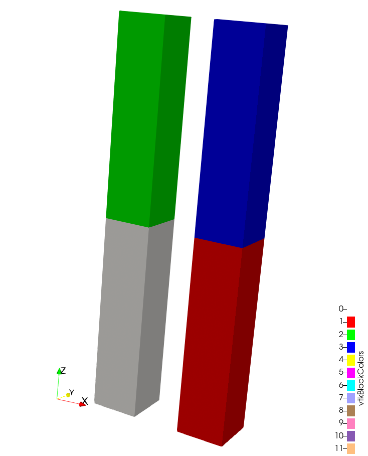
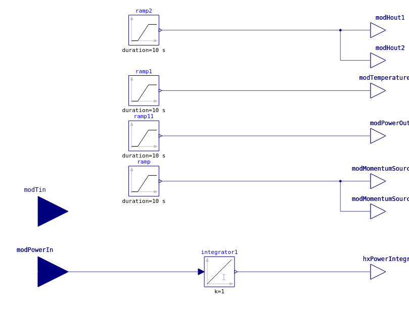
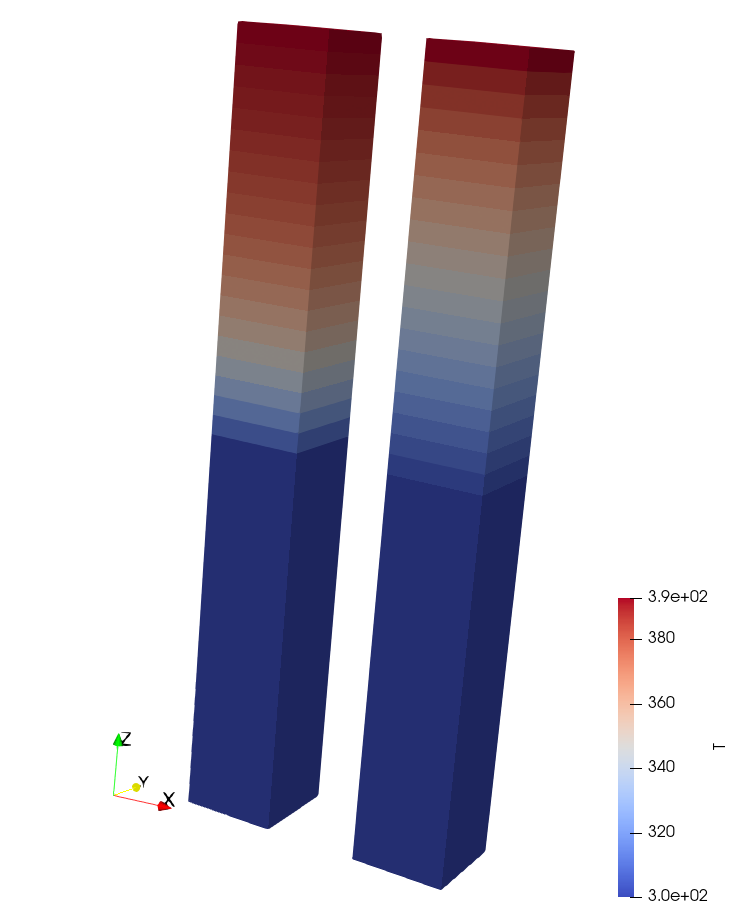

# Power-temperature-momentum controller

Tags: []() []()


## Description

This case is a demonstration of use of the **FMU** as an external model for GeN-Foam.
The FMU is a Modelica model that is able to receive and send information from:

- Pump momentum
- Heat-exchanger temperature (input and output)
- Heat-exchanger power (input and output)
- Heat-exchanger heat conductivity


## Model

The case is composed of 2 channels:
- One with a fixed-temperature heat-exchanger `hx1` (green in Figure 1)
- One with a fixed-power heat-exchanger `hx2` (blue in Figure 1)

Two pumps are placed in the white and red zone (see Figure 1).



*Figure 1: GeN-Foam mesh with colorized cellZones.*




*Figure 2: Modelica control model.*


The `Allrun` script is expected to output at the end of the simulation the same outlet temperature using the conservation of energy.

$$
q''' = \frac{\dot{m}}{\alpha V} c_p (T_{out} - T_{in})
$$

with $q'''$ the power density imposed to `hx2`, $\alpha$ the volume fraction of structure, $V$ the volume of heat-exchanger mesh, $\dot{m}$ the mass flow rate, $c_p$ the specific heat capacity of the fluid, $T_{out}$ the measured `hx1` outlet temperature, and $T_{in}$ the inlet temperature.


## FMU generation

Run the following command to build the FMU from the `momentumSourceTest.mo` file:
```bash
omc FMUGen.mos
```


## Run the case

```bash
./Allclean

./Allrun

# or
./Alltest
```



*Figure 3: Temperature distribution using fix-temperature and fix-power FMI inputs.*


## Results visualization

```bash
python3 Allplot.py log.GeN-Foam
```
