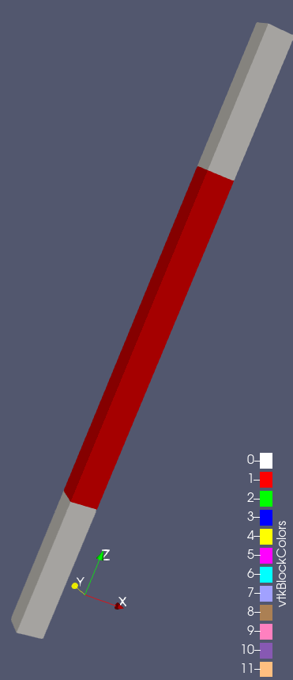
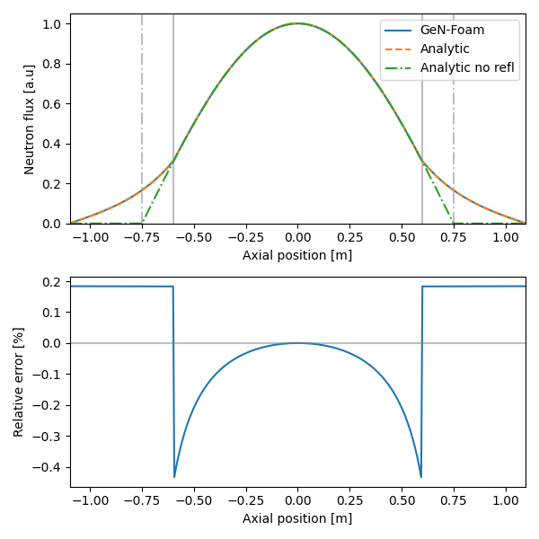

# Neutronics Diffusion: Slab Reactor with a reflector

Tags: []()


## Description

This tutorial is the second in a series of neutronics tutorials. In this tutorial, GeN-Foam is used to showcase the advantage of a neutron reflector to reduce the size of fissile zone and achieve criticality.



*Fig 1. Slab reactor with reflector visualized with ParaView (core in red, reflector in white).*


## Theory

First we start from the diffusion equation for the two regions, namely Core ($C$) and Reflector ($R$). The core is of length $L$ and the reflector is of thickness $d$.

$$
D_C \nabla^2 \phi_C + \nu \Sigma_f^C \phi_C - \Sigma_a^C \phi_C = 0
$$

$$
D_R \nabla^2 \phi_R - \Sigma_a^R \phi_R = 0
$$

The core is centered on 0, so the solution to the above equations looks like this:

$$
\phi_C(z) = A \cos(B_g z)
$$

$$
\phi_R(z) = E \exp\left(\frac{-z}{L_R}\right) + F \exp\left(\frac{z}{L_R}\right)
$$

with $L_R = \sqrt{\frac{D_R}{\Sigma_a^R}}$ and $B_g = \frac{\nu \Sigma_f^C - \Sigma_a^C}{D_C}$.

By imposing the neutron flux to 0 at the boundary of the reflector.

$$
\phi_R \left(z=\frac{L}{2}+d \right) = 0
\quad \rightarrow \quad
F = - E \exp \left( -\frac{L+2d}{L_R} \right)
$$

By continuity of the neutron flux between the core and the reflector, we can write:

$$
\phi_R(z) = A \frac{\cos \left(B_g \frac{L}{2} \right)}{\sinh \left( \frac{d}{L_R} \right)} \sinh \left( \frac{-z+L/2+d}{L_R} \right)
$$

Then, the results needs to satisfy the current continuity equation at the boundary between the core and the reflector to find $B_g$:

$$
D_C \frac{\partial \phi_C}{\partial z} = D_R \frac{\partial \phi_R}{\partial z}
\quad \rightarrow \quad
D_C B_g \tan \left( B_g \frac{L}{2} \right) = \frac{D_R}{L_R} \coth \left( \frac{d}{L_R} \right)
$$


## Simulation

The case has been prepared to verify the above results. One can change the geometry in the [`system/neutroRegion/blockMeshDict`](./system/neutroRegion/blockMeshDict) file with the `lCore` parameter for the core length and `lRefl` for the reflector thickness. The nuclear data are set in the [`constant/neutroRegion/nuclearData`](./constant/neutroRegion/nuclearData) file.

Before running the case, make sure to clean it using the following command:
```bash
./Allclean
```

Then run the case by running this command:
```bash
./Allrun
# or
./Alltest
```

The case should take no more than a few seconds. The results are stored in the `1` folder. The `1/uniform/reactorState` file stores the integral parameters of the simulation (e.g $k_\text{eff}$ and the power).


## Analysis

To compare the results of GeN-Foam with the analytic solution, run the following command:

```bash
#       Script      timeStep  fieldName
#       v           v         v
python3 Allplot.py  1         flux0
```



*Fig 2: Flux distribution computed by GeN-Foam. Comparison with analytic formula with and without reflector.*

From Figure 2, we can notice that the reactor needs less fissile material to reach criticality.


## Possible exercises

- How the $k_\text{eff}$ is affected when increasing/decreasing the reflector thickness?
