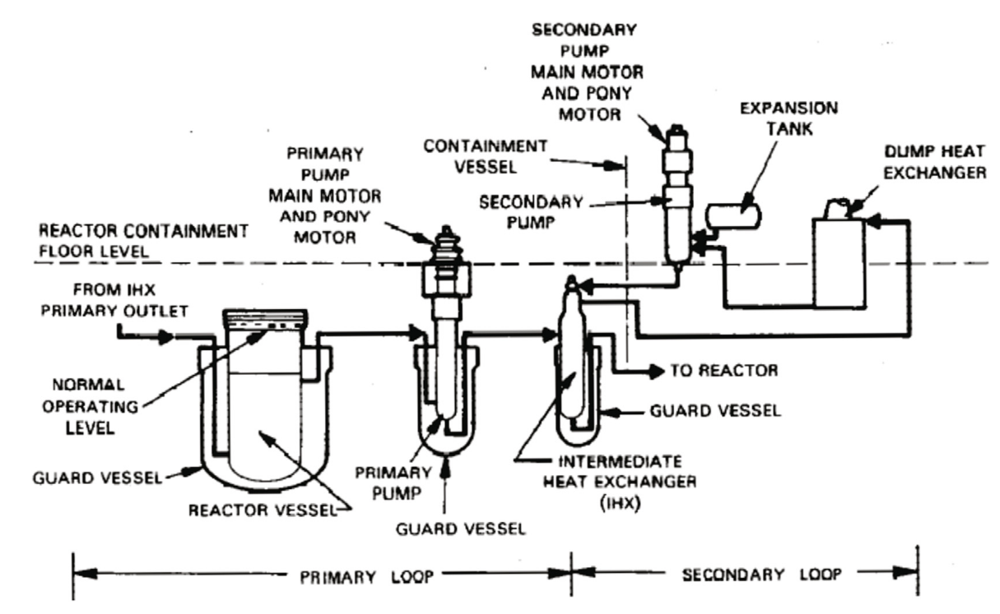
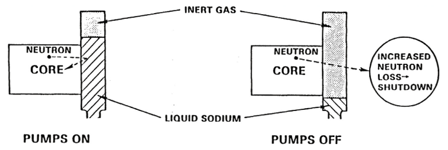
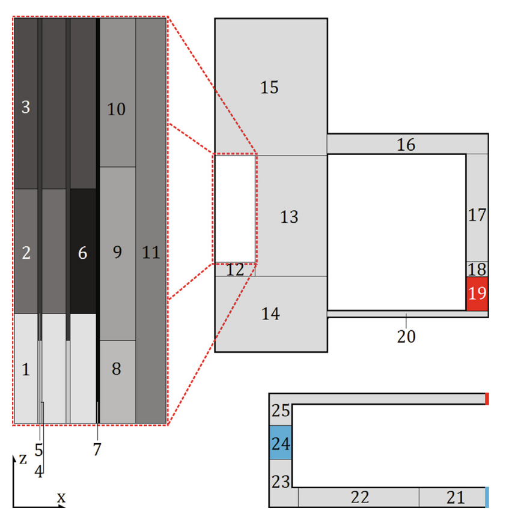
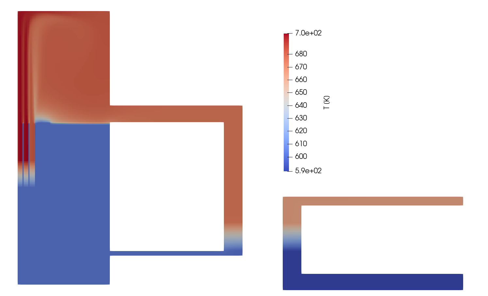
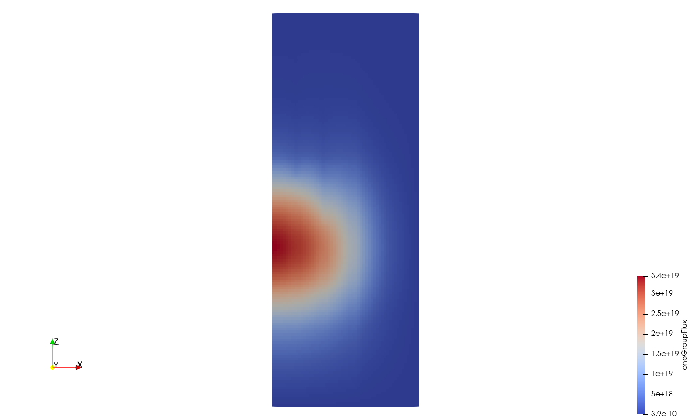
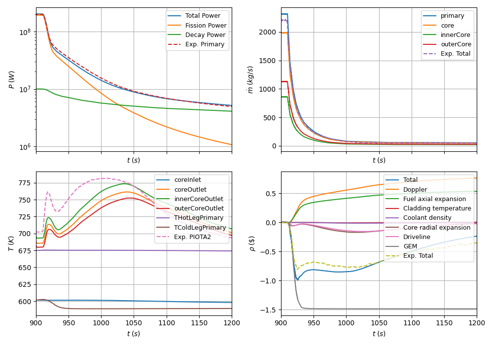
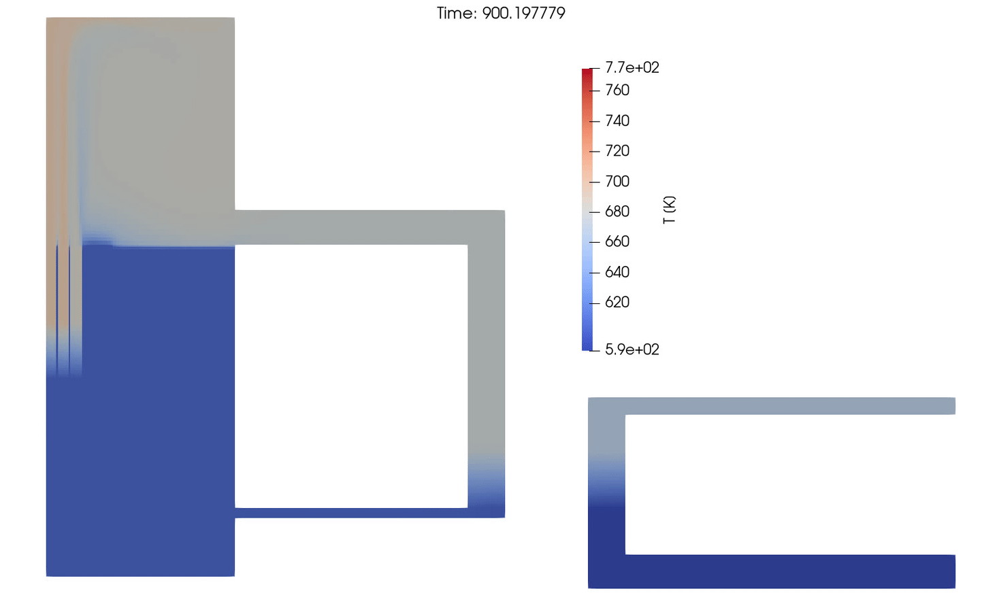

# Fast Flux Test Facility — LOFWOS‑13 Test

Tags:  
[]()  
[]()  
[]()

Authors: Stefan Radman  
Review and Editing: Carlo Fiorina

---

## Introduction

This case models the **Fast Flux Test Facility (FFTF)**—a decommissioned sodium‑cooled fast reactor located at the Hanford Site (WA, USA), operated during the 1980s. FFTF used a **hybrid pool–loop configuration**, with the primary pumps and intermediate heat exchangers (IHXs) placed in an external loop surrounding the reactor vessel.



*Fig. 1 – Overview of FFTF primary and secondary loops [1,2].*

This setup reproduces the **LOFWOS‑13 experiment**, designed to evaluate the performance of the **Gas Expansion Modules (GEMs)**—a passive safety feature located on the periphery of the core.

GEMs are closed‑top, open‑bottom assemblies partially filled with argon. During normal operation, hydrostatic head compresses the gas so the sodium free surface rises above the active core. During a ULOF transient, the pressure drop allows the gas to expand, lowering the sodium level **below** the core. This radially “unshields” part of the core, replacing sodium with argon and producing strong negative reactivity by increasing leakage.

Given the FFTF core’s small diameter (~1 m), this feedback is highly effective.



*Fig. 2 – Operating principles of the GEMs [1,2].*

The LOFWOS‑13 sequence:

- steady-state at **full flow** and **half nominal power**  
- **pump trip**  
- observation of GEM‑driven reactivity response  

---

## Calculation Details

The model uses a **hybrid mesh**: a **2° wedge** for the vessel and parallelepipeds for the external loops. Absolute volumes are scaled by **360/2** to represent the full FFTF primary circuit.



*Fig. 3 – Thermal–hydraulics computational domain.*

The simulation consists of:

1. **Steady‑state**: 900 s model time  
2. **Transient**: governed by the `pointKinetics` model  

Steady‑state power is set via `powerDensityStructure` in `0/fluidRegion`.  
Alternatively, `Allrun_powerFromDiffusion` performs an initial diffusion solve and uses its power distribution.

### Performance

Approximate runtimes on 5 cores (Intel i5‑8600K @ 3.60 GHz):

- ~820 s steady-state  
- ~3700 s transient  

Transient begins at **t = 910 s** and ends at **t = 1200 s**.  
You may extend this by editing `endTimeT` in `Allrun`.

---

## Porous Regions (cellZones)

| No. | Name |
|----:|--------------------------|
| 1  | Lower fuel shield |
| 2  | Inner fuel |
| 3  | Upper fuel shield |
| 4  | Lower CR shield |
| 5  | Control rod (CR) |
| 6  | Outer fuel |
| 7  | GEM |
| 8  | Lower reflector shield |
| 9  | Reflector |
| 10 | Upper reflector shield |
| 11 | Radial shield |
| 12 | Diagrid |
| 13 | Bypass |
| 14 | Lower plenum |
| 15 | Upper plenum |
| 16 | Primary hot leg |
| 17 | Primary pump |
| 18 | Primary junction |
| 19 | IHX (primary side) |
| 20 | Primary cold leg |
| 21 | Secondary cold leg |
| 22 | Secondary pump |
| 23 | Secondary junction |
| 24 | IHX (secondary side) |
| 25 | Secondary hot leg |

---

## GeN‑Foam Features Demonstrated

This case illustrates several advanced capabilities:

### **1. `gapHPowerDensityTable`**
Defines gap conductance as a function of linear power.

### **2. Time‑dependent `momentumSource`**
Configured in `constant/fluidRegion/phaseProperties`.

### **3. GEM Model (partial implementation)**
- Reactivity map specified in the `nuclearData` sub-dictionary within `constant/neutroRegion/nuclearPropeties/`
- Flow measured over a specified `faceZone`
- Height–flow correlation currently hard‑coded based on FFTF data

### **4. Point‑Kinetics with Decay Heat**
Decay power specified via table or OpenFOAM `Function1` in  
`0/uniform/reactorState`.

### **5. Heat Exchanger Coupling**
Handles heat transfer between two separate mesh regions (primary/secondary).

### **6. `cellCenteredFaceReconstruction` Momentum Mode**
Hybrid method reducing diffusion while preserving stability at porous interfaces.  
Controlled by:

- `porousInterfaceSharpness ∈ [0,1]`  

This case uses **0.5**.

---


## Notes on the plots

The plotted results consist of the evolution of total power, mass flows for a variety of faceZones, bulk temperatures for a variety of faceZones, and reactivity contributions of different components in dollars. Experimental results are marked via `exp`.

---

## Limitation of the model

The FFTF core was largely radially thermo‑hydraulically heterogeneous, meaning that neighboring assemblies could have significantly different power‑to‑flow ratios, resulting in different outlet temperatures. By representing the core only via two averaged regions—`innerCore` and `outerCore`—this heterogeneity is lost. This can be observed in the comparison of the experimental temperature (PIOTA2) against the `innerCore` temperature. The PIOTA2 assembly, which belongs to the inner core region of FFTF, had a higher power‑to‑flow ratio than the region average, so results do not match perfectly in magnitude.

Accurate predictions of temperature far into the transient are complicated by the fact that both power and flow are fractions of their steady‑state values. Even slight deviations from the experimental power‑to‑flow ratio lead to potentially large temperature differences in various regions of the model.

The model is preliminary; many parameters that strongly influence transient evolution (e.g., the gap‑conductance‑vs‑linear‑power map) have not yet been fully optimized. Nonetheless, overall trends are reproduced reasonably well, especially during the initial minute of the transient, where power evolution is dominated by Doppler, fuel axial expansion, and GEM reactivity contributions.


---

## Results



*Fig 4: Temperature field during a steady-state.*




*Fig 5: One group neutron flux in the core during a steady-state.*




*Fig 6: Evolution of temperature, power, mass flow rate and reactivity during the LOFWOS 13 Test.*




*Fig 7: Evolution of temperature field during the LOFWOS 13 Test.*

---

## References

[1] Radman, S., Fiorina, C., Song, P., Pautz, A. (2022).  
*Development of a point‑kinetics model in OpenFOAM, integration in GeN‑Foam, and validation against FFTF experimental data.*  
Annals of Nuclear Energy, 168(2022), 108891. https://doi.org/10.1016/j.anucene.2021.108891

[2] Cabell, C. (1980).  
*Summary description of the Fast Flux Test Facility.*  
Hanford Engineering Development Laboratory, Richland, WA.  
http://www.osti.gov/servlets/purl/6032523/


---

## How to Run

```bash
./Allrun
# or
./Allrun_parallel
