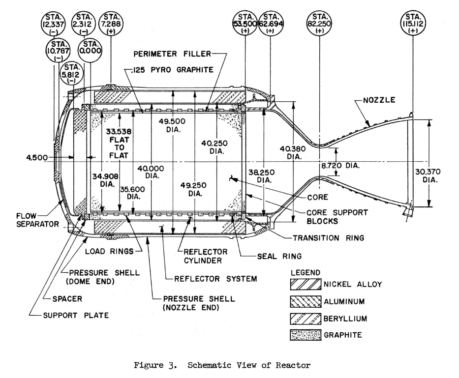
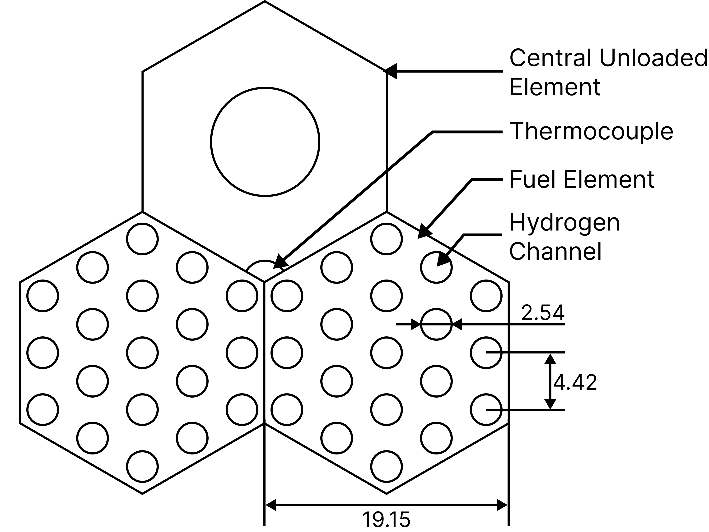
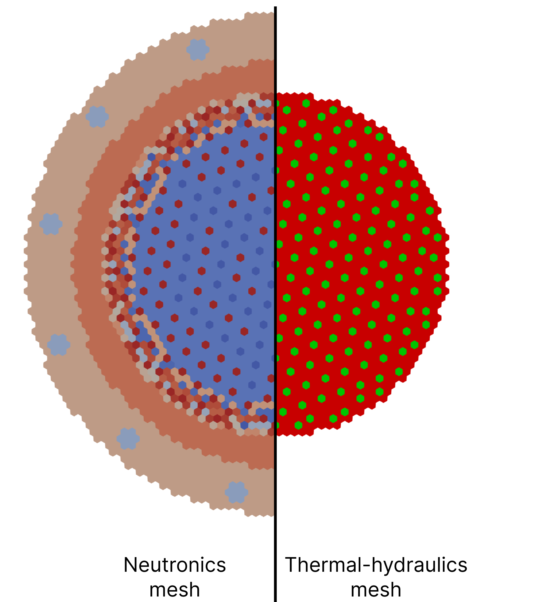
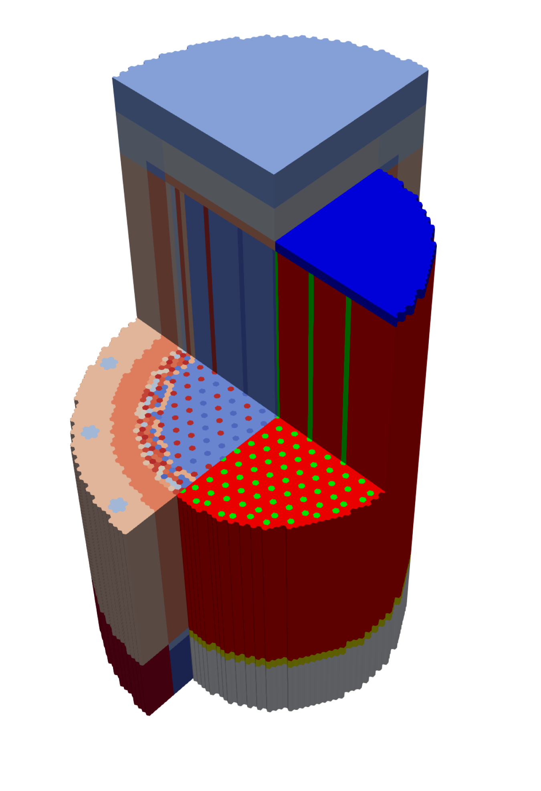
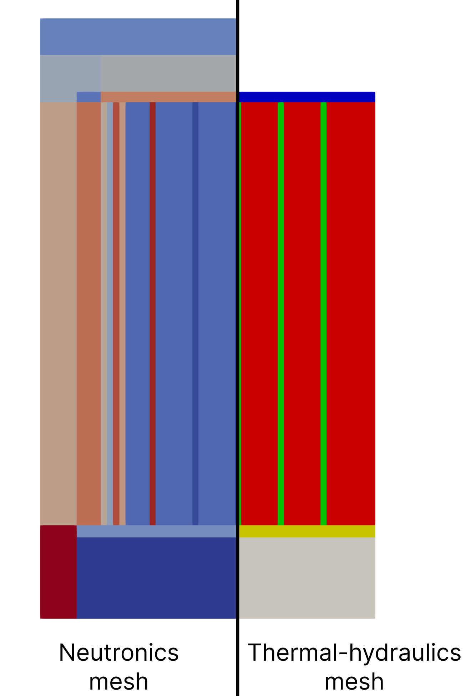
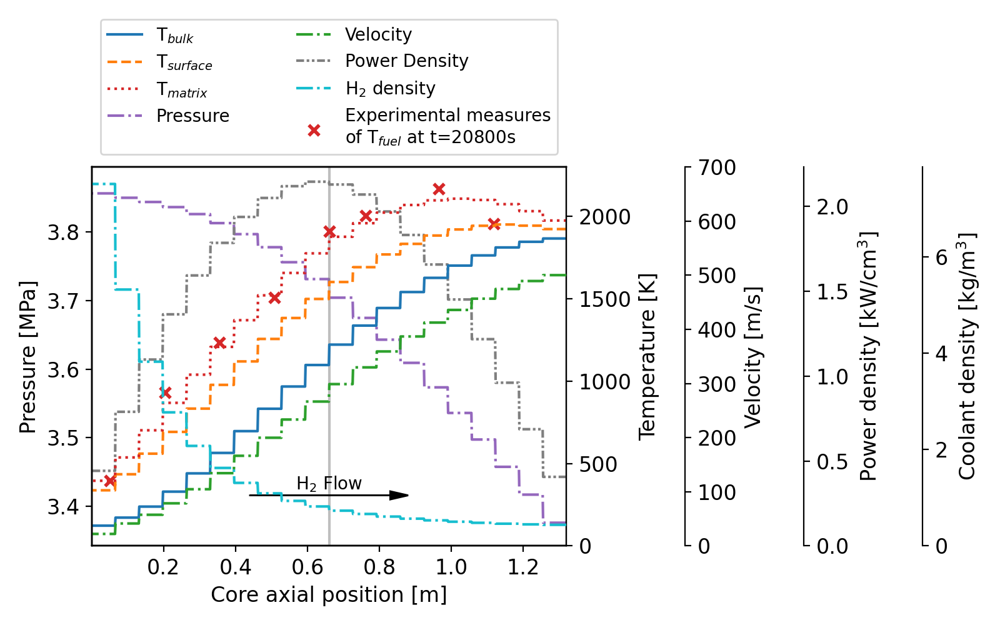
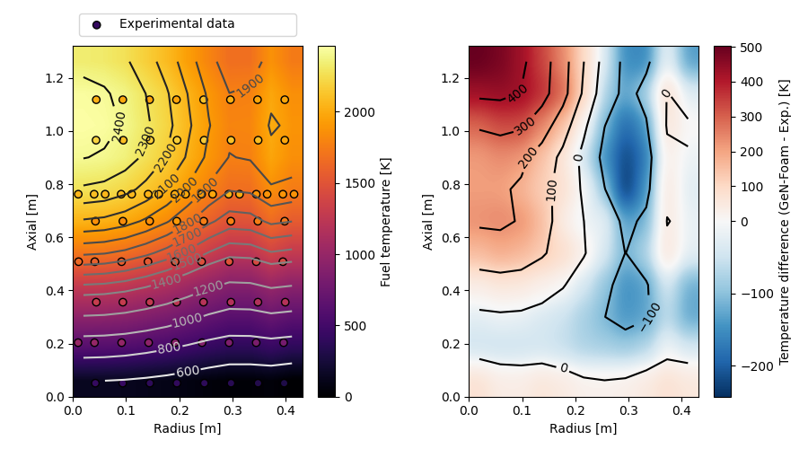
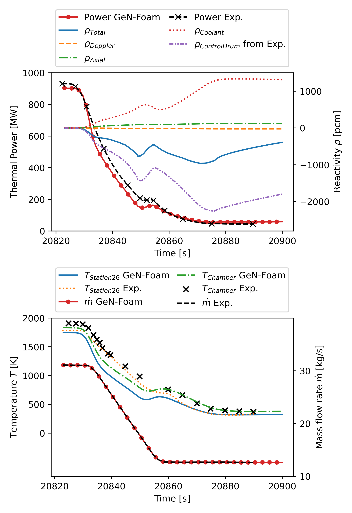
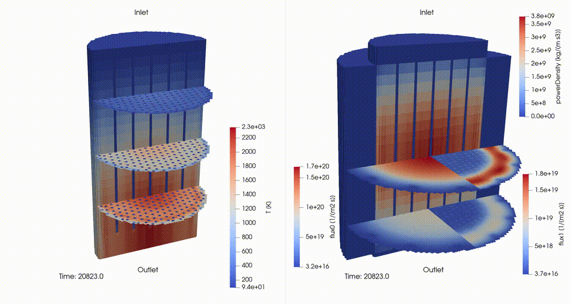

# KIWI-B-4E Full Core

## Description

This GeN-Foam case is a full-core model of the KIWI-B-4E NTP reactor used in this [journal paper](https://doi.org/10.1016/j.nucengdes.2024.113639). It uses the **SP3** neutronics sub-solver in eigenvalue mode and the **porous k-epsilon** thermal-hydraulics sub-solver.

The nuclear data are generated using an OpenMC model (see [journal paper](https://doi.org/10.1016/j.nucengdes.2024.113639)).

The steady state corresponds to the state of the KIWI-B-4E at the time 20800 s, a few seconds before the shutdown transient [3]. Then follows the shutdown transient, which rely on the point-kinetics neutronics sub-solver.



*Fig 1. KIWI-B-4E reactor scheme from Ref. [2]. Dimensions are in inches.*


### Neutronics region

There are currently 10 fuel element types placed with the same fuel loading pattern from OpenMC. This model also includes unloaded central elements (with and without Tantalum), and upper and lower support plates.


*Fig 2. KIWI-B-4E loading pattern using [Honeycomb](https://foam-for-nuclear.gitlab.io/honeycomb/).*


### Thermal-hydraulics region

The fuel elements are merged into one cellZone, as well as for the unloaded central elements. The mesh also includes clear fluid plena at the inlet and outlet. This model uses the specially developed hydrogen thermophysical properties model with hydrogen dissociation at high temperature.



*Fig 3. KIWI-B-4E fuel assembly scheme, dimensions are in mm.*


## Mesh generation

The script to generate the mesh of the full core model is in the [coreMeshGenerator.py](mesh/coreMeshGenerator.py). This Python script is based on the Salome Python API and reads a `.txt` file that contains the lattice map of the core. In this case, it is [coreMap.txt](mesh/coreMap.txt).

Before loading the script, make sure that the **absolute** path to the `coreMap.txt` file is adapted to your case in the Python script.

Load the following script to generate the mesh and export `neutroMesh` and `fluidMesh` into **UNV** format in the `mesh` folder.

To generate the `polyMesh` folders from the previously generated `.unv` files, run the following command:

```bash
./Allmesh
```





*Fig 4. KIWI-B-4E neutronics and thermal-hydraulics meshes side-by-side comparison visualized in ParaView.*


## Boundary conditions

In the fluid region, the boundary conditions are fixed value U-p respectively at the inlet and the outlet. Fixed values at the inlet of k and epsilon have been computed using the [`AllcomputeInitialBCValues.py`](./AllcomputeInitialBCValues.py) script:

```bash
python3 AllcomputeInitialBCValues.py
```


## Case simulation

To clean the case:

```bash
./Allclean
```

It is recommended to run the case in parallel for faster simulation. The current parallelization setup is on 8 physical cores but it can be increased in [`Allrun_parallel`](./Allrun_parallel).

```bash
./Allrun_parallel
```


## Post-processing

These commands are grouped in the [`Allpostprocess_parallel`](./Allpostprocess_parallel) script.

```bash
./Allpostprocess_parallel steadyStateTH 20
# and
./Allpostprocess_parallel transientShutdown 20900
```




*Fig 6. Axial distribution of temperature, velocity, pressure, power density, and hydrogen density in the GeN-Foam KIWI-B-4E core model compared with experimental values from Ref. [3] at radius 19.6 cm.*




*Fig 7. Fuel temperature field in RZ projection with a comparison to experimental data from Ref. [3].*




*Fig 8. Power, reactivity, temperature, and mass flow rate evolution during the shutdown of the KIWI-B-4E GeN-Foam core model.*




*Fig 9. Evolution of hydrogen temperature and power density during the shutdown transient. Slices are fast and thermal fluxes distributions.*


## Publication

This tutorial and the presented results are the subject of the following journal paper that is recommended for citation:

T. Guilbaud, E. Simonnot, A. Scolaro, C. Fiorina, "Full core study of the KIWI-B-4E Nuclear Thermal Propulsion system using OpenMC and GeN-Foam", In: Nuclear Engineering and Design, 429, (2024), [doi.org/10.1016/j.nucengdes.2024.113639](https://doi.org/10.1016/j.nucengdes.2024.113639).


## References

[1] Finseth, J., 1991. Overview of Rover Engine Tests Technical Report 313-002-91-059, National Aeronautics and Space Administration.

[2] Zeigner, V., 1965. Survey Description of the Design and Testing of Kiwi-B-4E-301 Propulsion Reactor Technical Report LA-3311-MS, Los Alamos Scientific Laboratory, http://dx.doi.org/10.2172/1569042, URL https://www.osti.gov/biblio/1569042.

[3] Elder, M., 1964. Preliminary Report KIWI-B-4E-301 Technical Report LA-3185-MS, Los Alamos Scientific Laboratory.

[4] Eugene A. Plassmann, Herbert H. Helmick, and John D. Orndoff. Some Neutronic Results of the Kiwi-B-4E Nevada Test. Tech. rep. LA-3327-MS. Los Alamos Scientific Laboratory, May 1965.
